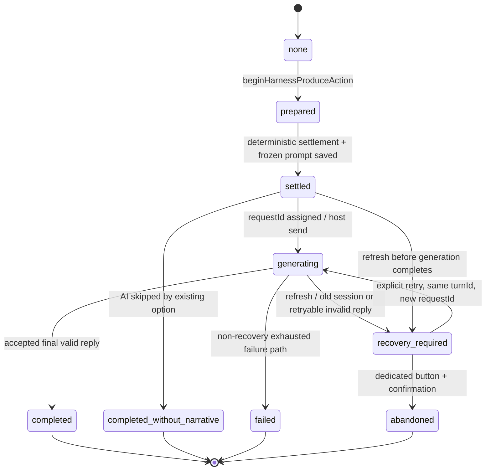

# Harness Phase 1 + Recovery 收尾审查

本文基于当前工作树和已提交的 Harness 实现审查。范围是普通行动 `lesson`、`training`、`rest`，不把其他 AI 入口假定为已接入 Harness。

需要先区分两类改动：

- 已提交的 Harness 相关提交：`d356149`、`74a1e40`、`dfcaea9`、`fa936d4`、`424db8f`、`344ce07`、`86ee5e9`、`24265a6`。
- 当前工作树未提交的 `st.html`、`tests/st-loader-bridge.test.mjs` 改动，是最近的空 assistant 回复/延迟生成结束桥接修复。它改善了宿主桥接行为，但不扩大 Harness 覆盖范围。

## 1. 当前已解决的问题

### 1.1 普通行动有最小回合身份和单飞门禁

`app.js` 的 `state.harness` 现在包含 `schemaVersion`、`persistenceRevision`、`sessionEpoch`、`activeTurn` 和受限 `trace`。普通行动入口在 `settleAction()` 中调用 `beginHarnessProduceAction()`，仅对 `lesson`、`training`、`rest` 生效。

当前 session 内的 `activeTurn` 是普通行动的全局单飞锁，不是按 `actionKey` 去重。已有 `prepared`、`settled`、`generating` 回合时，另一个普通行动也会被拒绝，并且拒绝发生在新的回合或确定性结算写入之前。

### 1.2 持久化观测与业务版本语义已分离

`saveState()` 使用 `persistenceRevision` 记录持久化次数，明确不是业务事务版本。例行 `state.save` 只输出 `console.debug`；`recordHarnessTrace()` 只保留允许的关键回合变化和拒绝事件，并限制为标量字段、最多 40 条。

Prompt 正文不会写入持久 trace。`captureHarnessGenerationPrompt()` 在写入冻结 Prompt 前记录长度，并拒绝空 Prompt 或超过上限的 Prompt；trace 只保留长度和状态。

### 1.3 确定性结算先于叙事生成，并可冻结恢复所需信息

`settleAction()` 仍负责现有数值、随机事件、日志和时间推进；普通行动在结算后记录 `settled`，随后才进入 `generating`。冻结的 `generationPrompt` 由当次 `buildPrompt()` 产生，恢复时直接使用，不重新调用 `buildPrompt()`。

因此，刷新后恢复不会重新执行数值结算、随机事件、时间推进或普通行动日志写入。

### 1.4 回复门禁已收紧到当前 requestId

`shouldAcceptAiReply()` 只接受当前 `pendingAiRequestId`/`state.pendingAiRequestId`，对于 Harness 回合实际由 `activeTurn.requestId` 表示当前可接受回复。`requestIds` 只是最近历史 ID 审计数组，不能扩大接受范围。

被门禁拒绝的 stale reply 不会继续触发编年史请求；相关判断由 `shouldRequestChronicleUpdate()` 和回复路由共同保证。

### 1.5 刷新后的普通行动恢复具备显式状态和显式放弃

`loadState()` 会清掉本页在途的 `pendingAiRequestId`，不恢复旧网络请求。旧 session 中同一 `saveScope` 的 `settled` 或 `generating` 普通回合会由 `getHarnessRecoveryDisposition()`/`markHarnessRecoveryRequired()` 转为 `recovery_required`。

恢复 UI 由 `openHarnessRecoveryOverlay()` 管理，页面生命周期内自动提示只打开一次；普通关闭、Escape、背景点击不会放弃回合。只有专用放弃按钮经过二次确认后，`abandonHarnessNarrativeRecovery()` 才能把回合标记为 `abandoned`。

### 1.6 恢复重试保持 turnId、轮换 requestId

`retryHarnessNarrativeRecovery()`（恢复路径）保留原 `turnId`，为每次尝试生成新的 requestId，更新 `activeTurn.requestId` 并将新 ID 追加到 `requestIds`。恢复发送使用 `activeTurn.generationPrompt`，不调用 `triggerRegeneration`，不使用宿主 regenerate cache。

恢复发送前的 `hasConflictingHarnessRecoveryFlow()` 只检查会占用同一主模型请求通道的请求，不把普通 overlay 或纯 UI 状态当成冲突。发送失败、回复无效且仍可重试时回到 `recovery_required`，不会形成不可恢复的 `failed` 终态。

### 1.7 恢复回合阻止下一次普通行动

`settleAction()` 在普通行动分支通过恢复门禁检查；`recovery_required` 会在任何新回合、数值结算、时间推进和日志写入前阻止下一次 `lesson`、`training`、`rest`。显式 `abandoned` 后才解除该门禁。

### 1.8 `saveScope` 校验已存在

`st.html` 的 `shouldAcceptHostSave()` 要求 incoming scope 与当前 host scope 均非空且完全相等，并要求状态是对象。这样可以拒绝切换聊天后旧聊天的状态回写；本地恢复路径也使用精确 storage key 检查。

## 2. 尚未解决的问题

### 2.1 Harness 仍只覆盖三种普通行动

外出、交流、亲密、羁绊/First Live、手机、广播、自由聊天、地图探索、委托、礼物、SNS、二级世界生成等入口仍使用各自的 pending/request 状态和保存路径，没有统一的 Harness 回合生命周期。

### 2.2 主模型通道仍由一个全局 pending ID 共享

`pendingAiRequestId` 同时被普通行动和多个旁支流程使用。Harness 恢复重试会检查通道是否已占用，但恢复开始后，另一个旁支请求仍可能覆盖该全局 ID，使恢复回复变成 stale。当前实现没有跨入口的 owner 记录或统一 acquire/release。

### 2.3 同 scope 的保存仍没有 revision ordering

`saveScope` 只解决“写错聊天”的问题，不解决同一聊天内旧异步保存晚到并覆盖新保存的问题。`persistenceRevision` 目前是观测计数，并不是保存顺序门禁。

### 2.4 仍没有真正的原子提交或补偿机制

普通行动的确定性状态和日志仍在 AI 正文完成前保存；正文完成后再保存叙事。浏览器崩溃、宿主写入失败或中途断电时，可能留下“数值已结算、正文未完成”的恢复回合。Recovery 能保留并重试叙事，但不能回滚或原子提交全部前端状态。

### 2.5 AI/宿主附加解析仍可能改权威状态

普通行动的结算是确定性的，但其他流程仍可能从 AI 回复解析关系、任务、地图或事件字段并直接写入 `state`。这些写入没有统一的 `SettlementResult`/patch 校验层。

### 2.6 随机性和完整审计仍不完备

随机事件结果没有统一 seed 和回合级随机记录；当前恢复依赖已保存的结算结果和冻结 Prompt，而不是重放随机过程。尚未有完整的回合 receipt、状态 patch、审计链或前端状态回滚工具。

### 2.7 编年史门禁不是完整的正文验证层

stale requestId 在编年史写入前会被拒绝，这是本阶段明确的验收目标。但编年史请求仍处于回复路由的较早位置，不能等同于“所有内容 schema/质量验证完成后再写入”的完整 Atomic Commit 设计。

### 2.8 页面刷新后的旧宿主回复无法被前端删除

刷新后旧网络请求不会被恢复；若宿主已经把旧回复写入 chat，前端只能拒绝其业务回写，不能保证从宿主聊天中移除已经出现的旧楼层。

### 2.9 当前工作树仍有与 Harness 无关的桥接测试失败

未提交的 `st.html` 空回复桥接改动尚未让全部既有桥接契约测试恢复为绿；这些失败不代表 Harness 门禁本身失效，但必须在合并前单独处理或明确基线。

## 3. 当前 Harness 覆盖的入口

### 已覆盖

- `settleAction("lesson", ...)`
- `settleAction("training", ...)`
- `settleAction("rest", ...)`
- 这些入口对应的确定性结算、随机事件结果保存、时间/轮次推进、冻结 Prompt、AI 正文接收、恢复重试、显式放弃和下一普通行动门禁。
- 普通行动的 host/local `saveScope` 恢复范围检查。
- 普通行动回复的 requestId 接受门禁和 stale chronicle 写入阻断。

### 未覆盖

- `outing`、`companion`、`intimacy` 及其选项第一/第二阶段。
- affinity/bond、First Live、free chat/idol interaction、gift。
- phone chat、broadcast、地图探索、委托/side quest、SNS、主动事件、小剧场。
- 二级 API/world generation 和其他不经过普通 `settleAction()` 的生成入口。
- 编年史分支读档对数值、任务、时间等前端权威状态的完整恢复。

因此，不能把 `state.harness` 的存在解释为“所有 AI 请求都已接入 Harness”。

## 4. 已知并发边界

1. **普通行动内部**：当前 session 是全局单飞；不同 `actionKey` 也会互相阻止。重复点击不会重复结算，但仅覆盖普通三入口。
2. **普通行动与旁支之间**：Phase 1 没有解决普通行动与手机、广播、地图、委托等入口的并发覆盖；它们仍可能竞争同一个 `pendingAiRequestId` 和主模型通道。
3. **恢复重试期间**：恢复函数会拒绝已经被占用的主模型通道，但在恢复发送之后，旁支请求仍可能覆盖全局 pending ID。
4. **同 scope 保存**：`saveScope` 只做作用域校验，不能阻止同一 scope 的旧异步 save 晚到覆盖新状态。
5. **stale reply**：`activeTurn.requestId`/当前 pending ID 是唯一可接受 ID；`requestIds` 不会放宽门禁，但 stale 回复如果已被宿主写入聊天，前端不能撤回其楼层。
6. **刷新边界**：刷新清掉在途请求，不自动重发；旧回合会转为 `recovery_required`，但只有已冻结且归属可确认的 Prompt 才能恢复。
7. **旁支状态覆盖**：多个二级 API/旁支流程仍各自保存和清理 pending 状态，跨流程的写入顺序没有统一协调器。

## 5. 当前状态机图

状态含义需要注意：`failed` 仍存在于非恢复的旧失败路径；Recovery Task 4/5 对“可重试的恢复失败”要求回到 `recovery_required`，不会停在不可恢复的 `failed`。

## 6. 当前测试结果

### Harness/Recovery 专项

本轮审查使用的专项组合覆盖 Phase 1、Recovery、metadata/saveScope、chronicle、VN/流程和桥接契约，共 `99` 项：

- `97` 通过
- `2` 失败

两个失败均来自现有 `tests/st-loader-bridge.test.mjs` 契约，不是 Harness 状态机断言：

- `st.html loader uses a responsive mobile viewport instead of a fixed desktop canvas`
- `st.html pauses floor hiding when the opening floor is not mounted`

去除 `st-loader-bridge` 契约后的 Phase 1、Recovery、metadata/saveScope、chronicle、VN/流程组合为 `80/80` 通过；空 assistant 占位与延迟 generation-end 的新增桥接子集为 `2/2` 通过。

### 完整测试套件

本轮新跑的 `node --test tests` 结果为：

- `279` tests
- `273` passed
- `6` failed
- `0` cancelled
- `0` skipped

6 个失败分别是：

- `tests/idol-interaction.test.mjs`：`selected idols are all required in a zero-cost interaction`
- `tests/producer-profile.test.mjs`：`producer profile includes gender in state, form, save flow, and prompts`
- `tests/st-loader-bridge.test.mjs`：responsive mobile viewport
- `tests/st-loader-bridge.test.mjs`：opening floor 未挂载时暂停隐藏
- `tests/summary-round.test.mjs`：`advanceDay only advances schedule from summary round`
- `tests/summary-round.test.mjs`：`day 21 summary round advances into First Live schedule`

这些失败跨越既有互动、producer profile、桥接和 summary-round 契约，不能归因于本阶段 Harness 门禁；但它们说明当前分支整体测试基线不是全绿。

另外，`node --check app.js` 和 `git diff --check` 在本阶段已通过；文档写入后应再次运行，避免把文档格式问题带入提交。

## 7. 建议下一个最小阶段

建议只做 **Phase 1.5：主模型通道 ownership + 同 scope 保存顺序保护**，暂不进入全量 Phase 2。

最小范围：

1. 增加一个轻量 primary-channel owner 记录：`requestId`、`ownerKind`、可选 `turnId`、`saveScope`、`sessionEpoch`。
2. 在 `requestHostPromptSend()` 附近集中 acquire/release/reject，先覆盖普通行动和恢复，再逐步接入旁支。
3. 为同一 `saveScope` 的 host metadata save 增加 revision/order 拒绝，避免旧异步保存覆盖新保存。
4. 保留现有 `settleAction()`、随机事件和 Prompt builder，不在这个阶段重写业务结算或 Prompt。
5. 增加三类回归测试：普通行动/恢复与旁支抢占、恢复发送后 pending ID 被覆盖、同 scope 旧 save 晚到。

理由是当前最大残余风险是跨流程 pending-ID 覆盖，而不是缺少队列、事件总线或微服务。这个阶段仍可保持前端单体和现有宿主桥接模型。

## 8. 现在不应该继续做的内容

- **不应立即接入所有旁支**：手机、广播、地图、委托、SNS 等入口应先在 ownership 规则稳定后分批接入。
- **不应推倒重写 `settleAction()` 或 Prompt builder**：当前普通行动的恢复目标已经通过冻结 Prompt 达成，重构会扩大行为差异。
- **不应引入队列、事件总线、微服务或复杂事务库**：当前项目规模和前端宿主边界不需要这些基础设施；轻量 owner + 状态机足够解决下一阶段问题。
- **不应让 AI 决定权威数值、时间、随机结果或 request 接受性**：这些应继续由确定性代码和当前 requestId 门禁控制。
- **不应把 `persistenceRevision` 升格为业务事务版本**：若要实现保存排序，应新增明确的 save ordering/revision 语义。
- **不应自动重发刷新前的请求**：恢复必须仍由用户明确触发，且只使用冻结 Prompt、新 requestId、原 turnId。
- **不应让普通 `closeEventOverlay()` 代表放弃**：任何 abandoned 仍必须是专用按钮加二次确认。
- **不应现在做全前端回滚或完整原子事务**：这是后续在通道 ownership、保存排序和 receipt 结构稳定后再评估的工作。
- **不应把当前 6 个全套件失败隐藏为“全部通过”**：它们需要单独归档、修复或明确基线后再宣称全绿。

