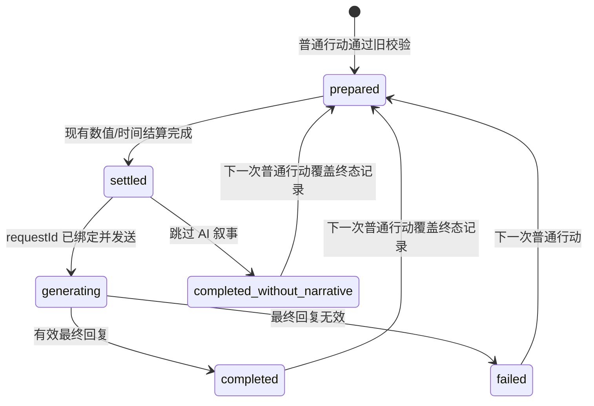

# Harness Phase 0/1 Minimal Implementation Plan

> **For agentic workers:** REQUIRED SUB-SKILL: Use `superpowers:subagent-driven-development` or `superpowers:executing-plans` to implement this plan task-by-task. Steps use checkbox (`- [ ]`) syntax for tracking.

**Goal:** 在不改变数值规则、不重构 Prompt、不迁移旁支功能的前提下，为普通上课/训练/休息行动加入最小可观测 Harness、全局单飞保护、作用域安全存档和 stale reply 编年史门禁。

**Architecture:** 不新增框架或运行时模块。`app.js` 继续持有权威 `state`，只增加 `state.harness`、少量纯辅助函数和普通行动生命周期钩子；`st.html` 继续作为 SillyTavern adapter，只补 `saveScope` 门禁。Phase 1 不拆分结算、不引入 JsonPatch、不实现跨 localStorage、聊天楼层和世界书的事务。

**Tech Stack:** Vanilla JavaScript、SillyTavern `postMessage` bridge、`localStorage`、Node.js built-in test runner。

---

## 1. 范围与约束

本计划只覆盖：

1. `state.harness` 的最小持久化结构。
2. `turnId`、`persistenceRevision`、`sessionEpoch` 的生成、迁移和保存。
3. `settleAction()` 中上课、训练、休息的重复提交保护。
4. `st.html` 对 `saveState` 消息的 `saveScope` 校验。
5. 编年史写入从 `routeHostAiPayload()` 前置调用移动到 `applyAiReply()` 的现有 requestId 门禁之后。
6. Phase 0 trace、单元测试和回滚边界。

明确不做：

- 不拆分 `settleAction()` 的确定性计算与写入。
- 不修改任何 Prompt builder 或 Prompt 文本。
- 不迁移外出、交流、亲密、地图、委托、赠礼、手机、广播和次 API。
- 不新增队列、事件总线、数据库、后台服务或通用事务框架。
- 不修改 `chronicle/sum-chronicle.js` 的编号和 worldbook 内容格式。
- 不处理编年史分支时的前端数值回档。
- 不把 `st2.html` 纳入本轮同步改造。
- 不实现刷新恢复、自动重试或放弃交互；这些内容单独进入后续 PR。
- 不解决普通行动与手机、广播、闲聊、地图等其他主模型入口的并发覆盖。

## 2. 方案选择

采用方案 A。

| 方案 | 内容 | 判断 |
|---|---|---|
| A：`app.js` 内薄 Harness | 在现有状态和入口旁加入辅助函数，不移动业务代码 | **采用**。改动最小，容易逐项回滚。 |
| B：新增 `harness/turn-harness.js` | 先抽模块，再接入 `app.js` | 暂不采用。当前结算仍依赖大量闭包状态，抽模块会扩大重构范围。 |
| C：一次迁移所有 AI/旁支请求 | 所有请求统一 turn map 和 sidecar | 暂不采用。超出 Phase 0/1，容易改变手机、广播和地图旧行为。 |

## 3. 最小数据结构

在 `baseState` 中新增以下结构；不复制完整 `state`：

```ts
interface HarnessState {
  schemaVersion: 1;
  persistenceRevision: number;
  sessionEpoch: string;
  activeTurn: HarnessActiveTurn | null;
  trace: HarnessTraceEntry[]; // 最多 40 条
}

interface HarnessActiveTurn {
  turnId: string;
  kind: 'produce_action';
  status:
    | 'prepared'
    | 'settled'
    | 'generating'
    | 'completed'
    | 'completed_without_narrative'
    | 'failed';
  actionKey: string;
  action: 'lesson' | 'training' | 'rest';
  attribute: 'Vo' | 'Da' | 'Vi' | null;
  requestId: string;
  saveScope: string;
  sessionEpoch: string;
  startPersistenceRevision: number;
  settledPersistenceRevision: number | null;
  snapshot: {
    day: number;
    round: number;
    postLiveDay: number | null;
    clockMinutes: number | null;
    stamina: number;
    stress: number;
    trust: number;
    Vo: number;
    Da: number;
    Vi: number;
    sp: { Vo: boolean; Da: boolean; Vi: boolean };
  };
  createdAt: number;
  updatedAt: number;
}

interface HarnessTraceEntry {
  at: number;
  type: string;
  turnId: string;
  requestId: string;
  persistenceRevision: number;
  saveScope: string;
  detail: Record<string, string | number | boolean | null>;
}
```

冻结字段只包含普通行动实际读取或修改的日程、核心数值和 SP 候选。`idols`、Prompt、完整日志、任务树、聊天历史、世界书、SNS 和资源只保留现有引用，不放入 snapshot。

`persistenceRevision` 是前端 state blob 的持久化修订号：每次 `saveState()` 前递增一次。名称刻意使用 persistence 前缀，防止被误认为业务事务版本；未来若引入原子 commit，再单独设计业务 revision。

## 4. 生命周期



activeTurn guard 是普通行动域的**全局单飞锁**：当前 session 中只要存在 `prepared`、`settled` 或 `generating`，任何新的上课、训练或休息都会被拒绝，不比较 actionKey 是否相同。actionKey 只用于诊断。刷新后的旧 turn 因 sessionEpoch 不同而不参与本轮锁判断；第一轮不提供恢复 UI，下一次普通行动可以覆盖该旧记录。

---

### 第一轮执行门禁

第一轮 PR 只包含 Task 1-5，并保留每个 Task 的独立 commit。Task 1-5 必须严格串行执行：每个 Task 都要先运行该 Task 指定测试，再查看 scoped diff 和 `git diff --check`，报告结果并确认范围后才能进入下一 Task；禁止连续修改多个 Task 后统一验证。

---

## Task 1：建立 Phase 0/1 契约测试

**Files:**

- Create: `tests/harness-phase1.test.mjs`
- Modify: `tests/chat-metadata-save.test.mjs`
- Modify: `tests/chronicle-sum.test.mjs`

**当前代码位置：**

- `tests/chat-metadata-save.test.mjs:7` 当前读取仓库外的 extension 文件，未直接覆盖本项目的 `st.html`。
- `tests/chronicle-sum.test.mjs:78` 只验证桥接存在，没有验证编年史调用顺序。
- 当前没有 `state.harness`、active turn 或普通行动全局单飞测试。

**最小修改方式：**

- 新测试文件使用现有 `readFunction()` 风格，从 `app.js` 提取纯辅助函数。
- `chat-metadata-save.test.mjs` 将 `bridgeSource` 指向 `../st.html`，让失败测试覆盖实际生产桥。
- `chronicle-sum.test.mjs` 增加调用顺序断言，不改 chronicle 算法测试。
- 在 `chronicle-sum.test.mjs` 内增加与现有测试相同风格的 `readFunction()` 辅助函数，用于读取 `routeHostAiPayload()` 和 `applyAiReply()`。

**可能影响的旧行为：** 无运行时影响；测试会先暴露缺失函数和错误调用顺序。

**需要增加的测试：**

```js
test('harness state migrates old saves without copying full state', () => {
  const normalized = normalizeHarnessState(null, 'session-new');
  assert.equal(normalized.schemaVersion, 1);
  assert.equal(normalized.persistenceRevision, 0);
  assert.equal(normalized.sessionEpoch, 'session-new');
  assert.equal(normalized.activeTurn, null);
  assert.deepEqual(normalized.trace, []);
});

test('current-session ordinary turn is a global single-flight lock', () => {
  assert.equal(isHarnessTurnBlocking({ status: 'generating', sessionEpoch: 's1', actionKey: 'lesson' }, 's1'), true);
  assert.equal(isHarnessTurnBlocking({ status: 'settled', sessionEpoch: 's1', actionKey: 'rest' }, 's1'), true);
  assert.equal(isHarnessTurnBlocking({ status: 'generating', sessionEpoch: 'old' }, 's1'), false);
  assert.equal(isHarnessTurnBlocking({ status: 'completed', sessionEpoch: 's1' }, 's1'), false);
});
```

`chronicle-sum.test.mjs` 增加：

```js
test('requestId-rejected stale reply cannot request a chronicle write', () => {
  const route = readFunction(app, 'routeHostAiPayload');
  const apply = readFunction(app, 'applyAiReply');
  assert.doesNotMatch(route, /requestChronicleUpdate\(/);
  assert.ok(apply.indexOf('if (!acceptedRequest)') < apply.indexOf('requestChronicleUpdate('));
});

test('chronicle decision helper rejects stale requests', () => {
  const shouldRequest = vm.runInNewContext(`(${readFunction(app, 'shouldRequestChronicleUpdate')})`);
  assert.equal(shouldRequest(false, true), false);
  assert.equal(shouldRequest(true, true), true);
});
```

**如何回滚：** 删除 `tests/harness-phase1.test.mjs`，恢复两个现有测试文件。本任务不修改生产代码。

- [ ] 新建失败的 Harness 状态和全局单飞 guard 测试。
- [ ] 将 metadata scope 测试切换到 `st.html`。
- [ ] 增加 chronicle 调用顺序与 stale decision helper 测试。
- [ ] 运行 `node --test tests/harness-phase1.test.mjs tests/chat-metadata-save.test.mjs tests/chronicle-sum.test.mjs`。
- [ ] 预期：因 `normalizeHarnessState`、`isHarnessTurnBlocking`、`shouldAcceptHostSave`、`shouldRequestChronicleUpdate` 缺失以及 chronicle 顺序错误而失败。
- [ ] 运行 `git diff -- tests/harness-phase1.test.mjs tests/chat-metadata-save.test.mjs tests/chronicle-sum.test.mjs` 和 `git diff --check`，确认只包含 Task 1 测试契约。
- [ ] 停止并报告 Task 1 的测试结果与 diff；确认后再进入 Task 2。
- [ ] Commit: `test: define phase 1 harness contracts`。

---

## Task 2：加入 `state.harness`、ID 和 Phase 0 trace

**Files:**

- Modify: `app.js:2298` `baseState`
- Modify: `app.js:2702-2713` 模块级运行时状态
- Modify: `app.js:2765` `loadState()`
- Modify: `app.js:2780` `saveState()`
- Modify: `app.js:2857` `ensureStateShape()`
- Test: `tests/harness-phase1.test.mjs`

**当前代码位置：**

- `baseState` 只有 `pendingAiRequestId` 和 `lastRequestId`，没有 Harness 状态。
- `loadState()` 会清空 pending request，但不记录中断原因。
- `saveState()` 直接序列化 state，没有 revision 或统一 trace。
- `createRequestId()` 使用 `Date.now() + Math.random()`。

**最小修改方式：**

在模块级变量区加入一次性运行时 epoch：

```js
let runtimeSessionEpoch = createHarnessId('session');
```

新增纯辅助函数，放在 `createRequestId()` 附近，函数声明可被初始化阶段调用：

```js
function createHarnessId(prefix) {
  const randomPart = globalThis.crypto?.randomUUID?.()
    || `${Date.now()}-${Math.random().toString(16).slice(2)}`;
  return `${prefix}-${randomPart}`;
}

function normalizeHarnessState(raw, sessionEpoch) {
  const source = raw && typeof raw === 'object' && !Array.isArray(raw) ? raw : {};
  return {
    schemaVersion: 1,
    persistenceRevision: Math.max(0, Number(source.persistenceRevision) || 0),
    sessionEpoch: String(sessionEpoch || source.sessionEpoch || ''),
    activeTurn: source.activeTurn && typeof source.activeTurn === 'object'
      ? source.activeTurn
      : null,
    trace: Array.isArray(source.trace) ? source.trace.slice(0, 40) : []
  };
}
```

在 `ensureStateShape()` 中调用 `normalizeHarnessState(state.harness, runtimeSessionEpoch)`。旧存档缺少字段时自动迁移；未知附加字段不参与本轮设计。

`runtimeSessionEpoch` 在第一轮只表示当前页面运行实例：页面加载时生成一次并写入 `state.harness.sessionEpoch`，聊天切换不旋转 epoch，聊天隔离仍由 saveScope 与 requestId 门禁负责。

新增两个职责分离的观测函数：

```js
const HARNESS_PERSISTED_TRACE_TYPES = new Set([
  'turn.prepared',
  'turn.settled',
  'turn.generating',
  'turn.completed',
  'turn.completed_without_narrative',
  'turn.failed',
  'turn.rejected_duplicate',
  'reply.rejected_stale'
]);
```

- `debugHarnessEvent(type, detail)` 只执行 `console.debug()`，不写入 `state.harness.trace`。
- `recordHarnessTrace(type, detail)` 仅接受上述 allowlist 类型，最多持久化 40 条，最新在前。
- 两者都只接收调用方显式传入的标量字段，不记录完整 Prompt、AI 正文、API key 或角色私密配置。
- 两者都不调用 `saveState()`，避免观测逻辑制造额外保存。

修改 `saveState(reason = 'state.save')`：

1. 确保 harness 形状存在。
2. `state.harness.persistenceRevision += 1`。
3. 调用 `debugHarnessEvent('state.save', { persistenceRevision, reason })`，只输出 console debug。
4. 执行原有 pending request、localStorage 和 host mirror 逻辑。

Phase 0 console-only 观测点：

- `saveState()`：persistenceRevision、reason。
- `requestHostStateSave()`：scope、persistenceRevision。
- `requestHostPromptSend()`：requestId、turnId、promptLength，不记录 Prompt 正文。
- `applyAiReply()`：reply received/accepted、requestId、isFinal。
- `requestChronicleUpdate()`：messageId、sumLength、turnId。

Phase 0 持久 trace 只记录：

- activeTurn 的 prepared/settled/generating/terminal 状态变化。
- 普通行动被全局单飞锁拒绝。
- AI 回复被 requestId 门禁拒绝。

**可能影响的旧行为：**

- 存档体积增加一个不超过 40 条的小数组，但不会因每次 `state.save` 追加 trace。
- 每次 `saveState()` 仍会因 `persistenceRevision` 递增而产生新版本。
- `persistenceRevision` 会受 `openEventOverlay()` 等展示层保存影响，因此只表示持久化次数，不表示数值事务次数。

**需要增加的测试：**

- 旧存档 `harness` 缺失、为数组、字段非法时可迁移。
- 持久 trace 超过 40 条时截断。
- `state.save`、`prompt.send`、`chronicle.request` 不进入持久 trace。
- 关键 turn 状态变化和 `reply.rejected_stale` 可以进入持久 trace。
- trace detail 不包含 `prompt`、`text` 或 `apiKey` 字段。
- `saveState()` 先递增 persistenceRevision，再写 localStorage/host mirror。

**如何回滚：**

- 删除 `baseState.harness` 和辅助函数。
- 恢复原 `saveState()`。
- 已写入旧存档的额外 `harness` 字段会被旧代码忽略，无需批量清理 localStorage。

- [ ] 实现 ID、normalize 和 trace 纯函数。
- [ ] 在 `baseState` 与 `ensureStateShape()` 接入 Harness。
- [ ] 为 `saveState()` 增加 persistenceRevision 与 console-only `state.save` debug。
- [ ] 关键 turn 状态变化和拒绝事件写持久 trace，其余观测点只写 console debug。
- [ ] 运行 `node --test tests/harness-phase1.test.mjs`。
- [ ] 运行 `node --check app.js`。
- [ ] 运行 `git diff -- app.js tests/harness-phase1.test.mjs` 和 `git diff --check`，确认只包含 Task 2。
- [ ] 停止并报告 Task 2 的测试结果与 diff；确认后再进入 Task 3。
- [ ] Commit: `chore: add minimal harness state tracing`。

---

## Task 3：普通行动重复提交保护

**Files:**

- Modify: `app.js:5311` `settleAction()`
- Modify: `app.js:5281` `finalizeProduceActionWithoutAi()`
- Modify: `app.js:16441` `applyAiReply()`
- Test: `tests/harness-phase1.test.mjs`

**当前代码位置：**

- `settleAction()` 完成旧校验后直接写 `state.pendingActionContext`，随后同步结算数值、时间和日志。
- 普通行动在 `saveState()` 后才设置模块级 `pendingAiRequestId`。
- 快速重复调用没有用户意图级 active turn guard。

**最小修改方式：**

新增以下辅助函数：

```js
function isHarnessTurnBlocking(turn, currentSessionEpoch) {
  return Boolean(
    turn
    && turn.sessionEpoch === currentSessionEpoch
    && ['prepared', 'settled', 'generating'].includes(turn.status)
  );
}

function isHarnessOrdinaryAction(action) {
  return ['lesson', 'training', 'rest'].includes(action);
}

function buildHarnessActionKey(action, attribute) {
  const schedule = isHybridFacilityActive()
    ? `free:${state.freeMode.postLiveDay}:${state.freeMode.clockMinutes}`
    : `produce:${state.day}:${state.round}`;
  return `${schedule}:${action}:${attribute || '-'}`;
}
```

`beginHarnessProduceAction(action, attribute)` 的行为：

1. 若当前 session 已有任意阻塞中的普通 active turn，记录 `turn.rejected_duplicate`，显示一次“行动处理中” toast，返回 `{ ok: false }`；不得比较 actionKey 后放行不同普通行动。
2. 生成新 `turnId`。
3. 冻结本计划第 3 节列出的 snapshot。
4. 保存 `status: 'prepared'`、当前 persistenceRevision、scope 和 session epoch；actionKey 仅用于 trace/debug。
5. 只改内存，不额外调用 `saveState()`；后续沿用 `settleAction()` 已存在的保存点。

接入位置必须在 `settleAction()` 的旧合法性检查和 companion topic 检查之后、`state.pendingActionContext = ...` 之前：

```js
if (isHarnessOrdinaryAction(action)) {
  const turnStart = beginHarnessProduceAction(action, attribute);
  if (!turnStart.ok) return;
}
```

在原结算完成、第一次 `saveState()` 前将 active turn 标为 `settled`，并预填 `settledPersistenceRevision = state.harness.persistenceRevision + 1`。设置 `pendingAiRequestId = requestId` 时，将同一 active turn 标为 `generating` 并绑定 requestId。

终态：

- `finalizeProduceActionWithoutAi()`：`completed_without_narrative`。
- `applyAiReply()` 普通非选项最终有效回复：`completed`。
- 最终无效回复且不再自动 retry：`failed`。

本任务不接入外出、交流、亲密和任何旁支。

**可能影响的旧行为：**

- 任意普通行动尚在结算/生成时，新的上课、训练或休息都会被拒绝，即使 actionKey 不同。
- 已完成、失败、旧 session 或无 active turn 时，普通行动入口不被该锁阻塞。
- 该锁只覆盖普通行动域，不阻止手机、广播、闲聊、地图等入口；这些主模型请求仍可能覆盖全局 pendingAiRequestId，本轮明确不解决。

**需要增加的测试：**

- 当前 session 的 `prepared/settled/generating` 阻塞；terminal 或旧 session turn 不阻塞。
- `settleAction()` 只对 lesson/training/rest 调用 begin helper。
- begin helper 位于数值 patch 之前。
- 第一次为 lesson、第二次为 training/rest 等不同 actionKey 时，第二次仍被全局单飞锁拒绝。
- skip AI 路径写 `completed_without_narrative`。
- 普通最终回复写 `completed`。

**如何回滚：**

- 删除 `settleAction()` 的 begin/mark 调用和三个终态调用。
- 保留 `state.harness` 与 trace 不会改变业务行为，可独立继续使用 Phase 0。
- 若需要一次性关闭 guard，可让 `isHarnessOrdinaryAction()` 返回 `false`，无需改存档。

- [ ] 写 duplicate guard 失败测试。
- [ ] 实现 ordinary action 判定、actionKey 和 begin helper。
- [ ] 在第一次业务写入前接入 guard。
- [ ] 接入 settled/generating/terminal 状态。
- [ ] 运行 `node --test tests/harness-phase1.test.mjs tests/bond-day-schedule.test.mjs tests/misuzu-balance.test.mjs`。
- [ ] 运行 `git diff -- app.js tests/harness-phase1.test.mjs` 和 `git diff --check`，确认新增内容只属于 Task 3。
- [ ] 停止并报告 Task 3 的测试结果与 diff；确认后再进入 Task 4。
- [ ] Commit: `feat: guard ordinary produce action turns`。

---

## Task 4：`st.html` 增加 `saveScope` 校验

**Files:**

- Modify: `st.html:616` `messageHandler`
- Modify: `st.html:928` `getCurrentContextInfo()` 邻近辅助函数区
- Modify: `st.html:1042` `saveChatState()`
- Modify: `tests/chat-metadata-save.test.mjs`

**当前代码位置：**

- `app.js:11571` 已发送 `saveScope: activeHostSaveScope`。
- `st.html:646` 当前忽略 `data.saveScope`，直接写当前 chat metadata。
- `saveChatState()` 总是从 `getContext()` 取得当前聊天。

**最小修改方式：**

在 `st.html` 增加纯函数：

```js
function shouldAcceptHostSave(incomingScope, currentScope, nextState) {
  if (!incomingScope || !currentScope || incomingScope !== currentScope) return false;
  return Boolean(nextState && typeof nextState === 'object' && !Array.isArray(nextState));
}
```

消息处理改为：

```js
if (data.type === 'saveState') {
  const currentScope = getCurrentContextInfo().saveScope;
  if (shouldAcceptHostSave(String(data.saveScope || ''), currentScope, data.state)) {
    saveChatState(data.state);
  } else {
    console.warn('[st.html] rejected stale or invalid state save', {
      incomingScope: String(data.saveScope || ''),
      currentScope
    });
  }
}
```

不增加 host save ACK，不比较 revision，不改变 metadata envelope 版本。

**可能影响的旧行为：**

- 旧版前端若发送不带 `saveScope` 的 `saveState`，宿主将拒绝写入；当前 `app.js` 已带 scope。
- 聊天切换瞬间迟到的保存不再污染新聊天。
- standalone 模式不经过 `st.html`，不受影响。

**需要增加的测试：**

- 非空且相等 scope + 普通对象返回 true。
- scope 不同、任一为空、state 为数组/null 返回 false。
- `messageHandler` 调用 `getCurrentContextInfo().saveScope` 后再决定 `saveChatState()`。

**如何回滚：** 恢复 `if (data.type === 'saveState') saveChatState(data.state)`，删除纯函数。metadata 结构没有迁移，回滚不需要数据处理。

- [ ] 让现有 scope 测试直接读取 `st.html`。
- [ ] 实现 `shouldAcceptHostSave()`。
- [ ] 在 message handler 接入校验和拒绝日志。
- [ ] 运行 `node --test tests/chat-metadata-save.test.mjs`。
- [ ] 运行 `git diff -- st.html tests/chat-metadata-save.test.mjs` 和 `git diff --check`，确认只包含 Task 4。
- [ ] 停止并报告 Task 4 的测试结果与 diff；确认后再进入 Task 5。
- [ ] Commit: `fix: validate host save scope`。

---

## Task 5：编年史写入移动到回复门禁之后

**Files:**

- Modify: `app.js:16441` `applyAiReply()`
- Modify: `app.js:17914` `routeHostAiPayload()`
- Modify: `tests/chronicle-sum.test.mjs`

**当前代码位置：**

- `routeHostAiPayload()` 在调用 `applyAiReply()` 前执行 `requestChronicleUpdate()`。
- `applyAiReply()` 随后才调用 `shouldAcceptAiReply()`。
- 因而 stale request 即使被正文路由拒绝，仍可能先写世界书。

**最小修改方式：**

1. 从 `routeHostAiPayload()` 删除前置 `requestChronicleUpdate()`。
2. 新增纯函数 `shouldRequestChronicleUpdate(acceptedRequest, isFinal)`，仅在二者都为 true 时返回 true。
3. 给 `applyAiReply()` 增加最后一个可选参数 `messageId`。
4. 在现有 `acceptedRequest` 拒绝分支之后加入：

```js
if (shouldRequestChronicleUpdate(acceptedRequest, isFinal)) {
  requestChronicleUpdate(rawText, renderedText, text, messageId);
}
```

5. `routeHostAiPayload()` 调用 `applyAiReply()` 时传入 `payload.messageId`。

Phase 1 的“验证”严格指现有 requestId 接受门禁，包括 phone chat 的 pending 容错。正文 schema、垃圾回复和 `<sum>` 语义校验仍使用现有逻辑；更严格的 narrative validation 留给 Phase 2/3。

**本 Task 唯一可靠性验收目标：被 `shouldAcceptAiReply()` 拒绝的 stale reply 不得触发 `requestChronicleUpdate()`。** 不宣称实现正文/状态/世界书的原子提交。

**可能影响的旧行为：**

- 被 requestId 门禁拒绝的旧回复不再写编年史。
- 被 requestId 接受、但后续判定正文过短的回复，若含合法 `<sum>`，仍可能写入；本轮不扩大到内容事务。
- 有效回复的世界书内容、编号和 prune 规则不变。

**需要增加的测试：**

- `shouldRequestChronicleUpdate(false, true)` 返回 false，直接覆盖 stale request 场景。
- `shouldRequestChronicleUpdate(true, true)` 返回 true，确保正常最终回复保持旧行为。
- `routeHostAiPayload()` 不直接调用 `requestChronicleUpdate()`。
- `applyAiReply()` 中 chronicle 调用位于 `if (!acceptedRequest)` 之后。
- 路由传递 `payload.messageId`。

**如何回滚：** 将 chronicle 调用移回 `routeHostAiPayload()`，移除 `messageId` 参数。worldbook schema 未变化。

- [ ] 先运行 Task 1 已加入的顺序和 stale decision helper 测试，确认失败。
- [ ] 实现 `shouldRequestChronicleUpdate()`，移动 chronicle 调用并传递 messageId。
- [ ] 运行 `node --test tests/chronicle-sum.test.mjs tests/vn-flow.test.mjs`。
- [ ] 运行 `git diff -- app.js tests/chronicle-sum.test.mjs` 和 `git diff --check`，确认只包含 Task 5。
- [ ] 停止并报告 Task 5 的测试结果与 diff；确认后才执行第一轮最终验收。
- [ ] Commit: `fix: gate chronicle writes by accepted replies`。

---

## 后续 PR：刷新后的 `activeTurn` 恢复（不属于本轮 Task 1-5）

本节只记录后续 PR 的安全约束，不在第一轮创建测试或修改代码：

- 刷新后检测旧 session 的非终态 activeTurn，并提供恢复提示。
- 重试必须保留 turnId、生成新 requestId，并发送完整 `lastPrompt`，不得依赖刷新前 host cache。
- 普通 `closeEventOverlay()` 只负责关闭展示，**不得**把 `recovery_required` 改为 abandoned。
- 放弃恢复必须使用独立的“放弃恢复”命令或按钮，并经过二次确认；确认文案必须说明已结算数值和时间不会回滚。
- 后续 PR 单独增加 retry、显式放弃、scope 切换和刷新恢复测试。
- 后续 PR 必须独立提交、独立验收，不与本轮 Task 1-5 合并。

---

## 第一轮最终验收（Task 1-5 完成后）

**Files:**

- Test: `tests/harness-phase1.test.mjs`
- Test: `tests/chat-metadata-save.test.mjs`
- Test: `tests/chronicle-sum.test.mjs`
- Test: `tests/bond-day-schedule.test.mjs`
- Test: `tests/misuzu-balance.test.mjs`
- Test: `tests/vn-flow.test.mjs`

**当前基线：** `node --test tests` 当前为 233 项中 226 通过、7 失败。已知失败包括 metadata scope 缺口和 6 个与本计划无直接关系的旧断言/测试沙箱问题。

**验收方式：**

- `chat-metadata-save` 的 scope 测试必须从失败变为通过。
- 新增 Harness 测试全部通过。
- 当前 session 的任意普通 activeTurn 对上课、训练、休息形成全局单飞锁。
- 该锁不宣称解决手机、广播等其他主模型入口的并发覆盖。
- 被 requestId 门禁拒绝的 stale reply 不得调用 `requestChronicleUpdate()`；不扩大为内容或世界书事务验收。
- 持久 trace 不包含 `state.save`，只保留关键 turn 状态变化和拒绝事件。
- 普通行动相关测试不得新增失败。
- 完整测试集的失败数应从 7 降至最多 6；若其他旧失败在期间被独立修复，以实际基线比较，不硬编码数量。
- `node --check app.js` 通过。
- 对 `st.html` 使用静态 bridge 测试验证；HTML 内联脚本不直接传给 `node --check`。
- `git diff --check` 无错误。

执行命令：

```powershell
node --test tests/harness-phase1.test.mjs tests/chat-metadata-save.test.mjs tests/chronicle-sum.test.mjs tests/bond-day-schedule.test.mjs tests/misuzu-balance.test.mjs tests/vn-flow.test.mjs
node --check app.js
node --test tests
git diff --check
```

手工验收场景：

1. 连续快速点击同一“上课”按钮，只产生一次数值变化和一条行动日志。
2. 上课正在生成时点击训练或休息，不同 actionKey 仍被普通行动全局单飞锁拒绝。
3. 在聊天 A 发起保存，立即切到聊天 B；迟到的 A scope 保存被 `st.html` 拒绝。
4. 构造旧 requestId 的含 `<sum>` 回复；该 stale reply 不写编年史。
5. 正常 requestId 回复仍按旧流程写正文和编年史。
6. 连续触发普通 `saveState()` 后，console 有 `state.save` debug，但持久 trace 中没有 `state.save`。

**整体回滚顺序：**

1. 回滚 Task 5 的 chronicle 调用移动。
2. 回滚 Task 4 的 saveScope 门禁。
3. 回滚 Task 3 的普通行动单飞锁。
4. 回滚 Task 2 的 persistenceRevision、sessionEpoch 和 trace。
5. 回滚 Task 1 测试契约。

按 Task 分提交后，使用普通 `git revert <commit>` 逆序回滚，不使用 `git reset`，也不需要清理用户存档。

- [ ] 确认 Task 1-5 各自已有测试结果和 scoped diff 记录。
- [ ] 运行聚焦测试集。
- [ ] 运行 JS 语法检查。
- [ ] 运行完整测试集并记录新旧失败差异。
- [ ] 执行六个手工验收场景。
- [ ] 检查 `state.harness.trace` 不含 `state.save`、Prompt 正文和密钥。
- [ ] 检查 `git diff --check`。

## 5. 最终文件清单

| 文件 | 操作 | 责任 |
|---|---|---|
| `app.js` | 修改 | Harness state、persistenceRevision/sessionEpoch/turnId、关键 trace、普通行动全局单飞、stale reply 后置 chronicle |
| `st.html` | 修改 | 当前 chat scope 校验后才写 metadata |
| `tests/harness-phase1.test.mjs` | 新增 | Harness 迁移、关键 trace、普通行动全局单飞与旧 session 非阻塞契约 |
| `tests/chat-metadata-save.test.mjs` | 修改 | 直接测试本项目 `st.html` 的 scope 门禁 |
| `tests/chronicle-sum.test.mjs` | 修改 | 验证 requestId-rejected stale reply 不触发编年史写入 |

本轮不新增 `harness/*.js`，不修改 Prompt、任务、世界状态、商店、广播和 chronicle 算法文件；不实现刷新恢复 UI。
