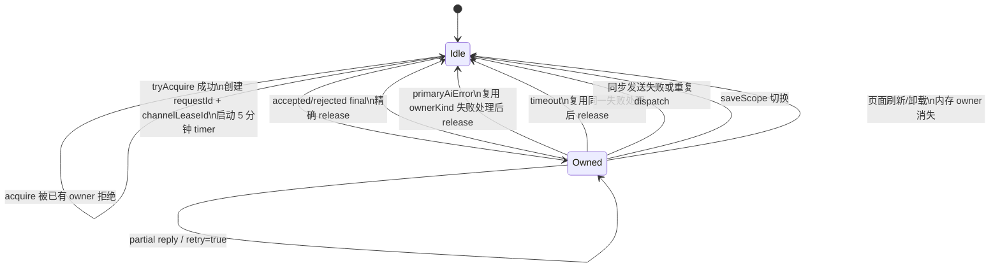

# Harness Phase 1.5 收尾审查

审查日期：2026-07-11

审查范围：当前工作区中的 `app.js`、`st.html`、Phase 1/Recovery 实现、Phase 1.5 测试和 `docs/harness-phase1.5-plan.md`。本文只描述当前实际代码，不把计划中的目标当作已完成事实。

## 0. 结论摘要

Phase 1.5 已建立两个有效的最小门禁：

1. 页面内存中的单一主模型 owner/lease，使普通行动、普通行动 Recovery、手机私聊、广播完整稿以及所有经过统一发送函数的旧入口不能同时占用主模型通道。
2. 独立的 `hostSaveSequence`，使同一 `saveScope` 已接受的 versioned 宿主保存只能单调增加，旧保存晚到时不会覆盖新 metadata。

这两个门禁解决的是“发送资格”和“宿主保存顺序”，不是完整事务系统。Phase 1.5 没有让所有旧入口都在业务写入前 acquire，也没有解决多标签页、宿主 ACK、网络取消、原子提交或所有旁支的恢复语义。

重点审查结论：

- **owner 是否可能永远无法释放：**正常代码路径均有终止释放或五分钟 timeout 兜底；宿主无响应、应用回复处理抛错等情况会延迟到 timeout。浏览器后台节流可能让五分钟不是严格墙钟时间。
- **旧 lease 是否能释放新 owner：**不能。`releasePrimaryModelChannel()` 同时严格比较 `requestId` 和 `channelLeaseId`；旧 reply、旧 error、旧 timer 均无法释放新 owner。
- **legacy_main 被拒后的副作用：**存在。`legacy_main` 自动 acquire 位于 `requestHostPromptSend()`/`requestHostRegeneration()` 内，多数旧入口在调用发送函数前已经修改业务状态、日志、pending、UI，甚至已经完成数值结算。
- **timeout 是否复制业务状态机：**没有复制第二套完整状态机。timeout 调用统一的 `handlePrimaryModelChannelFailure()`，后者复用 Recovery、手机、广播现有失败清理；但它仍按 `ownerKind` 集中编排不同清理动作。
- **同 scope 是否严格递增：**宿主“已接受序列”严格单调增加，重复值和更小值均拒绝；允许跳号，不要求必须恰好 `N+1`。该保证只适用于单活动前端实例，不适用于多标签页分布式竞争。
- **旧存档和 metadata v1：**仍可读取。旧 state 的 `hostSaveSequence` 归一化为 `0`；`getSavedChatState()` 直接读取 `envelope.state`，没有强制要求 envelope version 2。

## 1. Phase 1.5 实际解决的问题

### 1.1 主模型通道具备全局单飞 owner

`app.js` 新增内存态 `primaryModelChannelOwner` 和 `primaryModelChannelTimeoutId`。owner 最少包含：

```ts
interface PrimaryModelChannelOwner {
  requestId: string;
  channelLeaseId: string;
  ownerKind: "ordinary_action" | "ordinary_recovery" | "phone_chat" | "broadcast" | "legacy_main";
  turnId: string;
  saveScope: string;
  sessionEpoch: string;
  acquiredAt: number;
}
```

任意时刻只能存在一个 owner。不同 `ownerKind` 不允许并发，新的主模型请求会立即拒绝，不排队、不抢占当前请求。

### 1.2 普通行动在结算副作用前取得正式 lease

`settleAction()` 对 `lesson`、`training`、`rest` 的 AI 叙事路径在写入 `pendingActionContext`、随机事件、数值 delta、时间和日志之前 acquire `ordinary_action`。通道被占用时直接返回，不发生本次行动结算。

启用了“上课/训练跳过 AI 正文”时不会占用主模型 owner，保留原行为。

### 1.3 Recovery 复用同一 ownership

`retryHarnessNarrativeRecovery()` 在修改 `activeTurn` 前 acquire `ordinary_recovery`：

- 保留原 `turnId`。
- 每次尝试生成新的 `requestId` 和 `channelLeaseId`。
- 仍只使用 `activeTurn.generationPrompt`。
- acquire 失败时不修改 Recovery 状态。
- 生成失败或 timeout 时复用 `returnHarnessRecoveryAttemptToPending()` 回到 `recovery_required`。

`activeTurn.requestId` 仍是唯一可接受的当前普通行动回复 ID；`requestIds` 没有被用于放宽回复门禁。

### 1.4 手机和广播不会再覆盖普通行动 owner

以下路径取得专用 owner：

- 手机普通发送：`submitPhoneChatMessage()`。
- 手机重试：`triggerPhoneChatRegeneration()`。
- 手机添加好友后的问候生成：`sendPhoneAddFriendGreeting()`。
- 手机内部发送：`sendPhoneChatToHost()`。
- 广播完整稿手动/自动生成：`requestBroadcastFullScript()`。

普通手机发送在追加制作人气泡和清空输入前 acquire；广播在写入 `activeStoryNode`、`scriptStatus = "generating"` 和 pending ID 前 acquire。

注意：`confirmPhoneAddFriend()` 会先把联系人加入好友列表并保存，再调用 `sendPhoneAddFriendGreeting()` acquire。通道冲突会阻止问候生成，但不会撤销“已添加好友”这一非模型业务动作。

### 1.5 lease 在宿主桥接中端到端透传

`channelLeaseId` 从 `app.js` 的 `sendPrompt`/`regenerate` 消息进入 `st.html`，并原样返回到：

- `aiReply`
- `aiReplyCommitted`
- `primaryAiError`

宿主 `regenerate` 找不到 request Prompt cache 时会立即发送 `primaryAiError`，不会让 owner 无意义等待到 timeout。

### 1.6 同 scope 的旧宿主保存不能覆盖新保存

`state.harness.hostSaveSequence` 与 `persistenceRevision` 分离。前者只表示宿主镜像保存顺序，后者继续表示例行持久化观测次数。

`st.html` 使用 `lastAcceptedHostSaveSequenceByScope` 和 metadata envelope 中的序列共同决定最后接受值。同一 scope 的重复保存和晚到旧保存会在写 metadata 前被拒绝。

## 2. 实际覆盖的主模型入口

### 2.1 业务级正式接入

这些入口会在计划规定的业务副作用之前显式 acquire：

| ownerKind | 入口 | 实际门禁位置 |
|---|---|---|
| `ordinary_action` | `settleAction()` 的 `lesson`、`training`、`rest` AI 路径 | 数值、随机、时间、日志和 `pendingActionContext` 写入前 |
| `ordinary_recovery` | `retryHarnessNarrativeRecovery()` | `activeTurn` 新 requestId/status 写入前 |
| `phone_chat` | `submitPhoneChatMessage()` | 追加制作人气泡和清空输入前 |
| `phone_chat` | `triggerPhoneChatRegeneration()` | pending、typing、retry 状态写入前 |
| `phone_chat` | `sendPhoneAddFriendGreeting()` | AI waiting/pending 状态写入前；好友本身已经添加 |
| `phone_chat` | `sendPhoneChatToHost()` | 作为内部防线，在调用者未提供 lease 时 acquire |
| `broadcast` | `requestBroadcastFullScript()` | broadcast generating/pending 状态写入前 |

### 2.2 传输层覆盖但未完成业务迁移

所有经过 `requestHostPromptSend()` 或 `requestHostRegeneration()` 的其他主模型请求都会自动 acquire `legacy_main`。因此它们不能真正与已存在 owner 同时发往宿主，但它们在到达传输层前的业务写入不受保护。

### 2.3 不属于 primary owner 的入口

`requestHostSecondaryPromptSend()`、daily world generation 和其他 `sendSecondaryPrompt` 路径不占用 primary owner。它们仍可能与主模型请求进入宿主已有的 `promptTaskQueue`，Phase 1.5 没有改变该调度语义。

## 3. 仍只是 legacy_main 兜底的入口

当前可直接从调用关系确认的 legacy 调用者包括：

- `settleAction()` 中非普通三行动的旧分支，例如 outing/companion/intimacy。
- `beginGiftGivingStory()`。
- `startOpeningStory()`、`triggerAffinityStory()`。
- `startFirstLive()`、`startFirstLivePostStage()`。
- `beginSandboxScoutWrapUp()`。
- `startApartmentNsfwInvite()`、`beginApartmentCompanionChat()`、`requestNextApartmentCompanionOptions()`。
- `handleMapLocationReturn()`、`beginMapLocationExploreSession()`、`requestNextMapLocationOptions()`、`handleSideQuestSceneChoice()`。
- `requestFreeModeOutingSceneDialogue()`。
- `submitFreeChat()`、`submitIdolInteraction()`、`submitAiPrompt()`。
- 通用 `triggerRegeneration()`。
- `requestNsfwIntimacyAiRound()`、`handleNsfwIntimacyEndChoice()`。
- `handleChoiceSelection()` 的后续生成路径。

这些入口被拒绝后可能已经留下：

- `pendingAiRequestId` 或各自 pending context。
- `activeStoryNode`、`eventMode`、`choiceStep` 和 UI waiting 状态。
- `lastPrompt`、`lastStory`、日志或 journal。
- 礼物消耗/好感结算、First Live 判定等已经完成的业务结果。

因此，“legacy_main 已覆盖”只表示请求没有发出，不表示入口具备无副作用拒绝或完整恢复能力。

## 4. owner acquire/release/timeout 的实际生命周期



### 4.1 acquire

`tryAcquirePrimaryModelChannel()`：

1. 已有 owner 时返回 `{ ok: false, blockingOwner }`，不修改业务状态。
2. 空闲时生成 `channelLeaseId`，保存 owner。
3. 启动 `PRIMARY_MODEL_CHANNEL_TIMEOUT_MS = 5 * 60 * 1000` 的 timer。
4. 输出非持久化 debug 事件。

### 4.2 正常 release

最终回复进入 `applyAiReply()` 后，各终态路径调用 `sendAiReplyAck()`。`sendAiReplyAck()` 在尝试向宿主发送 ACK 之前先调用 `releasePrimaryModelChannel()`，因此 release 不依赖 ACK 发送成功。

流式非最终回复和 `retry=true` 不释放当前 lease，这是有意行为：同一生成尝试仍占用通道。最终接受、最终拒绝或重试耗尽才释放。

### 4.3 错误和 timeout

宿主生成抛错、regenerate cache 缺失会发送带双 ID 的 `primaryAiError`。`routeHostAiPayload()` 将其交给 `handlePrimaryModelChannelFailure()`。

timeout 也调用同一个 `handlePrimaryModelChannelFailure()`，没有建立第二套超时业务状态机：

- `ordinary_recovery`：回到 `recovery_required`。
- `ordinary_action`：保留已结算状态，标记现有失败语义。
- `phone_chat`：结束 awaiting，开放重试。
- `broadcast`：结束 loading，标记失败/可再次请求。
- `legacy_main`：只清兼容 pending，不尝试猜测每个旧流程的业务恢复。

失败清理完成后仍以 owner 自身的 `requestId + channelLeaseId` 精确 release。

### 4.4 其他 release 路径

- 显式 lease 已取得但宿主不可用或 Prompt 为空。
- 同 requestId/Prompt 的重复 dispatch 被去重。
- 手机文本最终为空。
- `applyHostCharacter()` 确认切换到不同 `saveScope`。
- 页面刷新/卸载：owner 不持久化，新页面从空闲开始；旧网络请求不会恢复。

### 4.5 owner 无法及时释放的剩余路径

没有发现能绕过 timer 形成永久 owner 的正常路径，但以下情况依赖 timeout：

- 宿主收到消息后既不返回 reply 也不返回 error。
- `applyAiReply()` 在到达任何 `sendAiReplyAck()` 前抛异常。
- 宿主或浏览器事件丢失。
- `retry=true` 后再也没有后续候选回复。

页面后台 timer 可能被浏览器节流，因此“五分钟”是目标超时，不是严格实时保证。timeout 也不取消宿主正在执行的模型请求；迟到回复只会被 request/lease 门禁拒绝。

## 5. hostSaveSequence 的生成、恢复和拒绝规则

### 5.1 生成

`saveState()` 每次仍先增加 `persistenceRevision`。只有同时满足以下条件时才增加 `hostSaveSequence`：

- 当前运行在 SillyTavern host。
- `hostStateReady === true`。
- `activeHostSaveScope` 非空。

sequence 在 localStorage 写入前增加，同一数值随后作为 `saveState` 消息顶层字段发送给 `st.html`。`requestHostStateSave()` 不会再次递增。

### 5.2 恢复

- 旧 state 缺少字段时，`normalizeHarnessState()` 将其归一化为 `0`。
- metadata 中存在远端 state 时，远端 state 优先；其中的 sequence 被保留。
- metadata 为空而 localStorage state 被迁移时，从 local state 的 sequence 继续。
- 下一次 host-eligible 保存从当前 `N` 增加到 `N+1`。

### 5.3 宿主接受规则

`st.html` 的 `decideHostStateSave()` 按以下顺序判断：

1. incoming scope 和 current scope 都必须非空且完全相等。
2. state 必须是非数组对象。
3. 正整数 sequence 被视为 versioned 保存。
4. versioned sequence 必须严格大于该 scope 最后接受值。
5. 相等返回 `duplicate_sequence`；更小返回 `stale_sequence`。
6. 更大的值可被接受，允许跳号。
7. 无 sequence/无效 sequence 被当作 legacy 保存；仅在该 scope 尚无 versioned 历史时接受。

最后接受值取以下两者最大值：

- 页面内 `lastAcceptedHostSaveSequenceByScope` Map。
- 当前 chat metadata envelope 中同 scope 的 `hostSaveSequence`。

Map 在调用 `saveChatState()` 前更新，metadata 写入 envelope v2：

```ts
interface HatsuChatStateEnvelopeV2 {
  version: 2;
  saveScope: string;
  hostSaveSequence: number;
  updatedAt: number;
  state: object;
}
```

拒绝只输出结构化 warning，不回写 metadata，不通知前端，也不自动重试。

### 5.4 严格性的实际边界

同一活动页面实例、同一 scope 下，宿主接受序列确实严格单调增加；前端正常发送时按 `N+1` 生成。宿主门禁只要求 `incoming > last`，所以它保证顺序而不保证连续性。

以下不在保证内：

- 两个浏览器标签页同时从 N 生成 N+1。
- metadata debounce 最终是否成功落盘。
- Map 已更新后 metadata 写入失败的确认与补偿。
- 宿主成功 ACK、保存重试和跨设备 revision。

### 5.5 旧存档和 metadata v1 兼容性

- 旧 state 可加载，缺失 `hostSaveSequence` 时使用 `0`。
- `getSavedChatState()` 只要求 envelope 是对象并返回 `envelope.state`，不会因 `version !== 2` 拒绝，因此 version 1 metadata 仍可读取。
- 尚未接受过 versioned 保存的 scope 可接受旧格式无 sequence 消息。
- 一旦接受过正整数 sequence，后续 legacy 消息会以 `legacy_after_versioned` 拒绝，防止旧页面降级覆盖。

## 6. 当前测试和手工验收结果

本次收尾审查重新执行结果：

| 验证 | 结果 |
|---|---|
| Phase 1.5/Harness/Recovery/phone/broadcast/save/chronicle/VN 组合 | `111/111` 通过 |
| `tests/st-loader-bridge.test.mjs` | `17/19` 通过，2 项既有失败 |
| 全量 `node --test tests` | `295` 项，`289` 通过，`6` 失败 |
| `node --check app.js` | 通过 |

全量六项失败与 Phase 1.5 实施前基线相同：

1. `selected idols are all required in a zero-cost interaction`
2. `producer profile includes gender in state, form, save flow, and prompts`
3. `st.html loader uses a responsive mobile viewport instead of a fixed desktop canvas`
4. `st.html pauses floor hiding when the opening floor is not mounted`
5. `advanceDay only advances schedule from summary round`
6. `day 21 summary round advances into First Live schedule`

自动化测试明确覆盖：单 owner、不同 ownerKind 抢占、错误双 ID 不释放、旧 lease 不释放新 owner、普通行动 acquire 顺序、Recovery acquire 顺序、lease 往返、timeout 复用失败处理、宿主错误、regenerate cache 缺失、同 scope 新旧 sequence、legacy 降级和 metadata v1 读取。

手工验收未完成：内置浏览器访问本地 SillyTavern 时返回 BasicAuth `Unauthorized`，无法真实点击验证手机/广播/普通行动抢占或 DevTools 重放 metadata 保存。自动化测试不能替代该宿主端端到端验收。

## 7. 实际实现与计划的偏差

1. 计划列出的 `tests/phone-chat.test.mjs`、`tests/world-engine.test.mjs` 没有因 Phase 1.5 新增断言；它们只参与组合回归。新的 acquire 顺序和跨入口约束主要集中在 `tests/primary-model-ownership.test.mjs`。
2. 计划中的六方向抢占测试没有全部做成可执行浏览器状态机测试；当前主要是 VM primitive 测试、源码顺序断言和既有模块回归。
3. 最终审查额外补充了 regenerate cache 缺失时的即时 `primaryAiError`，避免 owner 等待五分钟。
4. 计划建议 ownership 和 save ordering 分两个 commit；当前工作区尚未按此拆分提交。
5. `shouldAcceptHostSave()` 被保留为兼容 wrapper，实际规则集中到新增的 `decideHostStateSave()`，属于最小兼容实现。
6. 手机添加好友的联系人写入发生在问候生成 acquire 之前；正式门禁只覆盖问候 AI 状态，不回滚好友关系。

未发生的计划外扩张：没有修改 Prompt builder、确定性结算、普通行动 Recovery 语义，也没有引入队列、事件总线、数据库或微服务。

## 8. 尚未解决的竞态和产品边界

### 8.1 legacy_main 拒绝前的业务副作用

这是当前最明确的剩余一致性风险。旧入口可能已经结算、写日志、清输入或进入 waiting UI，随后才在传输层发现 owner 被占用。`requestHostPromptSend()` 只返回 false，各调用者通常沿用“未连接 SillyTavern”的旧 fallback 文案，不能准确表达“通道被占用”，也不统一补偿已写状态。

### 8.2 timeout 不取消真实宿主请求

timeout 释放的是前端 ownership，不是宿主生成任务。timeout 后新 owner 可以开始，而旧模型仍可能生成并写入 SillyTavern chat；旧回复不能修改前端权威状态，但宿主聊天中可能留下旧楼层。

### 8.3 页面刷新后的 owner 边界

owner 不持久化，刷新后立即为空；这是“不恢复旧网络请求”的既定语义。旧页面请求若仍在宿主完成，只能依靠新页面没有匹配 owner/request/lease 而拒绝业务回写，无法撤销宿主已经写入的内容。

### 8.4 sessionEpoch/saveScope 不是 release 比较字段

owner 保存 `sessionEpoch` 和 `saveScope` 用于归属、调试和切 scope 清理，但精确 release 的权威条件只有 `requestId + channelLeaseId`。随机 lease 使跨 session 碰撞概率可忽略，但当前没有把 sessionEpoch 作为第三道显式比较。

### 8.5 多标签页保存冲突

两个标签页可能从同一 N 各自生成 N+1。宿主会接受先到者并拒绝后到者，但无法合并后到标签页的更新，也无法告诉它保存失败。Phase 1.5 是单 writer 顺序保护，不是多 writer 协调。

### 8.6 metadata 无成功 ACK

Map 在 metadata save 前前移，`saveMetadataDebounced()` 没有成功确认。若宿主最终写入失败，本页会认为该 sequence 已接受；后续更大 sequence 仍可能恢复进展，但无法确认中间状态是否持久化。

### 8.7 次 API 和宿主队列边界

secondary prompt 不占 primary owner，但宿主仍通过既有 `promptTaskQueue` 调度。Phase 1.5 没有承诺 secondary 与 primary 真并行，也没有为 secondary 建立 lease 或跨 scope 生命周期。

### 8.8 原子提交仍未解决

普通行动仍是确定性结算先保存、叙事后完成。Recovery 可以补叙事，但状态、正文、编年史和宿主 metadata 不是一个原子事务，也没有通用补偿 receipt。

## 9. 下一个最小阶段建议

建议下一个阶段定义为 **Phase 1.6：高风险 legacy 入口前置门禁与真实宿主验收**，暂不进入全面 Phase 2。

最小范围：

1. 先补一套可执行的入口门禁测试，验证被占用时 state/log/UI/input 均不变，而不只检查源码顺序。
2. 优先迁移低耦合入口：`submitFreeChat()`、`submitIdolInteraction()`、`submitAiPrompt()` 和通用 regeneration，在任何 pending/UI 写入前 acquire。
3. 单独设计有既成业务结果的入口：gift、First Live、地图/委托、choice continuation。先明确“通道忙时是否允许先结算、是否保留结算、如何提示”，再移动 acquire，避免暗中改变产品语义。
4. 增加 owner 诊断视图或只读 debug 快照：当前 ownerKind、年龄、scope、最后 release/reject reason；不持久化 Prompt。
5. 在通过 BasicAuth 的真实 SillyTavern 环境完成手机、广播、普通行动、Recovery 抢占和 metadata 重放验收。

该阶段仍可保持单文件前端和现有宿主桥接，不需要队列或事务基础设施。

## 10. 现在不应该继续做的内容

- 不应立即把所有 legacy 流程批量改成业务级 owner；gift、First Live、地图和选项流程的 acquire 时点涉及产品语义，必须逐类验收。
- 不应重构 `settleAction()`、Prompt builder 或普通行动 Recovery。
- 不应引入等待队列、优先级抢占、事件总线、微服务、数据库或分布式锁。
- 不应把 `persistenceRevision` 改成保存顺序或事务版本。
- 不应为了多标签页直接增加复杂 host ACK/重试协议；先确认项目是否真实需要多 writer 支持。
- 不应自动重发 timeout、刷新前或旧 session 的模型请求。
- 不应让 AI 决定 request 接受、数值、时间、随机结果、保存顺序或 owner 释放。
- 不应声称所有主模型入口已完成 Harness；当前只有 ordinary/Recovery/phone/broadcast 是业务级接入，其余仍是 transport-level `legacy_main`。
- 不应在真实宿主手工验收缺失时宣称 Phase 1.5 已完成端到端验证。
