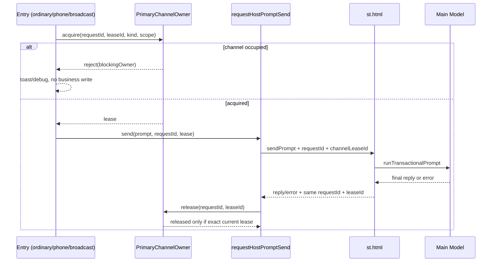
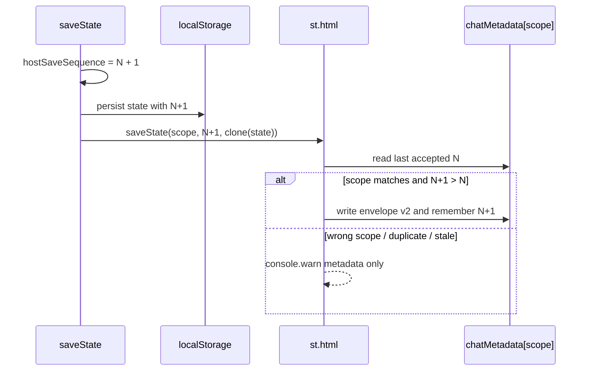

# Harness Phase 1.5 Implementation Plan

> **For agentic workers:** REQUIRED SUB-SKILL: Use superpowers:subagent-driven-development (recommended) or superpowers:executing-plans to implement this plan task-by-task. Steps use checkbox (`- [ ]`) syntax for tracking.

**Goal:** 在不改变普通行动结算、Prompt 和 Recovery 语义的前提下，为主模型请求建立单一 ownership 门禁，并阻止同一 `saveScope` 的旧宿主存档覆盖新存档。

**Architecture:** 主模型通道使用页面内存中的单一 lease owner；`requestId` 继续承担业务回复身份，新增 `channelLeaseId` 区分同一 requestId 的不同发送尝试。宿主存档使用独立的 `hostSaveSequence`，前端按当前存档递增，`st.html` 按 `saveScope` 保存最后接受值并拒绝倒序或重复保存。

**Tech Stack:** 原生 JavaScript、SillyTavern `postMessage` 桥接、chat metadata、Node.js `node:test`。

---

## 0. 范围和当前代码结论

本计划基于 `docs/harness-phase1-completion.md` 和当前代码，而不是通用 Harness 模板。

当前事实：

- `app.js:12163` 的 `requestHostPromptSend()` 是显式 Prompt 的主模型统一发送点。
- `triggerPhoneChatRegeneration()` 和 `triggerRegeneration()` 还会直接发送 `type: "regenerate"`，同样占用主模型通道。
- `st.html` 的 `sendPrompt` 和 `regenerate` 最终进入 `runTransactionalPrompt()`；宿主已经有 `pendingRequestId`，但没有前端 owner/lease 语义。
- `requestHostSecondaryPromptSend()` 使用 `sendSecondaryPrompt`，属于独立次 API；不纳入本阶段主模型 ownership。
- `saveState()` 先写 localStorage，再由 `requestHostStateSave()` 发送 `{ saveScope, state }`。
- `st.html` 的 `shouldAcceptHostSave()` 目前只验证 scope 和 state 形状；metadata envelope 没有顺序字段。
- `persistenceRevision` 是所有 `saveState()` 的观测计数，不是宿主保存排序契约。

本阶段不新增等待队列。主模型通道被占用时，新请求立即拒绝，由原入口保留输入或显示提示。

## 1. 设计选择

### 1.1 备选方案

1. **继续只用 `pendingAiRequestId`**：改动最少，但不同入口仍能先覆盖该全局变量，无法证明释放的是同一次发送。排除。
2. **页面内 lease owner + 桥接透传 lease（推荐）**：保留现有业务 requestId，并用 `channelLeaseId` 防止旧完成/失败释放新 owner；无需队列或重构业务流程。
3. **把 ownership 下沉到宿主队列**：能够集中排队，但会引入等待语义、跨聊天调度和更复杂 ACK，超出 Phase 1.5。排除。

### 1.2 核心决策

- 主模型请求不允许不同类型并发；普通行动、Recovery、手机、广播和暂缓入口共享一个 owner。
- 次 API/world generation 不占用这个 owner，继续走现有 `sendSecondaryPrompt`。
- `primaryModelChannelOwner` 只存在于页面内存，不写入存档；刷新不恢复旧网络请求。
- `pendingAiRequestId` 暂时保留为兼容镜像，不再是跨入口 ownership 的权威来源。
- 普通行动仍以 `activeTurn.requestId` 作为唯一业务回复 ID；ownership 不允许 `requestIds` 放宽门禁。
- 新的宿主保存排序字段命名为 `hostSaveSequence`，放在 `state.harness`，同时作为 `saveState` 消息的顶层字段发送。

## 2. A：主模型请求通道 ownership

### A1. 当前哪些入口会占用主模型通道

所有下列入口最终使用 `requestHostPromptSend()` 或 `regenerate`：

| 类别 | 当前函数/入口 | Phase 1.5 处理 |
|---|---|---|
| 普通行动 | `settleAction()` 的 lesson/training/rest | 显式 owner：`ordinary_action` |
| 普通行动恢复 | `retryHarnessNarrativeRecovery()` | 显式 owner：`ordinary_recovery` |
| 手机 | `submitPhoneChatMessage()`、`sendPhoneChatToHost()`、`sendPhoneAddFriendGreeting()`、`triggerPhoneChatRegeneration()` | 显式 owner：`phone_chat` |
| 广播 | `requestBroadcastFullScript()` | 显式 owner：`broadcast` |
| 普通行动之外的育成剧情 | outing/companion/intimacy、opening、affinity、First Live | 通用 owner：`legacy_main`，暂不迁移业务状态 |
| 自由模式/地图 | apartment、map location、side quest、outing scene | 通用 owner：`legacy_main`，暂不迁移业务状态 |
| 其他剧情 | gift、free chat、idol interaction、通用编辑重发/再生成 | 通用 owner：`legacy_main`，暂不迁移业务状态 |

`requestHostSecondaryPromptSend()`、daily world generation、tier/side-quest 次 API 测试请求不占用主模型 owner。

### A2. 优先接入与暂缓范围

优先做业务级接入：

1. 普通行动初次生成。
2. 普通行动 Recovery。
3. 手机私聊初次发送、加好友问候和私聊重试。
4. 广播完整稿的手动与自动生成。

暂缓：outing、companion、intimacy、bond、First Live、地图、委托、礼物、free chat、idol interaction 等流程的专用 ownerKind、专用失败恢复和 UI 状态迁移。

暂缓入口仍必须经过 transport 级 `legacy_main` owner，因而不能绕过单飞锁；只是其业务状态继续使用现有逻辑。

### A3. owner 最小结构

```ts
type PrimaryModelOwnerKind =
  | "ordinary_action"
  | "ordinary_recovery"
  | "phone_chat"
  | "broadcast"
  | "legacy_main";

interface PrimaryModelChannelOwner {
  requestId: string;
  channelLeaseId: string;
  ownerKind: PrimaryModelOwnerKind;
  turnId: string;       // 仅普通行动/Recovery 非空
  saveScope: string;
  sessionEpoch: string;
  acquiredAt: number;
}
```

字段不能再减：

- `requestId` 用于业务回复路由。
- `channelLeaseId` 唯一标识一次发送尝试，防止旧请求释放复用 requestId 的新 owner。
- `ownerKind` 用于失败清理和 UI 文案。
- `turnId` 绑定普通行动；其他入口为空字符串。
- `saveScope` 防止切聊天后继续持有错误 owner。
- `sessionEpoch` 防止刷新后的旧消息被当前页面接收。
- `acquiredAt` 用于超时判断和调试。

owner 不需要持久化 `status`、Prompt、完整 state 或请求历史。

### A4. acquire、release、reject 位置

在 `app.js` 新增纯小函数：

```js
function tryAcquirePrimaryModelChannel(intent) {
  // 返回 { ok: true, owner } 或 { ok: false, blockingOwner }
}

function releasePrimaryModelChannel(requestId, channelLeaseId, reason) {
  // 仅 requestId 和 channelLeaseId 都与当前 owner 相等时清空
}

function rejectPrimaryModelDispatch(blockingOwner, options = {}) {
  // 只负责 debug/toast，不修改业务状态
}
```

发生位置：

- `settleAction()`：普通三入口在任何数值、随机事件、时间、日志写入前执行 availability/preflight；函数同步执行期间无 `await`，结算完成后用同一 intent acquire 并发送。若 preflight 失败，直接返回。
- `retryHarnessNarrativeRecovery()`：在改成 `generating` 和写新 requestId 前 acquire；失败时保持 `recovery_required`。
- `submitPhoneChatMessage()`：在追加 producer 消息、清空输入框和保存前生成 requestId 并 acquire；失败时保留输入。
- `sendPhoneAddFriendGreeting()`：在写 awaiting 状态前 acquire。
- `requestBroadcastFullScript()`：在设置 `activeStoryNode`、`scriptStatus = "generating"` 和 pending ID 前 acquire。
- `requestHostPromptSend()`：要求显式 lease，或为未迁移调用者自动 acquire `legacy_main`；如果 owner 已存在则 reject，并把兼容镜像 `pendingAiRequestId` 恢复为当前 owner.requestId。
- 新增 `requestHostRegeneration()`：所有 `type: "regenerate"` 也必须经相同 acquire/lease 校验，不能直接 `postMessage` 绕过。

### A5. 各终止条件如何释放

| 条件 | 释放行为 |
|---|---|
| 正常流式片段 `isFinal=false` | 不释放 |
| 最终回复已接受 | `sendAiReplyAck(..., isFinal=true, retry=false)` 路径按 requestId + lease 释放 |
| stale reply | 尝试条件释放；ID/lease 不匹配时无操作，不能影响新 owner |
| 可重试的校验失败 | 不释放当前 lease；若创建新尝试，则先条件释放旧 lease再 acquire 新 lease |
| 最终失败 | ownerKind 专用失败处理完成后条件释放 |
| 同步发送失败 | 调用者用刚取得的 requestId + lease 条件释放，然后执行原有失败 UI |
| 宿主生成抛错 | `st.html` 回传 `primaryAiError`，包含 requestId + lease；前端执行专用失败处理并释放 |
| 5 分钟 lease 超时 | 定时器只在 lease 仍匹配时触发；先执行 ownerKind 专用失败处理，再释放 |
| 页面刷新 | owner 不持久化；新页面从 `null` 开始，旧 reply 因 session/lease 不匹配被拒绝 |
| 切换聊天 | `applyHostCharacter()` 在采用新 scope 前条件释放旧 scope owner；`st.html` 的 `CHAT_CHANGED` 同时清理 pending requestId 和 pending lease |

超时后的业务语义沿用现有失败语义：

- `ordinary_action`：走现有非恢复生成失败终止处理，不回滚数值。
- `ordinary_recovery`：调用 `returnHarnessRecoveryAttemptToPending()` 回到 `recovery_required`。
- `phone_chat`：清除 awaiting，设置 `retryAvailable = true`，保留用户消息。
- `broadcast`：手动请求标记 `failed`；自动请求恢复为可稍后手动请求的非 generating 状态。
- `legacy_main`：只清 owner/兼容 pending 并显示现有通用失败提示，不新增业务恢复。

### A6. 避免旧请求释放新 owner

必须同时满足以下三点：

1. 所有 release 都要求 `requestId` 和 `channelLeaseId` 同时相等，禁止 `primaryModelChannelOwner = null` 的无条件清理。
2. `channelLeaseId` 从 `app.js` 的 `sendPrompt/regenerate` 消息透传到 `st.html`，再原样回传到 `aiReply`、`aiReplyCommitted` 和 `primaryAiError`。
3. 优先接入入口的每次新尝试仍生成新 requestId；lease 是第二道门禁，不用来放宽 requestId 接受条件。

旧桥接未提供 lease 时，只允许 `legacy_main` 以 requestId 做兼容接受；普通行动、Recovery、手机、广播要求精确 lease。这样不会为了兼容旧消息降低已接入流程的门禁。

### A7. 普通行动 Recovery 如何复用 ownership

Recovery 不创建第二套锁：

```js
const acquired = tryAcquirePrimaryModelChannel({
  requestId: newRequestId,
  ownerKind: "ordinary_recovery",
  turnId: activeTurn.turnId,
  saveScope: activeTurn.saveScope,
  sessionEpoch: runtimeSessionEpoch
});
```

- 保留原 `turnId`。
- 每次重试使用新 requestId 和新 lease。
- Prompt 仍只读取 `activeTurn.generationPrompt`。
- acquire 失败时不改 `activeTurn.requestId`、`requestIds`、状态或 attempt count。
- 生成失败且可重试时先回到 `recovery_required`，再释放对应 lease。
- `hasConflictingHarnessRecoveryFlow()` 改为查询 primary owner，而不是扫描 overlay 或只看全局 pending。

### A8. UI 提示

新增 `describePrimaryModelOwner(ownerKind)`，使用稳定用户文案：

- ordinary action：`上一项育成行动仍在生成剧情`
- recovery：`上一项行动正在恢复叙事`
- phone chat：`手机私聊正在等待回复`
- broadcast：`广播完整稿正在生成`
- legacy main：`另一项剧情正在生成`

交互规则：

- 普通行动/Recovery：toast 警告并返回；不打开或关闭普通 overlay。
- 手机：保留输入框文字，不追加 producer 气泡，不进入 typing。
- 手动广播：toast 警告，保持原 scriptStatus。
- 自动广播：不弹 toast，只 console debug，保留稍后手动生成资格。
- 暂缓入口：沿用其现有失败 UI，但错误原因改为“主模型通道被占用”，不能误报“未连接 SillyTavern”。

### A9. 是否允许不同类型主模型请求并发

不允许。当前宿主只有一个 transactional main prompt 状态、一个 `pendingRequestId` 和一个聊天写入目标；允许 phone、broadcast、ordinary 并发会重新引入回复路由和楼层覆盖风险。

次 API 不受 primary owner 拒绝，因为它使用 `sendSecondaryPrompt`、独立 request metadata 和独立回复类型；但 `st.html` 当前仍让主/次请求经过既有 `promptTaskQueue`，实际执行可能串行。本阶段不改变该既有调度，也不新增队列。

### A10. 手机、广播、普通行动抢占测试

必须覆盖六个方向：

1. phone owner 存在时，lesson 在结算前拒绝，数值/时间/log/activeTurn 不变。
2. broadcast owner 存在时，Recovery 保持 `recovery_required` 且 requestId 不变。
3. ordinary owner 存在时，手机提交保留输入且不追加消息。
4. phone owner 存在时，广播保持原 scriptStatus 和 pending ID。
5. 旧 phone reply/lease 到达时不能释放更新的 ordinary owner。
6. ordinary 最终回复释放后，phone 能立即 acquire；反向亦然。

## 3. B：同 saveScope 的宿主存档顺序保护

### B1. 字段命名

使用 `hostSaveSequence`：

```ts
interface HarnessStateV1_5 {
  persistenceRevision: number;
  hostSaveSequence: number;
}
```

消息和 metadata envelope 也统一使用 `hostSaveSequence`，不再引入 `saveRevision`、`stateRevision` 等近义字段。

### B2. 为什么不用 persistenceRevision

`persistenceRevision` 记录所有 `saveState()`，包括纯 local、host 未就绪和例行 UI 保存；它已经被定义为观测计数。把它变成宿主拒绝契约会改变既有语义，并可能因旧存档归一化、scope 迁移或 host 未就绪保存而错误拒绝有效状态。

`hostSaveSequence` 只在“本次 `saveState()` 确实具备 host mirror 条件”时递增，语义是当前 scope 下一条宿主保存消息的严格顺序。

### B3. sequence 在哪里生成

在 `saveState()` 内、localStorage 写入之前生成：

```js
const willMirrorToHost = isSillyTavernHost() && hostStateReady && Boolean(activeHostSaveScope);
if (willMirrorToHost) state.harness.hostSaveSequence += 1;
localStorage.setItem(activeStorageKey, JSON.stringify(state));
if (willMirrorToHost) requestHostStateSave(state.harness.hostSaveSequence);
```

这样本地副本和发送给宿主的 clone 包含同一个 sequence。`requestHostStateSave()` 不自行二次递增，只验证并发送传入值。

### B4. st.html 如何按 scope 记录最后接受值

新增：

```js
const lastAcceptedHostSaveSequenceByScope = new Map();
```

metadata envelope 升级为：

```ts
interface HatsuChatStateEnvelopeV2 {
  version: 2;
  saveScope: string;
  hostSaveSequence: number;
  updatedAt: number;
  state: object;
}
```

`getLastAcceptedHostSaveSequence(saveScope)` 取 Map 与当前 chat metadata envelope 中同 scope 的 sequence 最大值。接受保存时必须先同步更新 Map，再同步替换 metadata envelope，最后调用 `saveMetadataDebounced()`。

### B5. 同 scope 旧保存晚到时如何拒绝

新增纯判断函数：

```js
function decideHostStateSave(input) {
  // { accepted, reason, normalizedSequence }
}
```

规则顺序：

1. incoming/current scope 非空且完全相等。
2. state 必须是普通对象。
3. versioned 消息的 `hostSaveSequence` 必须是正整数。
4. 若该 scope 已接受 versioned 保存，则 incoming sequence 必须严格大于 last accepted。
5. 相等视为重复保存，拒绝；更小视为 stale 保存，拒绝。

拒绝发生在 `saveChatState()` 前，不修改 metadata、Map 或当前前端状态。

### B6. 切换聊天后如何隔离 revision

- Map 按完整 `saveScope` 为 key，不使用全局单数字。
- `messageHandler` 每次保存都重新读取 `getCurrentContextInfo().saveScope`。
- incoming scope 与当前 scope 不同立即拒绝，即使 sequence 更大。
- metadata envelope 同时保存 `saveScope`，读取历史 sequence 时 scope 不匹配则忽略。
- `CHAT_CHANGED` 不需要清空整个 Map；scope key 已隔离不同聊天。

### B7. 页面刷新后 sequence 如何继续

- 新存档从 `hostSaveSequence = 0` 开始。
- host metadata 中的 state 已包含最后接受的 sequence；`applyHostCharacter()` 采用 remote state 后，`normalizeHarnessState()` 保留该值。
- 下一次 host-eligible `saveState()` 从 N 增至 N+1。
- 如果 remote metadata 为空但 localStorage 有有效状态，则迁移时沿用 local state 的 sequence；宿主没有历史 versioned sequence 时接受第一条。

本阶段假设同一 `saveScope` 只有一个活动前端实例。多个标签页同时从 N 递增到 N+1 的分布式冲突不在 Phase 1.5 解决范围内；解决它需要 host-issued revision/ACK。

### B8. 是否需要 host ACK

不需要成功 ACK。单活动实例下，前端从已加载的 host state 继续递增，宿主即可单向拒绝倒序保存。

本阶段也不以 ACK 驱动重发，避免引入重试队列和“宿主已保存但 ACK 丢失”的新幂等问题。

### B9. 拒绝保存是否通知前端

本阶段不发送前端 UI 通知。stale 保存通常来自旧 scope、旧 session 或延迟消息；向当前页面弹 toast 会误导用户。

宿主必须输出结构化 `console.warn`，字段只包含：`reason`、incoming/current scope、incoming/last sequence。不得输出完整 state。后续调试工具确有需要时，再增加 rejection-only 诊断消息，不与本阶段绑定。

### B10. 旧存档和旧消息兼容

- `normalizeHarnessState()` 对缺失 `hostSaveSequence` 的旧 state 归一化为 0。
- schemaVersion 暂时保持 1；这是带默认值的向后兼容增量字段，不触发整份 state 迁移。
- `getSavedChatState()` 继续读取 `envelope.state`，兼容 version 1 envelope。
- 旧 `saveState` 消息没有 sequence 时：仅当该 scope 从未接受 versioned 保存时允许 legacy 保存。
- 一旦某 scope 接受过正整数 sequence，后续缺失 sequence 的消息全部拒绝，防止旧页面降级覆盖。
- 过渡期可从 `data.hostSaveSequence ?? data.state?.harness?.hostSaveSequence` 读取，但顶层消息字段是最终权威来源。

## 4. 建议流程图

### 4.1 主模型 ownership



### 4.2 保存顺序



## 5. 文件范围

**修改：**

- `app.js`
  - `baseState.harness`、`normalizeHarnessState()`
  - 新增 primary channel owner helpers 和 lease timeout
  - `settleAction()` 的普通三入口前置门禁
  - `retryHarnessNarrativeRecovery()`、`hasConflictingHarnessRecoveryFlow()`
  - `submitPhoneChatMessage()`、`sendPhoneChatToHost()`、`sendPhoneAddFriendGreeting()`、`triggerPhoneChatRegeneration()`
  - `requestBroadcastFullScript()`
  - `requestHostPromptSend()`、新增 `requestHostRegeneration()`
  - `routeHostAiPayload()`、`applyAiReply()`/`sendAiReplyAck()` 的 lease 透传与条件释放
  - `saveState()`、`requestHostStateSave()`
- `st.html`
  - `messageHandler` 的 sendPrompt/regenerate/saveState 分支
  - `runTransactionalPrompt()` 及 reply/error payload 的 lease 透传
  - `clearPendingReplyRequest()` 和 `CHAT_CHANGED` 清理 lease
  - `getSavedChatState()`、`saveChatState()`、新增顺序判断 helpers
- `tests/harness-phase1.test.mjs`
- `tests/harness-recovery.test.mjs`
- `tests/phone-chat.test.mjs`
- `tests/world-engine.test.mjs`
- `tests/chat-metadata-save.test.mjs`
- `tests/st-loader-bridge.test.mjs`

**新增：**

- `tests/primary-model-ownership.test.mjs`：集中测试 acquire/release/lease 和跨入口抢占。

不新增运行时模块，避免为当前单文件前端引入加载顺序和 Worker 资源发布改造。

## 6. 实施任务

每个 Task 完成后必须单独运行专项测试、`node --check app.js`、`git diff --check`，并检查该 Task 的 diff；不能连续修改全部 Task 后再统一验证。

### Task 1：建立 owner/lease 纯状态机

**Files:**

- Modify: `app.js`（`pendingAiRequestId` 附近新增 owner state/helpers）
- Create: `tests/primary-model-ownership.test.mjs`

- [ ] **Step 1: 写失败测试**

测试精确覆盖：空通道 acquire 成功、占用时 reject、错误 requestId 不释放、错误 lease 不释放、精确匹配释放、旧 lease 不能释放新 owner、不同 ownerKind 仍不能并发。

- [ ] **Step 2: 验证测试先失败**

Run: `node --test tests/primary-model-ownership.test.mjs`

Expected: FAIL，提示 owner helper 尚不存在。

- [ ] **Step 3: 实现最小 owner helpers**

实现 `tryAcquirePrimaryModelChannel()`、`releasePrimaryModelChannel()`、`describePrimaryModelOwner()`；不接业务入口，不持久化 owner。

- [ ] **Step 4: 验证 Task 1**

Run:

```powershell
node --test tests/primary-model-ownership.test.mjs
node --check app.js
git diff --check
git diff -- app.js tests/primary-model-ownership.test.mjs
```

Expected: 专项全绿；diff 只包含 owner primitive 和测试。

### Task 2：接入普通行动与 Recovery

**Files:**

- Modify: `app.js`（`settleAction()`、`retryHarnessNarrativeRecovery()`、`hasConflictingHarnessRecoveryFlow()`、发送/回复桥接）
- Modify: `st.html`（lease 透传、error payload、切聊天清理）
- Modify: `tests/harness-phase1.test.mjs`
- Modify: `tests/harness-recovery.test.mjs`
- Modify: `tests/st-loader-bridge.test.mjs`
- Modify: `tests/primary-model-ownership.test.mjs`

- [ ] **Step 1: 写普通行动/Recovery 抢占失败测试**

断言：被 phone/broadcast owner 阻止时，普通行动在结算前返回；Recovery 保持原 turnId、原 requestId 和 `recovery_required`。

- [ ] **Step 2: 写 lease 往返和旧 lease 释放测试**

断言 `sendPrompt/regenerate -> runTransactionalPrompt -> aiReply/error` 保留同一个 `channelLeaseId`；旧 reply 无法释放新 owner。

- [ ] **Step 3: 验证测试先失败**

Run: `node --test tests/primary-model-ownership.test.mjs tests/harness-phase1.test.mjs tests/harness-recovery.test.mjs tests/st-loader-bridge.test.mjs`

Expected: 新断言 FAIL。

- [ ] **Step 4: 最小接入普通行动和 Recovery**

不移动 `settleAction()` 现有结算块；只在其前方加 preflight，并在发送点绑定 owner。Recovery 使用原 turnId、新 requestId、新 lease、冻结 Prompt。

- [ ] **Step 5: 验证 Task 2**

Run:

```powershell
node --test tests/primary-model-ownership.test.mjs tests/harness-phase1.test.mjs tests/harness-recovery.test.mjs tests/st-loader-bridge.test.mjs
node --check app.js
git diff --check
git diff -- app.js st.html tests/primary-model-ownership.test.mjs tests/harness-phase1.test.mjs tests/harness-recovery.test.mjs tests/st-loader-bridge.test.mjs
```

Expected: 新 owner/Recovery 测试全绿；已知的两项 st-loader 旧基线失败必须单独列出，不能误报为新回归。

### Task 3：接入手机和广播并建立 ownerKind 超时清理

**Files:**

- Modify: `app.js`
- Modify: `tests/phone-chat.test.mjs`
- Modify: `tests/world-engine.test.mjs`
- Modify: `tests/primary-model-ownership.test.mjs`

- [ ] **Step 1: 写六向抢占测试**

实现 A10 列出的六个方向，另加 phone/broadcast timeout、同步发送失败和自动广播静默拒绝测试。

- [ ] **Step 2: 验证测试先失败**

Run: `node --test tests/primary-model-ownership.test.mjs tests/phone-chat.test.mjs tests/world-engine.test.mjs`

Expected: 新断言 FAIL。

- [ ] **Step 3: 接入 phone/broadcast**

门禁必须发生在用户消息追加、typing、broadcast generating 等状态写入前。私聊重试使用新 requestId 和新 lease；不得让旧回复释放新尝试。

- [ ] **Step 4: 加入 5 分钟 lease timeout**

timer callback 捕获 requestId + lease；只有仍为当前 owner 时才调用 ownerKind 专用失败清理。不得通过关闭 overlay 触发释放或 abandoned。

- [ ] **Step 5: 验证 Task 3**

Run:

```powershell
node --test tests/primary-model-ownership.test.mjs tests/phone-chat.test.mjs tests/world-engine.test.mjs tests/harness-recovery.test.mjs
node --check app.js
git diff --check
git diff -- app.js tests/primary-model-ownership.test.mjs tests/phone-chat.test.mjs tests/world-engine.test.mjs tests/harness-recovery.test.mjs
```

Expected: 抢占和 timeout 专项全绿；普通 Recovery 语义测试保持全绿。

### Task 4：生成 hostSaveSequence

**Files:**

- Modify: `app.js`（harness shape、`normalizeHarnessState()`、`saveState()`、`requestHostStateSave()`）
- Modify: `tests/harness-phase1.test.mjs`
- Modify: `tests/chat-metadata-save.test.mjs`

- [ ] **Step 1: 写失败测试**

断言旧存档归一化为 0；host 未就绪的 local save 不递增；host-eligible save 在 localStorage 前递增且消息携带同值；`persistenceRevision` 继续独立递增。

- [ ] **Step 2: 验证测试先失败**

Run: `node --test tests/harness-phase1.test.mjs tests/chat-metadata-save.test.mjs`

Expected: `hostSaveSequence` 断言 FAIL。

- [ ] **Step 3: 实现前端 sequence 生成和发送**

只新增 ordering 字段，不改变 `persistenceRevision`、state 内容或保存触发频率。

- [ ] **Step 4: 验证 Task 4**

Run:

```powershell
node --test tests/harness-phase1.test.mjs tests/chat-metadata-save.test.mjs
node --check app.js
git diff --check
git diff -- app.js tests/harness-phase1.test.mjs tests/chat-metadata-save.test.mjs
```

Expected: sequence 生成专项全绿。

### Task 5：宿主按 saveScope 拒绝倒序保存

**Files:**

- Modify: `st.html`
- Modify: `tests/chat-metadata-save.test.mjs`
- Modify: `tests/st-loader-bridge.test.mjs`

- [ ] **Step 1: 写顺序矩阵失败测试**

覆盖：N 后接受 N+1；拒绝 N 和 N-1；不同 scope 互不比较；错误 current scope 始终拒绝；version 1 envelope 可读；未 versioned scope 可接受 legacy；接受 versioned 后拒绝 legacy。

- [ ] **Step 2: 验证测试先失败**

Run: `node --test tests/chat-metadata-save.test.mjs tests/st-loader-bridge.test.mjs`

Expected: 新 ordering 断言 FAIL；记录 st-loader 既有失败基线。

- [ ] **Step 3: 实现 envelope v2 和 Map 门禁**

拒绝日志不能包含 state 或 Prompt。不要新增成功 ACK、重试队列或 UI toast。

- [ ] **Step 4: 验证 Task 5**

Run:

```powershell
node --test tests/chat-metadata-save.test.mjs tests/st-loader-bridge.test.mjs
node --check app.js
git diff --check
git diff -- st.html tests/chat-metadata-save.test.mjs tests/st-loader-bridge.test.mjs
```

Expected: save ordering 专项全绿；任何旧基线失败逐项列明。

### Task 6：组合回归与手工验证

**Files:**

- No business changes expected

- [ ] **Step 1: 跑 Phase 1.5 组合测试**

```powershell
node --test tests/primary-model-ownership.test.mjs tests/harness-phase1.test.mjs tests/harness-recovery.test.mjs tests/phone-chat.test.mjs tests/world-engine.test.mjs tests/chat-metadata-save.test.mjs tests/chronicle-sum.test.mjs tests/vn-flow.test.mjs tests/st-loader-bridge.test.mjs
node --check app.js
git diff --check
```

- [ ] **Step 2: 手工验证抢占**

1. 发起手机私聊，在回复前点击 lesson/training/rest：普通行动不得结算。
2. 发起普通行动，在回复前手动生成广播：广播不得进入 generating。
3. 发起广播，在回复前发送手机消息：输入文字保留，不追加气泡。
4. 等当前请求正常完成后，原被拒入口可立即发送。
5. Recovery 生成中尝试手机/广播：新请求被拒；Recovery reply 仍被接受。

- [ ] **Step 3: 手工验证保存排序**

1. 在同一聊天观察连续 `hostSaveSequence` 递增。
2. DevTools 手动重放更小 sequence 的 saveState 消息：metadata 不变并输出 stale warning。
3. 切换到另一聊天发送更大 sequence 但旧 scope 的消息：必须因 scope mismatch 拒绝。
4. 刷新页面后首次保存应从已加载 N 继续到 N+1。
5. 载入不含字段的旧存档后首次 versioned 保存应成功。

- [ ] **Step 4: 跑完整测试并记录基线**

Run: `node --test tests`

Expected: 不新增 Phase 1.5 相关失败；当前分支既有失败不能隐藏或归因于 Harness。

## 7. 验收标准

- 任意时刻最多一个主模型 owner。
- ordinary/recovery/phone/broadcast 不能相互覆盖 requestId 或 owner。
- 旧 requestId 或旧 lease 不能释放当前 owner。
- Recovery 保留 turnId、冻结 Prompt、数值和时间语义。
- 普通三入口被占用时在结算写入前返回。
- 次 API 仍可独立发送。
- 同 scope 只接受严格递增的 `hostSaveSequence`。
- 不同 scope 的 sequence 完全隔离。
- 刷新后从 host/local 已保存 sequence 继续。
- 旧存档和首次 legacy 消息可兼容，但 versioned 保存后不能被 legacy 降级覆盖。
- 不新增队列、事件总线、数据库、Prompt 重构或结算重构。

## 8. 回滚策略

Task 1-3 和 Task 4-5 应分成两个独立 commit：

- 回滚 ownership：移除 owner helpers/lease 透传，恢复 `pendingAiRequestId` 现有行为；不影响 state schema，因为 owner 不持久化。
- 回滚 save ordering：停止发送/判断 `hostSaveSequence`，`getSavedChatState()` 仍能读取 envelope v2 的 `state`，无需迁移用户存档。

任何回滚都不得删除或重置 `persistenceRevision`、`activeTurn`、Recovery Prompt 或现有 chat metadata state。

## 9. 明确不在本阶段处理

- 不为所有旁支增加专用 Harness 状态机。
- 不改变 `settleAction()` 的数值、随机事件、时间、日志或 Prompt 构造。
- 不实现请求等待队列、优先级抢占或取消正在运行的模型。
- 不允许多个主模型类型并发。
- 不处理多个浏览器标签页同时编辑同一 `saveScope`。
- 不增加 host success ACK 或自动重发保存。
- 不实现原子 state/正文提交、完整 rollback、事件总线或数据库。
- 不把 `persistenceRevision` 改成事务版本或保存顺序版本。

