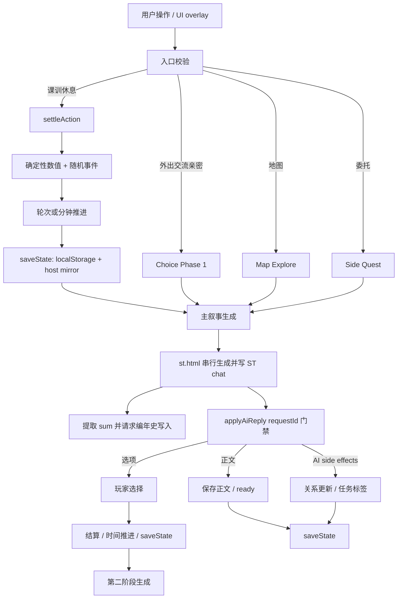
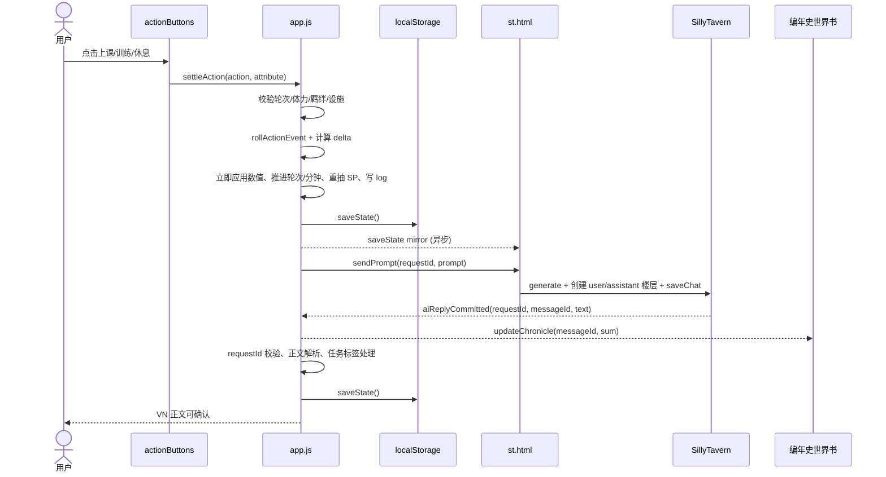
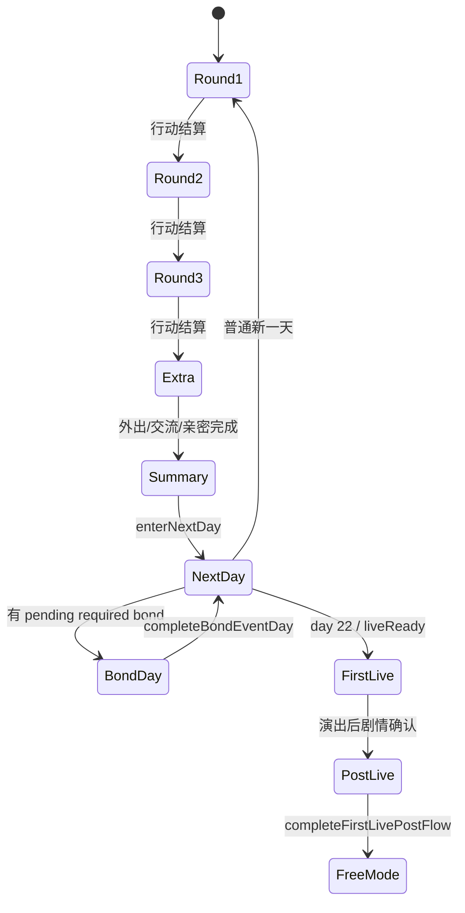
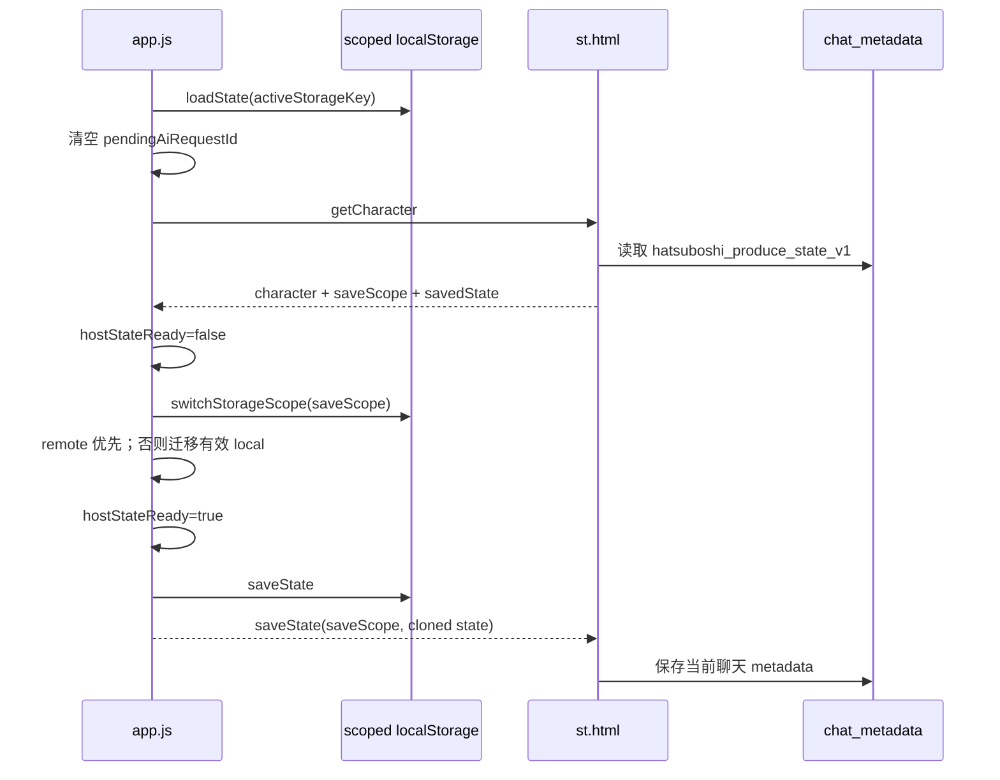
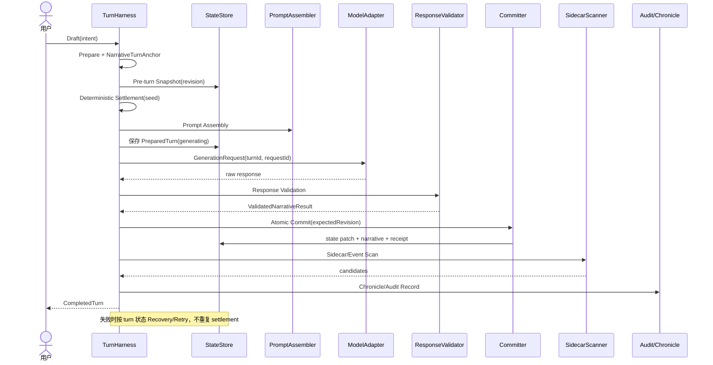
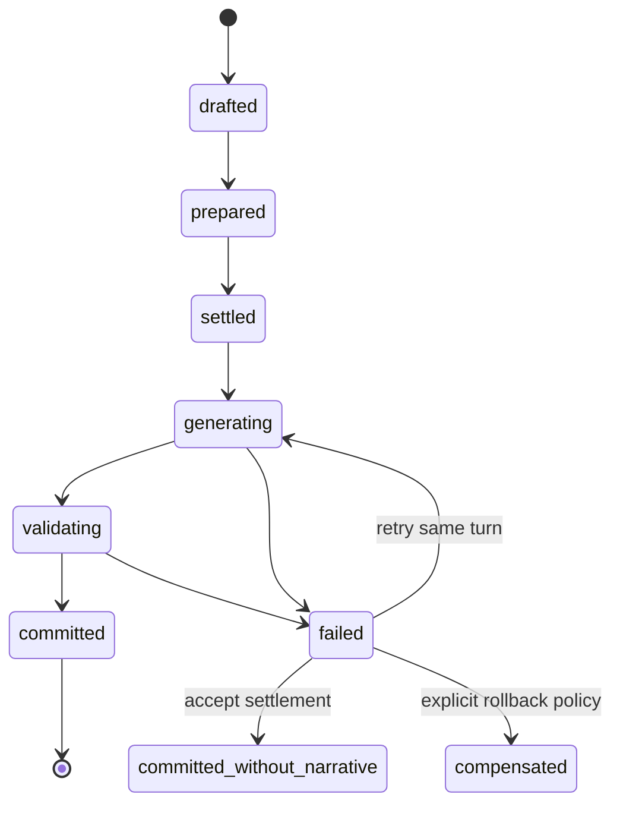
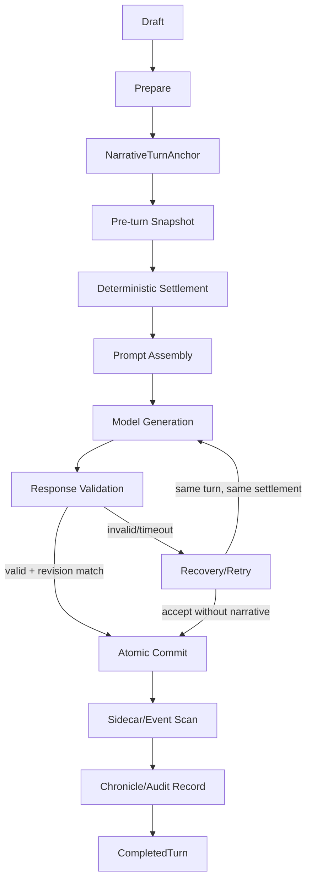

# Harness 工作流审计与预览设计

> 审计日期：2026-07-10  
> 审计范围：`hatsu-produce-local` 当前工作区，包括未提交修改；仅分析和设计，不修改业务代码。  
> 证据优先级：当前代码与测试 > 当前文档 > 根据调用关系推断。  
> 状态标记：**Confirmed** = 可由代码直接确认；**Inferred** = 由调用关系或宿主行为推断；**Unknown** = 当前仓库无法确认。

## 执行摘要

当前项目已经具备 Harness 的若干核心雏形：前端权威状态、确定性行动结算、requestId 回复门禁、提示词协议、SillyTavern 事务式生成桥、聊天元数据存档、编年史写入、世界层日更和支线回退。但这些能力分散在 `app.js`、`st.html` 和多个全局模块中，没有形成一个显式的“回合对象”和统一状态机。

最关键的现状不是“缺少事务框架”，而是同一个用户意图会跨越多个局部流程：

- 普通课训在发起 AI 前已经修改并保存数值、轮次、SP 和日志。
- 外出/交流在 AI 给出选项后，玩家选择时才结算数值，再发第二次 AI 请求。
- 地图探索在抵达、每次选项、返回时分别推进时间。
- 委托在玩家选择现场选项时先结算奖励，再等待 AI 写收尾。
- AI 回复仍可通过 `relationship_update`、任务完成标签和任务标记修改权威状态。
- 编年史在回复通过当前 requestId 门禁之前就可能写入世界书。
- `st.html` 的聊天元数据写入不校验 `saveScope`，已有测试明确失败。

因此最适合当前项目的 Harness 不是重写业务，而是在 `state` 与现有入口之间增加一个薄的回合协调层：统一生成 `turnId`，冻结最小快照，记录确定性 patch 与随机轨迹，串行化生成/验证/提交，并将 SNS、广播、委托、任务标签、编年史归为可审计的 sidecar。

推荐的最小可行版本只需要：

1. `turnId + stateRevision + saveScope/sessionEpoch`。
2. 一个持久化的 `activeTurn` 和最近若干条 `turnReceipts`。
3. 将现有 `settleAction()` 的计算与写入分成 `prepare/settle/commit` 三步。
4. 所有 AI 回复先验证，再写编年史和权威状态。
5. 为聊天元数据写入增加 scope/revision 校验。

---

# 一、现有系统地图

## 1.1 运行形态与主要模块

| 模块 | 主要职责 | 结论 | 证据 |
|---|---|---|---|
| `index.html` | 主 UI、所有 overlay、行动区、VN、手机、地图、任务、商店与脚本装载顺序 | **Confirmed** | `index.html:1454-1467` |
| `app.js` | 单体应用控制器：权威状态、UI、行动、结算、Prompt、AI 回复、时间、存档、世界层接线 | **Confirmed** | `app.js` 共 18230 行；`baseState` 位于 `app.js:2312` |
| `st.html` | 在 SillyTavern 中加载前端及模块；桥接聊天、生成、元数据、世界书编年史和分支 | **Confirmed** | `st.html:550-588`, `st.html:601-679` |
| `st2.html` | 另一套较旧/较简化的 SillyTavern 装载与回复桥 | **Confirmed** 存在；是否仍为生产入口 **Unknown** | `st2.html`; `worker.js:37-44` 仍特殊处理它 |
| `tasks/sandbox-tasks.js` | 沙盒主线、校园次数、委托、钱包、任务标签与阈值判定 | **Confirmed** | `defaultTasksState()` `tasks/sandbox-tasks.js:506` |
| `tasks/side-pool.js` | 静态商业委托池、地点、知名度档位、奖励表 | **Confirmed** | 模块导出 `global.HatsuSideQuestPool` |
| `tasks/side-quest-api.js` | 次 API 委托提示词和 JSON 解析 | **Confirmed** | `buildSideQuestDailyPrompt()`、`parseSideQuestDailyResponse()` |
| `world/daily-tick.js` | 每日 presence、广播提纲、SNS buzz 的静态日更 | **Confirmed** | `runFreeModeDailyTick()` `world/daily-tick.js:218` |
| `world/world-gen-api.js` | 次 API 批量生成广播、SNS 和可选委托，并写入世界状态 | **Confirmed** | `applyDailyWorldGeneration()` `world/world-gen-api.js:357` |
| `world/injection.js` | 将公开世界状态压缩为 Prompt 上下文 | **Confirmed** | `composeWorldSummary()` `world/injection.js:7` |
| `world/campus-behavior.js` | 校园日程、地点 presence、地图提示、SNS/广播权重 | **Confirmed** | `resolveCampusDay()`、`buildCampusInjectionBlock()` |
| `world/events-pool.js` | 广播主题、校园事件、地点与角度的种子化选择 | **Confirmed** | `global.HatsuWorld.eventsPool` |
| `world/buzz-pool.js` | SNS 作者、类别、热度、互动量和文本池 | **Confirmed** | `rollDailyBuzz()` 及 seeded pick helpers |
| `world/cast-track.js` | 非担当偶像的 First Live 公开状态与路线守卫 | **Confirmed** | `getCastFirstLiveStatus()`、`getRouteGuardLines()` |
| `chronicle/sum-chronicle.js` | `<sum>` 提取、楼层到编号映射、世界书编年史 upsert/prune | **Confirmed** | 全文件 |
| `broadcast/prompts.js` | 完整广播稿 Prompt | **Confirmed** | `buildBroadcastScriptPrompt()` |
| `shop/gift-shop.js` | 钱包扣款、库存、赠礼消耗、基础好感增量 | **Confirmed** | `buyGift()`、`giveGift()` |
| `dist/hatsu-launcher/*` | 在普通页面中打开独立前端、隐藏旧聊天楼层 | **Confirmed** | `dist/hatsu-launcher/index.js` |
| `worker.js` | 静态资源服务、CORS、为 `st.html/st2.html` 注入资源基址 | **Confirmed** | `worker.js:34-50` |

## 1.2 用户操作入口

| 入口 | 路由 | 结论 |
|---|---|---|
| 育成行动按钮 | `#actionButtons` click -> `settleAction()` 或专用 overlay | **Confirmed** `app.js:17430-17476` |
| 下一天 | `enterNextDay()` -> `advanceDay()` | **Confirmed** `app.js:5139-5165` |
| 羁绊事件 | `triggerAffinityStory(threshold)` | **Confirmed** `app.js:7059` |
| First Live | `startFirstLive()` | **Confirmed** `app.js:7301` |
| 自由地图 | `enterFreeMode()`、地点热点 -> `startMapLocationExplore()` | **Confirmed** `app.js:10079`, `app.js:10271` |
| 地图选项 | `handleMapLocationChoiceSelection()` | **Confirmed** `app.js:9467` |
| 手动时间推进/睡觉 | `applyFreeModeManualTimeAdvance()` / `advanceFreeModeToNextDay()` | **Confirmed** `app.js:9054`, `app.js:8983` |
| 委托 | `openSideQuestOverlay()` / 地图现场 `handleSideQuestSceneChoice()` | **Confirmed** `app.js:3827`, `app.js:9512` |
| 赠礼 | 商店按钮 -> `handleGiftShopBuy()` / `handleGiftShopGive()` | **Confirmed** `app.js:4366`, `app.js:4472` |
| 闲聊/偶像互动 | `submitFreeChat()` / `submitIdolInteraction()` | **Confirmed** `app.js:13880`, `app.js:13901` |
| 手机私聊/广播/SNS | phone app handlers | **Confirmed** `app.js:12024-13641` |
| 编年史读档 | `openChronicleLoadOverlay()` -> host branch | **Confirmed** `app.js:11521`, `st.html:904` |

## 1.3 核心状态对象

权威状态是内存中的单一 `state` 对象，由 `baseState` 提供默认形状，并通过 `ensureStateShape()` 迁移。**Confirmed**：`app.js:2312-2401`, `app.js:2857-3053`。

关键字段：

| 状态域 | 字段 | 作用 | 结论 |
|---|---|---|---|
| 育成日程 | `day`, `round`, `liveReady` | 22 日育成、普通/额外/总结轮次、Live 解锁 | **Confirmed** |
| 核心数值 | `stamina`, `stress`, `trust`, `Vo`, `Da`, `Vi`, `growth`, `threshold`, `cap`, `sp` | 行动结算和 Live 判定 | **Confirmed** |
| 羁绊 | `affinity.openingComplete/unlocked/pending/viewed/bondUnlockDay` | 解锁、待处理与剧情日 | **Confirmed** |
| Live | `firstLive.completed/success/result` | 确定性演出结果 | **Confirmed** |
| 沙盒 | `sandbox.*`, `tasks.*` | 物色、主线、校园、委托、钱包、库存、次 API 配置 | **Confirmed** |
| 自由模式 | `freeMode.postLiveDay/clockMinutes/presence/relationships/npcRelationships/world` | 日历、时钟、地点、关系、SNS/广播 | **Confirmed** |
| 在途叙事 | `activeStoryNode`, `eventMode`, `choiceStep`, `pendingActionContext`, `pendingChoiceRewards`, `pendingOptionTexts` | 多轮 AI/VN 状态机 | **Confirmed** |
| 请求 | 模块变量 `pendingAiRequestId`, state 中同名字段、`lastRequestId` | 当前主叙事请求和重生成 | **Confirmed** |
| 次 API | 模块变量 `pendingSecondaryRequestId`, `pendingSecondaryMeta`; world/task 中 pending 字段 | 世界层和委托生成 | **Confirmed** |
| 日志 | `log`, `lastStory`, `lastPrompt`, `lastDebug`, `dailySummary` | UI 手账与最近叙事 | **Confirmed** |

当前不存在统一的 `turnId`、`stateRevision`、提交记录或回合状态枚举。**Confirmed**：全仓库无对应结构化实现。

## 1.4 AI/API 调用入口

### 主叙事模型

- `requestHostPromptSend()` 发送 `{type: "sendPrompt", requestId, prompt}`。**Confirmed**：`app.js:11646-11699`。
- `st.html` 通过 `queuePromptTask()` 串行调用 `runTransactionalPrompt()`。**Confirmed**：`st.html:628-634`, `st.html:1054`, `st.html:1552`。
- 优先使用 `TavernHelper.generate({generation_id: reqId})`，成功后再创建 user/assistant 两个聊天楼层并 `saveChat()`。**Confirmed**：`st.html:1468-1548`。
- 回退路径先写 user 楼层，再调用 `context.generate('quiet')`，失败时回滚 user 楼层。**Confirmed**：`st.html:1552-1605`。

### 次 API

- 宿主模式：`requestHostSecondaryPromptSend()` -> `st.html:runSecondaryApiPrompt()` -> OpenAI-compatible `/chat/completions`。**Confirmed**：`app.js:3344`, `st.html:1421`。
- 独立模式：`runLocalSecondaryApiPrompt()` 直接 `fetch()`。**Confirmed**：`app.js:3308`。
- 次 API 用于每日世界层、委托列表、委托档位文案和连接测试。**Confirmed**：`app.js:3207-3646`。

## 1.5 数值结算入口

| 结算 | 入口 | 结论 |
|---|---|---|
| 课训休息 | `settleAction()` | **Confirmed** `app.js:5311` |
| 外出/交流/普通亲密 | `handleChoiceSelection()`，在第二阶段 AI 请求前结算 | **Confirmed** `app.js:16291` |
| NSFW 亲密 | `settleNsfwIntimacyStats()` | **Confirmed** `app.js:14564` |
| First Live | `evaluateFirstLive()` | **Confirmed** `app.js:6951` |
| 委托奖励 | `HatsuTasks.applySideQuestTier()` | **Confirmed** `tasks/sandbox-tasks.js:1715` |
| 购买/赠礼 | `HatsuGiftShop.buyGift/giveGift()`，上层再写关系 | **Confirmed** |
| 自由模式关系 | AI `<relationship_update>` -> `applyFreeModeRelationshipUpdate()` | **Confirmed** `app.js:16043` |
| 任务完成/标记 | AI 标签 -> `applyQuestCompletionsFromReply()` / `applyQuestFlagsFromReply()` | **Confirmed** |

## 1.6 时间推进位置

时间至少有以下来源：

1. 经典育成轮次：`advanceRound()`。**Confirmed** `app.js:5270`。
2. 经典育成换日：`advanceDay()` / `enterNextDay()`。**Confirmed** `app.js:5115-5165`。
3. 羁绊剧情日：`completeBondEventDay()` 可直接修改 `day/liveReady`。**Confirmed** `app.js:5031`。
4. 自由模式分钟：`advanceFreeModeTime()`。**Confirmed** `app.js:9103`。
5. 地图抵达、地图选项、公寓选项、设施行动分别调用分钟推进。**Confirmed** `app.js:9336`, `9478`, `8918`, `5505`。
6. 自由模式换日：`advanceFreeModeToNextDay()`，由手动按钮或公寓睡觉触发。**Confirmed** `app.js:8983`, `8732`。
7. First Live 后通过 `completeFirstLivePostFlow()` 解锁自由模式，但不直接推进 `postLiveDay`。**Confirmed** `app.js:10791`。

这些来源共享部分状态但没有统一时钟命令或时间变更收据。**Confirmed**。

## 1.7 存档与读档位置

### 前端本地存档

- `loadState()` 从作用域化 `localStorage` 读取，并主动清空在途主请求。**Confirmed** `app.js:2765-2777`。
- `saveState()` 先写 `localStorage`，再异步请求宿主写聊天元数据。**Confirmed** `app.js:2780-2786`。
- `backupCurrentSave()` / `restoreBackupSave()` 维护一个浏览器备份。**Confirmed** `app.js:2810-2841`。

### SillyTavern 聊天元数据

- `requestHostStateSave()` 发送 `saveScope` 和完整 state。**Confirmed** `app.js:11571`。
- `st.html` 当前只调用 `saveChatState(data.state)`，忽略消息中的 `saveScope`。**Confirmed** `st.html:646-648`。
- `saveChatState()` 写 `chatMetadata.hatsuboshi_produce_state_v1` 并调用 `saveMetadataDebounced()`。**Confirmed** `st.html:1042-1052`。
- `CHAT_CHANGED` 清理桥接 pending 并重新握手。**Confirmed** `st.html:724-729`。

### 编年史读档

- “读档”实际是扫描 `<sum>` 的 assistant 楼层、裁剪世界书编年史，然后 `/branch-create {messageId}` 并刷新。**Confirmed** `st.html:875-913`。
- 它不会恢复与该楼层对应的前端 `state` 快照。**Confirmed**：分支函数没有读取/写入前端历史快照。
- 因而“剧情分支”和“前端数值回档”目前不是同一事务。**Inferred**，由上述调用链直接推得。

## 1.8 编年史、世界书、角色卡上下文组装

| 上下文 | 位置 | 结论 |
|---|---|---|
| 担当角色核心与行动风格 | `idols`, `affinityRouteSeeds`, `*BondRoutes` in `app.js` | **Confirmed** |
| 制作人资料 | `buildProducerPromptSection()` | **Confirmed** `app.js:5682` |
| 好感度世界书触发标签 | `getAffinityStageLine()`，由各 Prompt builder 注入 | **Confirmed** `app.js:898` |
| 公开世界层 | `composeWorldSummaryBlock()` -> `world/injection.js` | **Confirmed** `app.js:4816` |
| 校园地点在场信息 | `buildMapPresencePromptLines()` | **Confirmed** `app.js:5857` |
| 沙盒主线提示 | `HatsuTasks.buildSandboxMainQuestPromptBlock()` | **Confirmed** `app.js:6020` |
| SillyTavern 角色卡/世界书/preset 的最终注入顺序 | 宿主内部 | **Unknown**：当前项目只调用 generate，不读取最终 prompt payload |
| 编年史世界书 | 角色卡绑定世界书中的常驻“编年史”条目 | **Confirmed** `st.html:811-857` |

## 1.9 SNS、主动事件、小剧场、随机事件与其他旁支

- SNS：静态 seeded 生成或次 API 日报生成，写入 `state.freeMode.world.buzz`。**Confirmed**。
- 广播：前端先生成/接收提纲；完整稿走主叙事模型并写 `broadcast.today.fullScript`。**Confirmed** `app.js:12244-12484`。
- 课训随机互动：`rollActionEvent()` 使用 `Math.random()` 抽触发、角色、场景、情绪与奖励。**Confirmed** `app.js:4915`。
- 主动事件/羁绊：通过 `affinity.pending` 和剧情日调度；多轮路线由硬编码 route 数据驱动。**Confirmed**。
- 小剧场/零成本旁支：闲聊、偶像互动、手机私聊、公寓聊天、赠礼叙事、广播稿。**Confirmed**。
- 沙盒支线：每日 3 条商业委托，可静态或次 API 生成，奖励仍由前端档位表结算。**Confirmed**。
- “角色主动事件”作为统一概念和统一扫描器目前不存在；功能分散在 affinity、tasks、world、phone、broadcast 等入口。**Confirmed**。

## 1.10 所有主要副作用

| 副作用 | 位置 | 结论 |
|---|---|---|
| 修改内存 `state` | `app.js` 与全局模块 | **Confirmed** |
| `localStorage` 写入/删除 | 存档、BGM、API key、地图布局、音乐收藏 | **Confirmed** |
| 向父窗口 `postMessage` | Prompt、次 API、存档、编年史、分支、ACK | **Confirmed** |
| HTTP `fetch` | 次 API、资源、地图布局、Cloudflare assets | **Confirmed** |
| SillyTavern chat 楼层创建/删除/保存 | `st.html` transaction bridge | **Confirmed** |
| SillyTavern `chat_metadata` 写入 | `saveChatState()` | **Confirmed** |
| 世界书 load/save | 编年史 | **Confirmed** |
| 创建分支并刷新页面 | `/branch-create` + `window.location.reload()` | **Confirmed** |
| DOM overlay、toast、VN、地图、手机更新 | `app.js` | **Confirmed** |
| 音频/视频播放和计时器 | BGM、Live、手机音乐、typewriter、retry | **Confirmed** |
| 剪贴板写入 | `copyPrompt()` | **Confirmed** |
| 远程 Live 视频 CDN 请求 | `playLiveVideo()` | **Confirmed** |

---

# 二、现有完整调用链

## 2.1 当前总流程图



## 2.2 单次普通行动流程



结论：

- 数值和日程在模型调用前已经提交。**Confirmed**。
- AI 失败不会回滚行动；玩家保留已结算结果。**Confirmed**。
- `pendingAiRequestId` 在第一次 `saveState()` 时尚未设置，随后 `requestHostPromptSend()` 再保存一次。**Confirmed** `app.js:5527-5544`。
- UI 没有统一 `turnStatus=settling/generating` 锁；普通行动入口只依赖按钮状态和当前规则。快速重复触发是否可在真实浏览器造成双结算，需要交互级复现。**Inferred** 风险。

## 2.3 一周行动或阶段结算流程

项目没有“周”这一独立领域对象；实际是“每日 3 次普通行动 + 1 次额外行动 + 总结轮次 + 换日”，以及羁绊剧情日和第 22 天 Live。**Confirmed**。



阶段关键点：

- 额外行动的第二阶段 Prompt 同时要求 AI 输出 `dailySummary`。**Confirmed** `buildDailySummaryContract()`。
- “今日总结”按钮本身只展示已有总结，没有独立确定性日结。**Confirmed**。
- `advanceDay()` 只允许 summary round。**Confirmed**。
- 羁绊剧情完成可自行修改 `day`，与 `advanceDay()` 并列。**Confirmed**。
- 沙盒/自由模式使用另一套 `postLiveDay + clockMinutes`，不走经典 round。**Confirmed**。

## 2.4 AI 正文生成流程

1. Prompt builder 从当前 `state`、角色配置、制作人资料、公开世界摘要和局部 action context 拼接文本。**Confirmed**。
2. `requestHostPromptSend()` 生成/接收 requestId，以 requestId + prompt 片段做 120 秒内发送去重。**Confirmed**。
3. `st.html` 的 `promptTaskQueue` 串行执行主生成和次 API。**Confirmed**。
4. TavernHelper 路径先生成，再写两层 chat；回退路径先写 user 层，失败回滚。**Confirmed**。
5. `postCommittedReply()` 将 `requestId`、正文和 `messageId` 发回前端。**Confirmed**。
6. 前端先调用 `requestChronicleUpdate()`，随后 `applyAiReply()` 才做 requestId 门禁。**Confirmed** `app.js:17943-17953`。
7. `applyAiReply()` 按 phone/broadcast/选项第一阶段/选项第二阶段/普通正文分流。**Confirmed**。
8. 最终正文写 `lastStory`、`log[0].aiReply`、`activeStoryNode.ready`，然后保存。**Confirmed**。

## 2.5 存档恢复流程



恢复特性：

- 主请求不恢复；页面刷新后旧回复会因 requestId 不匹配被拒收。**Confirmed**。
- `activeStoryNode`、已结算数值和最后 Prompt 会恢复，用户通常可以手动重发。**Inferred**。
- 没有持久化 `PreparedTurn` 或请求尝试记录，无法自动判断“生成已在 ST 完成但前端未提交”。**Confirmed**。
- 编年史分支不会同步恢复前端数值快照。**Confirmed/Inferred**。

## 2.6 角色主动事件或旁支事件流程

### 羁绊事件

`refreshAffinityUnlocks()` -> `affinity.pending` -> `pendingRequiredBondThreshold()` -> 行动区只显示 bond -> `triggerAffinityStory()` -> 1 至 3 次 AI 生成 -> 确认关闭时 `completeBondEventDay()`。**Confirmed**。

### 沙盒委托

换日 `syncSideQuestDay()` -> 静态池或次 API -> 玩家设为目标 -> 抵达地点 -> AI 出 4 个现场选项 -> `applySideQuestTier()` 立即结算 -> AI 收尾 -> 返回地图。**Confirmed**。

### SNS/广播

换日 `runFreeModeWorldDailyTick()` -> presence -> 静态 roll 或次 API 批量生成 -> 保存 `world.broadcast/buzz`；完整广播稿另走主模型。**Confirmed**。

### 闲聊/互动/手机/赠礼

均为独立入口，通常不消耗经典行动；赠礼先扣库存并增加关系，再请求叙事。**Confirmed**。

---

# 三、Harness 目标流程预览

## 3.1 建议总流程



## 3.2 阶段定义

### Draft

- 输入：UI 意图，例如 `{kind:'lesson', attribute:'Vo'}`、地图选项、赠礼、羁绊选择。
- 输出：纯 `TurnDraft`，尚未读取随机数或修改状态。
- 读取：仅 UI 输入和当前 route 标识。
- 修改：无。
- 副作用：不允许。
- 现有位置：散落在 `#actionButtons` handler、各 `submit*`、`handle*ChoiceSelection()`。
- 建议接口：`draftTurn(intent, uiContext)`。
- 是否需要：**需要**，用于阻止 UI 入口直接改状态。

### Prepare

- 输入：`TurnDraft`、当前 state revision。
- 输出：`PreparedTurn`，含合法性结果、规则版本、随机种子、预期资源。
- 读取：当前日程、体力、设施、任务、目标 slot、关系、模式。
- 修改：最多写入 `activeTurn.status='prepared'`；不改业务状态。
- 副作用：仅允许持久化 prepared 记录。
- 现有位置：`settleAction()` 前半段和多个 `can*` 函数。
- 建议接口：`prepareTurn(state, draft): PreparedTurn | Rejection`。
- 是否需要：**真正需要**。

### NarrativeTurnAnchor

- 输入：prepared intent、当前 scope、stateRevision。
- 输出：稳定 `turnId`、`sessionEpoch`、day/round/time anchor、parent turn。
- 读取：`activeHostSaveScope`、当前聊天/角色、经典或自由模式时钟。
- 修改：`state.harness.activeTurn.anchor`。
- 副作用：允许单次持久化。
- 现有位置：当前只有 `requestId`，无叙事回合锚。
- 建议接口：`createTurnAnchor()`。
- 是否需要：**必须**，是所有幂等与旧请求隔离的根。

### Pre-turn Snapshot

- 输入：anchor、prepared turn。
- 输出：最小 `PreTurnSnapshot`。
- 读取：本回合可能修改的权威字段。
- 修改：仅 activeTurn 记录。
- 副作用：允许持久化；不发送模型请求。
- 现有位置：无统一实现；消息历史里有局部 variables 快照的设计意图，但本项目没有 turn snapshot。
- 建议：只冻结 touched slices，不复制角色库、资源、全部世界书和完整历史。
- 是否需要：**必须**，用于恢复、补偿和冲突检测。

### Deterministic Settlement

- 输入：snapshot、prepared turn、固定 seed。
- 输出：`SettlementResult`，包含 patch、随机轨迹、日志草稿、时间变化。
- 读取：snapshot 和只读规则表。
- 修改：不直接写全局 state。
- 副作用：不允许。
- 现有位置：`settleAction()`、`handleChoiceSelection()`、`applySideQuestTier()`、`evaluateFirstLive()`。
- 建议接口：`settlePreparedTurn(snapshot, prepared): SettlementResult`。
- 是否需要：**必须**。

### Prompt Assembly

- 输入：anchor、snapshot、settlement、context refs。
- 输出：`GenerationRequest`。
- 读取：角色配置、制作人配置、world digest、必要的最近摘要。
- 修改：无业务状态；可更新 activeTurn prompt hash。
- 副作用：不允许发送。
- 现有位置：大量 `build*Prompt()`。
- 建议：保留现有 builder，外层增加统一 envelope 和去重报告。
- 是否需要：**需要**，但不必立刻重写所有 Prompt builder。

### Model Generation

- 输入：`GenerationRequest`。
- 输出：原始生成结果或明确 timeout/error/unknown。
- 读取：transport 配置。
- 修改：仅 attempt 记录。
- 副作用：允许调用 SillyTavern/次 API；SillyTavern chat 写入由 adapter 管理。
- 现有位置：`requestHostPromptSend()`、`st.html:runTransactionalPrompt()`。
- 建议接口：`modelAdapter.generate(request): GenerationOutcome`。
- 是否需要：**需要**。

### Response Validation

- 输入：原始回复、generation request、anchor、当前 state revision。
- 输出：`ValidatedNarrativeResult` 或结构化拒绝原因。
- 读取：expected response schema、turnId/requestId、当前 sessionEpoch。
- 修改：无。
- 副作用：不允许写编年史、关系或任务。
- 现有位置：`shouldAcceptAiReply()`、`extractReplyText()`、`extractChoicePayload()`、各 parser。
- 建议：把 `<relationship_update>`、任务标签视为 `claims`，不是立即 patch。
- 是否需要：**必须**。

### Atomic Commit

- 输入：snapshot revision、settlement、validated narrative。
- 输出：`CompletedTurn` 或 conflict。
- 读取：当前 stateRevision、activeTurn。
- 修改：一次性合并业务 patch、正文、日志、状态机、revision 和 idempotency record。
- 副作用：一次本地持久化；宿主镜像异步复制。
- 现有位置：当前分散在生成前、选择时和回复时多次 `saveState()`。
- 建议：原子性定义为“单一 state blob 内逻辑原子”，不是跨浏览器、ST chat、世界书的分布式事务。
- 是否需要：**必须**，但应轻量实现。

### Sidecar/Event Scan

- 输入：CompletedTurn、validated claims、before/after state。
- 输出：`SidecarEventCandidate[]`。
- 读取：任务规则、羁绊阈值、日更规则、委托/广播/SNS 触发条件。
- 修改：默认不修改；候选经接受后形成后续 turn 或同 commit 的确定性 sidecar patch。
- 副作用：不允许直接发模型请求。
- 现有位置：`processSandboxQuestAfterSettlement()`、`refreshAffinityUnlocks()`、daily tick、广播自动请求等。
- 是否需要：**需要**，可先只统一扫描结果，不迁移全部实现。

### Chronicle/Audit Record

- 输入：CompletedTurn、validated summary、模型元数据。
- 输出：`AuditReceipt` 和可选编年史写入请求。
- 读取：turn receipt、ST messageId。
- 修改：本地 audit ring；编年史 adapter 可写世界书。
- 副作用：允许，但必须在 commit 成功后，且以 turnId/messageId 幂等。
- 现有位置：`requestChronicleUpdate()`、`updateChronicleWorldbook()`。
- 是否需要：**必须调整顺序**。

### Recovery/Retry

- 输入：activeTurn、attempts、当前 revision/sessionEpoch、宿主 chat 查询结果。
- 输出：resume generation、revalidate existing result、compensate、abort 或人工选择。
- 读取：持久化 turn journal 和 ST message extra `hatsuRequestId/turnId`。
- 修改：activeTurn status/attempt；不得重复 settlement。
- 副作用：允许重查或重发生成。
- 现有位置：`triggerRegeneration()`、空回复 retry、手动重发；没有统一恢复。
- 是否需要：**必须有最小版本**。

---

# 四、建议的数据结构

```ts
type TurnKind =
  | 'produce_action'
  | 'choice_phase'
  | 'map_action'
  | 'side_quest'
  | 'bond'
  | 'first_live'
  | 'gift'
  | 'phone_chat'
  | 'broadcast'
  | 'world_daily';

interface NarrativeTurnAnchor {
  turnId: string;
  parentTurnId?: string;
  requestScope: 'main' | 'secondary' | 'none';
  saveScope: string;          // 当前 ST chat scope；独立模式为 local scope
  sessionEpoch: string;       // 页面启动或 CHAT_CHANGED 时更新
  stateRevision: number;      // prepare 时看到的 revision
  kind: TurnKind;
  mode: 'produce' | 'sandbox' | 'free';
  schedule: {
    day?: number;
    round?: number;
    postLiveDay?: number;
    clockMinutes?: number;
  };
  createdAt: number;
}

interface PreparedTurn {
  anchor: NarrativeTurnAnchor;
  intent: {
    action: string;
    attribute?: 'Vo' | 'Da' | 'Vi';
    optionIndex?: number;
    targetId?: string;
    text?: string;
  };
  rulesVersion: string;
  randomSeed: string;
  requiredStatePaths: string[];
  contextRefs: {
    idolProfileId?: string;
    bondRouteId?: string;
    worldDigestRevision?: string;
    promptTemplateId: string;
  };
  validation: { ok: true } | { ok: false; code: string; message: string };
}

interface PreTurnSnapshot {
  turnId: string;
  stateRevision: number;
  frozen: {
    schedule: Pick<AppState, 'day' | 'round' | 'liveReady'>;
    stats: Pick<AppState, 'stamina' | 'stress' | 'trust' | 'Vo' | 'Da' | 'Vi' | 'sp'>;
    affinity?: AppState['affinity'];
    firstLive?: AppState['firstLive'];
    targetedRelationships?: Record<string, number>;
    targetedQuestState?: unknown;
    targetedSideQuestSlot?: unknown;
    freeModeClock?: { postLiveDay: number; clockMinutes: number };
  };
  refs: {
    idolProfileId?: string;
    configHash: string;
    worldStateRevision?: string;
    latestNarrativeRef?: string;
  };
}

interface SettlementResult {
  turnId: string;
  patch: JsonPatchOperation[];
  compensationPatch?: JsonPatchOperation[];
  randomTrace: Array<{
    key: string;
    roll: number | string;
    result: unknown;
  }>;
  scheduleDelta?: { rounds?: number; minutes?: number; days?: number };
  resultSummary: string;
  logDraft?: unknown;
  sideEffectClaimsAllowed: string[];
}

interface GenerationRequest {
  turnId: string;
  requestId: string;
  attempt: number;
  idempotencyKey: string;
  prompt: string;
  promptHash: string;
  expectedSchema: 'narrative' | 'choices4' | 'daily_world' | 'phone_lines';
  timeoutMs: number;
  saveScope: string;
  sessionEpoch: string;
}

interface ValidatedNarrativeResult {
  turnId: string;
  requestId: string;
  narrative: string;
  options?: Array<{ text: string; minutes?: number }>;
  summary?: string;
  claims: {
    relationshipDeltas?: Record<string, number>;
    questCompletions?: string[];
    questFlags?: string[];
  };
  sourceMessageId?: number;
  rawHash: string;
  warnings: string[];
}

interface CompletedTurn {
  turnId: string;
  status: 'committed' | 'committed_without_narrative' | 'aborted' | 'compensated';
  beforeRevision: number;
  afterRevision: number;
  settlement: SettlementResult;
  narrative?: ValidatedNarrativeResult;
  committedAt: number;
}

interface IdempotencyRecord {
  key: string;
  turnId: string;
  requestIds: string[];
  status: 'prepared' | 'generating' | 'validated' | 'committed' | 'failed' | 'aborted';
  settlementHash?: string;
  responseHash?: string;
  committedRevision?: number;
  expiresAt?: number;
}

interface SidecarEventCandidate {
  candidateId: string;
  sourceTurnId: string;
  kind: 'quest' | 'bond_unlock' | 'daily_world' | 'broadcast' | 'sns' | 'chronicle' | 'toast';
  dedupeKey: string;
  priority: number;
  payload: unknown;
  policy: 'same_commit' | 'enqueue_next_turn' | 'best_effort_after_commit';
}

interface AuditReceipt {
  turnId: string;
  saveScope: string;
  beforeRevision: number;
  afterRevision: number;
  promptHash?: string;
  responseHash?: string;
  settlementHash: string;
  randomTraceHash: string;
  sourceMessageId?: number;
  chronicleKey?: string;
  sidecars: Array<{ kind: string; dedupeKey: string; status: string }>;
  createdAt: number;
}
```

## 4.1 Snapshot 冻结原则

需要冻结：

- 本回合会读取并可能修改的数值。
- 当前日/轮次/分钟、设施、地点和活动目标。
- 被触及的任务、委托 slot、库存项、钱包、关系条目。
- `stateRevision`、`saveScope`、`sessionEpoch`。
- 已抽出的随机结果或随机 seed。

只保存引用或 hash：

- `idols`、`affinityRouteSeeds`、Bond route 等静态配置。
- 图片、音频、视频和地图布局资产。
- 完整 SillyTavern 聊天历史。
- 完整世界书/角色卡；只保存绑定 id、版本/hash 和组装时的 digest。
- 全部 SNS/广播历史；只冻结本回合读取的 dayKey 与 digest revision。

不应把整个 `state` 每回合复制到 Snapshot。当前 state 已较大，完整复制会重复保存日志、世界历史、手机消息和 UI 状态，并让迁移复杂化。

---

# 五、一致性和可靠性审查

## 5.1 风险清单

| 风险 | 等级 | 判断 | 证据与说明 |
|---|---|---|---|
| 聊天切换后旧存档写入新聊天 | **必须修复** | **Confirmed** | 前端发送 `saveScope`，但 `st.html:646` 忽略；`saveChatState()` 总写当前 context。测试 `chat-metadata-save` 已失败。 |
| 编年史先于回复门禁写入 | **必须修复** | **Confirmed** | `routeHostAiPayload()` 先 `requestChronicleUpdate()`，再 `applyAiReply()`；旧 request 可污染世界书。 |
| 页面刷新无法恢复未完成回合 | **必须修复** | **Confirmed** | `loadState()` 主动清空 pending；无 persisted turn/attempt。已结算行动只能人工重发叙事。 |
| 主行动重复提交保护不足 | **必须修复** | **Inferred** | `settleAction()` 无 idempotency/activeTurn guard；普通按钮并非入口即同步锁定。需要浏览器双击复现确认频率。 |
| 状态与正文部分成功 | **建议修复** | **Confirmed** | 普通行动先结算保存，后生成；ST chat 也可能已提交但前端拒收。当前是可理解的产品策略，但没有明确 receipt。 |
| AI 直接修改权威状态 | **必须修复边界** | **Confirmed** | 自由关系、任务完成/flag 由 AI 标签驱动；与“AI 只叙事”目标不完全一致。 |
| 随机结果重试稳定性 | **部分具备** | **Confirmed** | 结算后的随机结果已写入 prompt/state，叙事重试通常稳定；但没有 seed/trace，重复提交会重新抽。 |
| API 超时后无法准确判定结果 | **建议修复** | **Confirmed** | TavernHelper 120s timeout 后可能回空；ST chat 是否稍后落地只能靠当前 adapter 行为，前端无查询回执。 |
| 旧请求回写 | **部分已防护** | **Confirmed** | 主回复 requestId 严格匹配；刷新后旧回复被拒。编年史和 host chat 已产生的副作用不受此前端门禁保护。 |
| 多个主异步请求覆盖 | **建议修复** | **Inferred** | 全局只有一个 `pendingAiRequestId`；手机、广播、事件可能相互夺取 active request。已有 source 清理逻辑，但无统一并发策略。 |
| 多个次 API 请求覆盖 | **必须修复** | **Confirmed/Inferred** | 只有一个全局 `pendingSecondaryRequestId/meta`；各入口只阻止部分同 kind 请求，其他 kind 可覆盖，旧回复随后被忽略并可能留下 loading 状态。 |
| 时间推进来源过多 | **建议修复** | **Confirmed** | round/day/bond/free clock/arrival/choice/facility/sleep 分散写入。 |
| 编年史重复或丢失 | **建议修复** | **Confirmed/Inferred** | 同 entryNo upsert 能去重；但并发 load-modify-save 无 revision，且 stale reply 可提前写入。 |
| 旁支绕过主流程 | **建议修复** | **Confirmed** | 委托、赠礼、地图关系、任务标签各自直接改 state，不经过统一 commit。 |
| Prompt 上下文冲突/重复 | **建议修复** | **Inferred/Unknown** | 前端重复注入角色核心、阶段、世界 digest；ST 还会注入角色卡/世界书/编年史。最终 prompt 顺序当前不可见。 |
| 编年史读档不恢复前端状态 | **必须明确产品语义** | **Confirmed** | `/branch-create` 只分支聊天与裁剪编年史，没有 turn snapshot 恢复。 |
| `openEventOverlay()` 也触发存档 | **建议修复** | **Confirmed** | 展示层函数调用 `saveState()`，导致大量元数据写入并扩大竞态面。 |
| 重复桥和重复函数 | **建议修复** | **Confirmed** | `isSillyTavernHost()` 连续定义两次；`st.html/st2.html` 两套桥长期漂移。 |

## 5.2 重复提交与幂等性

当前已有：

- 主 Prompt 的短期发送去重：`recentHostPromptDispatches`。**Confirmed**。
- 回复 requestId 门禁：`shouldAcceptAiReply()`。**Confirmed**。
- 已提交回复的内存 dedupe key。**Confirmed**。
- 委托 slot 完成后拒绝再次结算。**Confirmed**。
- 任务状态从 active 到 completed 后再次标签通常无效。**Confirmed**。

当前缺少：

- 用户意图级幂等键。
- 结算级 idempotency record。
- 跨刷新持久化去重。
- 编年史和 host metadata 的 scope/revision 幂等。
- sidecar 的统一 dedupe key。

## 5.3 AI 权限边界

建议将 AI 输出分三类：

1. 纯叙事：正文、对话、`<sum>`，可直接验证后保存。
2. 建议性结构：四个选项、分钟建议、SNS/广播文案，需 schema 校验。
3. 权威状态 claims：关系变化、任务完成、任务 flag，必须经过 allowlist、当前阶段、目标存在、上限和幂等校验后才能转成 patch。

AI 不应直接决定：

- Vo/Da/Vi、体力、压力、信赖的最终数值。
- 行动是否消耗轮次/分钟。
- 委托奖励档位与金额。
- First Live 成败。
- 任务是否满足纯数值条件。
- 当前请求是否属于当前聊天/回合。

## 5.4 Prompt 上下文审查

Confirmed：前端 Prompt 通常同时包含担当、阶段、数值、好感标签、角色核心、制作人资料、world digest 和局部规则。

Inferred 风险：

- 角色核心可能与角色卡正文重复。
- `world/injection` 的公开状态可能与常驻编年史世界书重复。
- 最近正文摘要、ST chat 历史和 `<sum>` 编年史可能同时描述同一事件。
- 各 Prompt builder 对 world digest 的使用不一致，导致同一天不同旁支看到不同上下文。

Unknown：SillyTavern preset、角色卡和世界书最终注入顺序及 token 截断位置。Phase 0 应记录最终 prompt payload 或至少记录各上下文段 hash/长度。

---

# 六、不合理设计排除

| 判断 | 级别 | 建议 |
|---|---|---|
| 为当前单页原型引入微服务、远程事务协调器或 Kafka 类队列 | **不建议引入** | 状态和主要规则都在前端，复杂度远超收益。 |
| 引入通用事件总线替代所有函数调用 | **不建议引入** | 先用显式 `TurnHarness` 状态机和普通函数返回值。 |
| 为 localStorage + ST chat + 世界书模拟严格 ACID 分布式事务 | **不建议引入** | 使用本地逻辑原子提交 + 外部副作用 receipt/补偿即可。 |
| 一次性拆分 18230 行 `app.js` | **不建议引入** | 先抽 Harness 纯模块和 adapter；只迁移被触及的入口。 |
| 保留多个函数直接修改 day/round/clock | **建议修复** | 收口为 `applyScheduleDelta()`，底层仍写现有字段。 |
| 继续用单个 pending id 表示所有主/次异步任务 | **必须修复** | 至少按 turn/request map 管理，或限制单飞并明确拒绝策略。 |
| 让 UI 展示函数调用 `saveState()` | **建议修复** | 展示和提交分离，减少无意义写入。 |
| AI 直接完成数值门槛任务 | **必须修复** | 数值任务只由确定性代码判断。 |
| AI 输出语义任务标签 | **暂时可接受** | 保留 allowlist，但转换为 claim，经当前 quest/turn 验证且幂等。 |
| 确定性代码硬编码具体对白和完整剧情 | **不建议引入** | 代码保留叙事目标、锚点、禁区和选项种子；正文仍由模型生成。 |
| 前端负责行动规则、数值、时间、随机、UI 和本地恢复 | **应保留在前端** | 这些是当前产品的权威领域逻辑。 |
| Prompt envelope、request/turn 路由、验证、commit、审计 | **应移到统一 Harness 层** | 现有 builder 和模块可作为依赖保留。 |
| ST chat/metadata/worldbook API 调用 | **应保留在 adapter/桥层** | Harness 不直接依赖宿主全局对象。 |
| SNS/广播/委托文本内容完全确定性硬编码 | **暂时可接受但非目标** | 静态池是可靠回退；丰富文本可由次 API 生成。 |

一个简单状态机已经足够：



---

# 七、渐进式实施方案

## Phase 0：仅加日志和观测，不改变行为

- 修改范围：新增只读 turn trace；记录入口、requestId、saveScope、state hash/revision、Prompt 各段长度、回复来源、编年史请求、host save 请求。
- 风险：低；注意不要把 API key 或完整私密 Prompt 打到持久日志。
- 验收：能从一次用户点击串起结算、保存、生成、回复、任务/关系更新、编年史；能识别当前 7 个失败测试。
- 可暂缓：Snapshot、patch、自动恢复。

## Phase 1：加入 turnId、snapshot 和重复提交保护

- 修改范围：`state.harness`、`beginTurn()`、`activeTurn`、`stateRevision`、入口 guard；`st.html` metadata scope 校验。
- 风险：中；最容易影响多轮 VN 和 phone/broadcast 并发。
- 验收：双击同一行动只结算一次；刷新后能看到 unfinished turn；旧 scope save 被拒绝；旧 session 回复不提交。
- 可暂缓：真正 patch 化结算，Snapshot 先保存最小 before values。

## Phase 2：拆分确定性结算与 AI 叙事

- 修改范围：从 `settleAction()`、`handleChoiceSelection()`、委托和赠礼中抽纯 settlement；现有 Prompt builder 接收 settlement 参数。
- 风险：中高；涉及经典、自由、沙盒三种时钟。
- 验收：纯函数测试覆盖同一 snapshot + seed 得到同一结果；模型重试不改变数值和随机结果；AI claims 不直接落 state。
- 可暂缓：一次迁移全部旁支，优先普通行动、外出/交流、地图、委托。

## Phase 3：加入原子提交或补偿机制

- 修改范围：`commitTurn(expectedRevision)`；一次合并 settlement + narrative + claims；host save 增加 revision/ack；外部副作用 receipt。
- 风险：高；会改变当前“先结算后等待正文”的时序。
- 验收：任意失败点不会出现重复数值；冲突时拒绝覆盖；ST chat 已提交但前端失败时能重新关联或标记 orphan。
- 可暂缓：跨设备强一致；先保证本页和当前 chat scope。

## Phase 4：加入主动事件和 sidecar 扫描

- 修改范围：把任务阈值、羁绊解锁、日报、广播、SNS、toast、编年史建模为 candidate；统一 dedupe。
- 风险：中；容易改变现有触发顺序。
- 验收：同一 source turn 不重复完成任务/写编年史/生成日报；旁支均能追溯 sourceTurnId。
- 可暂缓：把所有手机功能都纳入；先做任务、羁绊、编年史、日报。

## Phase 5：完善恢复、审计和调试工具

- 修改范围：unfinished turn 恢复面板、attempt 查询、orphan ST message 关联、receipt 查看、导出审计包。
- 风险：低到中；主要是诊断 UI 和 adapter 查询。
- 验收：刷新、超时、切聊天、重复回复、世界书写失败均有明确状态和可执行恢复动作。
- 可暂缓：长期全量历史；保留最近 20-50 turn 即可。

---

# 八、最终输出

## 8.1 建议 Harness 流程图



## 8.2 当前问题清单

### P0 必须优先

1. `st.html` 存档写入增加 `saveScope` 校验和 revision 防旧写。
2. 编年史写入移动到 `applyAiReply` 验证成功、回合 commit 成功之后。
3. 引入持久化 `turnId/stateRevision/sessionEpoch` 和入口重复提交保护。
4. 将主/次请求从单个全局 pending id 改为按 turn 管理，或明确全局单飞锁。
5. 明确“编年史读档仅分支剧情”还是“同时恢复前端状态”；当前 UI 文案容易让用户认为是完整读档。

### P1 建议随后处理

6. 将时间写入收口到一个 schedule adapter。
7. AI 关系/任务标签先转 claims，再经过确定性验证。
8. 将 `openEventOverlay()` 等展示函数中的保存副作用移出。
9. 合并重复 `isSillyTavernHost()`，明确淘汰或维护 `st2.html`。
10. 为编年史、sidecar 和 host mirror 增加幂等 receipt。

### P2 可渐进处理

11. Prompt 上下文分段 hash/长度观测，减少角色卡/世界书/编年史重复。
12. 将 `app.js` 中被 Harness 触及的纯逻辑逐步抽到小模块。
13. 修复现有 7 个失败测试并区分过期断言与真实回归。

## 8.3 推荐改造优先级

```text
Scope 安全与旧写隔离
  > turnId / revision / duplicate guard
  > 编年史提交顺序
  > 结算纯化与随机轨迹
  > 恢复与重试
  > sidecar 统一
  > Prompt 去重与模块整理
```

## 8.4 最小可行 Harness 版本

MVP 不需要新数据库、服务端队列或大型模块迁移。建议只新增：

```ts
state.harness = {
  revision: 1,
  sessionEpoch: '...',
  activeTurn: null as PreparedTurn | null,
  idempotency: [] as IdempotencyRecord[], // 最近 20 条
  receipts: [] as AuditReceipt[]          // 最近 20 条
};
```

并提供六个入口：

```ts
beginTurn(intent)
prepareTurn(turn)
settleTurn(turn)
requestNarrative(turn)
validateNarrative(turn, response)
commitTurn(turn)
```

第一版可以继续使用现有 `saveState()` 和 Prompt builders；关键是每一步都绑定同一个 turnId，结算只能执行一次，回复必须同时匹配 requestId、turnId、saveScope、sessionEpoch 和 expectedRevision。

## 8.5 仍需确认的设计问题

1. “读档”是否必须恢复前端数值/任务/时间，还是仅创建 SillyTavern 剧情分支？这是 Snapshot 保留策略的最大分叉。
2. 普通行动 AI 失败时，产品语义是“行动已结算但无正文”，还是允许玩家撤销行动？当前实现选择前者。
3. 是否允许手机私聊、广播稿和主行动生成并发？若不允许，MVP 可直接采用全局单飞锁；若允许，需要 per-channel request map。
4. AI 任务标签是否继续保留？建议保留为受限 claim，而不是完全删除。
5. 自由模式 `<relationship_update>` 是模型裁量，还是应由选项/礼物/事件表确定？当前两种机制并存。
6. 次 API 的每日世界层是否允许覆盖当天已经展示过的静态 SNS/广播？建议展示后锁定，不再静默替换。
7. 编年史应按 ST messageId、turnId 还是二者组合编号？当前按楼层推算，分支/插楼时语义脆弱。
8. `st2.html` 是否仍有真实用户入口？若无，应标记 deprecated；若有，需要与 `st.html` 同步 scope、transaction 和 chronicle 修复。

---

# 附录 A：验证结果

执行结果：

- `node --check app.js`：通过。
- `node --test tests`：233 项中 226 通过，7 失败。

失败项：

1. `chat-metadata-save`: 缺少 `shouldAcceptHostSave`，与本报告 scope 风险一致。
2. `idol-interaction`: Prompt 文案断言不匹配，功能语义接近但契约测试失败。
3. `producer-profile`: Prompt 中制作人性别 fallback 契约不匹配。
4. `st-loader-bridge`: 仍检测到固定 1180px 画布。
5. `st-loader-bridge`: 缺少旧测试期望的 floor-hide gate。
6. `summary-round`: 测试沙箱未注入 `BOND_80_DAY`。
7. `summary-round`: 同上。

其中第 1 项是明确可靠性缺口；第 2-7 项需要分别判断是当前实现回归还是测试已滞后，不能仅凭失败名称直接改业务。

# 附录 B：审计边界

- 已阅读当前仓库结构、现有 `docs` 设计文档、核心 `app.js` 调用段、SillyTavern 桥、任务、世界层、编年史、广播、商店和相关测试。
- 未读取实际用户的 SillyTavern preset、角色卡 JSON、世界书内容和宿主最终组装后的完整 Prompt，因此对应注入顺序标为 **Unknown**。
- 未在真实 SillyTavern UI 中执行交互级双击、切聊天、断网和超时复现；相关竞态中只有代码直接可证部分标为 **Confirmed**，其余标为 **Inferred**。
