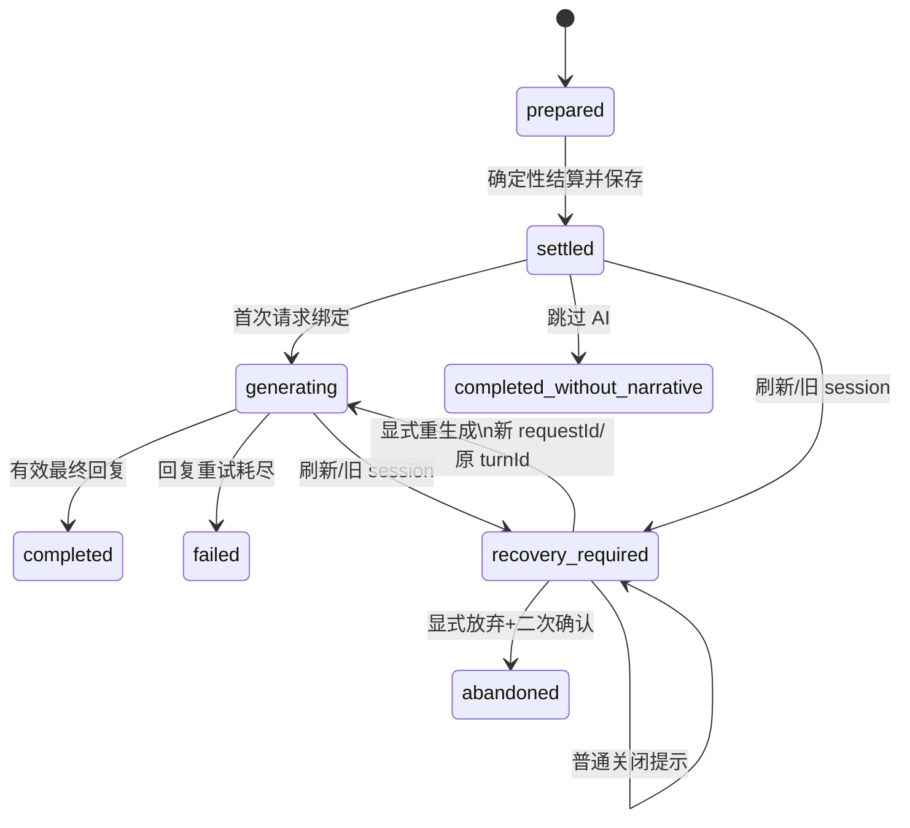

# Ordinary Action Refresh Recovery Implementation Plan

> **For agentic workers:** REQUIRED SUB-SKILL: Use superpowers:subagent-driven-development (recommended) or superpowers:executing-plans to implement this plan task-by-task. Steps use checkbox (`- [ ]`) syntax for tracking.

**Goal:** 普通上课、训练、休息已完成确定性结算但 AI 叙事尚未被前端确认时，刷新后保留同一 `turnId`，由用户显式选择以新 `requestId` 重新生成叙事或放弃叙事恢复。

**Architecture:** 继续使用 `state.harness.activeTurn`，不引入队列、事件总线或后端事务。首次结算时把该普通行动实际使用的 Prompt 冻结到 active turn；刷新后只把同一存档范围内、旧 session 的已结算非终态 turn 标为 `recovery_required`。恢复使用独立弹窗，不恢复旧请求，不复用 `closeEventOverlay()` 的业务收尾逻辑。

**Tech Stack:** 原生 JavaScript、HTML、localStorage、SillyTavern `postMessage` bridge、Node.js `node:test`。

---

## 1. 范围

只覆盖 `lesson`、`training`、`rest`。不回滚或重做数值、SP、随机事件、轮次、日期、自由模式时间和日志；不自动重发 AI；不恢复旧 `pendingAiRequestId`；不修改手机、广播、地图、委托、外出、交流、亲密、羁绊和 Live 流程；不修改 Prompt 文案或数值结算逻辑。

## 2. Task 1-5 实现审查

- `app.js:2773` `loadState()` 已清空刷新前的模块级和 state `pendingAiRequestId`，旧请求不会被新页面自动接管。
- `app.js:2788` `saveState()` 规范化 Harness 并增加 `persistenceRevision`。
- `app.js:5606` `normalizeHarnessState()` 更新外层 `harness.sessionEpoch`，但保留 `activeTurn.sessionEpoch`，可以识别跨刷新中断。
- `app.js:5693` `beginHarnessProduceAction()` 在结算前创建 `prepared`，只锁当前 session。
- `app.js:5555` 在 delta、随机事件、日志、轮次/时间已经写入后标记 `settled` 并保存。
- `app.js:5569` 绑定 requestId 并标记 `generating`；`requestHostPromptSend()` postMessage 前会保存，因此正常在途请求可持久化。
- `app.js:5728` `markHarnessProduceTurn()` 校验当前 session 和 expected requestId。
- `app.js:16663` `applyAiReply()` 的 requestId 门禁位于编年史写入之前。
- `st.html:647` 已严格校验 incoming/current saveScope。

当前缺口：旧 session turn 不阻塞下一普通行动；`state.lastPrompt` 被所有主模型流程共享，不能证明属于某个普通 turn；`triggerRegeneration()` 可能复用 `lastRequestId` 和宿主旧缓存，不符合新 requestId；`applyHostCharacter()` 尚无恢复检测。

“真正中断”在本方案中指：**前端持久状态证明结算已完成，但叙事结果尚未提交为终态**。它不保证宿主一定没有生成回复。若回复已写入聊天但刷新发生在前端提交前，仍显示“叙事结果未确认”，由用户决定重生成或放弃，不扫描楼层猜测。

## 3. 状态机



进入 `recovery_required` 必须同时满足：

1. `kind === "produce_action"` 且 action 为 lesson/training/rest。
2. status 为 `settled` 或 `generating`；已经是 `recovery_required` 时只显示，不重复迁移。
3. `turn.sessionEpoch !== runtimeSessionEpoch`。
4. 宿主模式下 turn/current saveScope 均非空且完全一致；本地模式下新增的 `storageKey` 与 `activeStorageKey` 一致。

不恢复 `prepared`，因为不能证明结算已经完成；不恢复 `completed`、`completed_without_narrative`、`failed`、`abandoned`；不恢复当前 session 或错误 scope 的 turn。

正常完成以持久化 terminal status 为准。如果宿主已经生成回复，但刷新发生在前端保存 `completed` 之前，仍作为 recovery candidate。这是保守行为，UI 不得宣称旧生成一定失败。

## 4. activeTurn 最小扩展

```ts
interface RecoverableOrdinaryTurn {
  turnId: string;
  kind: "produce_action";
  status: "prepared" | "settled" | "generating" | "recovery_required"
    | "completed" | "completed_without_narrative" | "failed" | "abandoned";
  action: "lesson" | "training" | "rest";
  requestId: string;
  saveScope: string;
  sessionEpoch: string;
  snapshot: HarnessPreTurnSnapshot;

  storageKey: string;
  generationPrompt: string;
  requestIds: string[]; // 最多 6 个非空值
  interruptedStatus?: "settled" | "generating";
  interruptedSessionEpoch?: string;
  recoveryRequiredAt?: number;
  recoveryAttemptCount: number;
  abandonedAt?: number;
}
```

只冻结 `generationPrompt`、现有 pre-turn snapshot、scope/storageKey 和请求标识。不保存 post-turn snapshot，不复制日志、世界书、角色卡、手机状态或完整 state。权威数值和时间继续只存在主 state。Prompt 不进入 trace。

## 5. 恢复 Prompt

`settleAction()` 在 `app.js:5518` 已得到现有 `buildPrompt()` 的结果。在首次 settled save 前将该完整文本写入 active turn：

```js
markHarnessProduceTurn("settled", {
  settledPersistenceRevision: state.harness.persistenceRevision + 1,
  generationPrompt: prompt,
  storageKey: activeStorageKey,
  recoveryAttemptCount: 0
});
```

恢复只使用 `activeTurn.generationPrompt`，不调用 `buildPrompt()` 重建。刷新后轮次、时间、lastStory 和世界摘要已经改变，重建不能保证与原行动一致。

兼容 Task 1-5 形成的 legacy generating turn 时，仅在归属可证明时回退：

```js
if (turn.requestId && state.lastRequestId === turn.requestId && state.lastPrompt.trim()) {
  return state.lastPrompt;
}
```

不能仅凭 lastPrompt 非空复用。Prompt 缺失或归属无法确认时，不创建 requestId、不发送、不重建；禁用“重新生成叙事”，明确提示原 Prompt 缺失，但仍允许关闭或显式放弃。legacy settled turn 的 requestId 为空，因此默认不能安全回退。

## 6. 恢复提示

宿主模式只在 `applyHostCharacter()` 完成 storage scope 切换、remote/local state resolution、`activeHostSaveScope` 赋值和 render 后，通过一次 `requestAnimationFrame()` 检测。不能在初始 `loadState()` 后立即检测，因为当时可能仍是基础 storage key。非宿主模式在首次 render 后按 storageKey 检测。

新增仅存在于当前页面内存的集合：

```js
const shownHarnessRecoveryKeys = new Set();
```

键为 `${scopeKey}:${turnId}`。同一页面只自动显示一次；关闭提示不持久化 shown 状态，也不改变 turn；再次刷新会再次提示；下一次普通行动被 recovery guard 拦截时可 `force: true` 重开。

在 `index.html` 新增独立 `#harnessRecoveryOverlay`，复用现有面板样式，包含“重新生成叙事”“暂时关闭”“放弃叙事恢复”和右上角关闭。所有关闭动作只调用 `closeHarnessRecoveryOverlay()`。`closeEventOverlay()` 不修改，也不得写 abandoned。

## 7. 显式重新生成

新增 `retryHarnessNarrativeRecovery()`：

1. 重新校验 turn、status、普通行动类型和当前 scope。
2. 解析冻结 Prompt；缺失则停止。
3. 如果手机、广播、地图/委托等其他前台流程仍有 pending/active 标记，拒绝 retry，不清理或覆盖它们。
4. `createRequestId()` 创建全新 requestId；不得调用 `triggerRegeneration()` 或宿主 `regenerate`。
5. 保留 turnId；旧 requestId 留在 `requestIds`，新 requestId 成为当前值。
6. active turn 改为当前 session 的 `generating`，增加 attemptCount。
7. 设置模块级 pending 和 `state.lastPrompt`，显示普通等待叙事界面。
8. 调用 `requestHostPromptSend(frozenPrompt, newRequestId)`。
9. 同步发送失败时清空 pending，补偿回 `recovery_required`，不自动再试。

必须始终满足：

```js
activeTurn.turnId === originalTurnId;
activeTurn.requestId === newRequestId;
newRequestId !== previousRequestId;
```

新尝试 pending 只等于新 requestId，因此旧回复继续被现有门禁拒绝，且不会写编年史。正常新回复沿用现有 `applyAiReply()`，无需第二套提交路径。

## 8. 显式放弃与下一普通行动

`abandonHarnessNarrativeRecovery()` 只能由专用按钮触发，并二次确认：

> 放弃后不会补写本次叙事。已经结算的数值、随机结果、轮次和时间不会回滚。确认放弃吗？

确认后只把 active turn 改为 `abandoned`，写 `abandonedAt` 和 `turn.abandoned` trace，保留 turnId/snapshot/Prompt/requestIds；不修改数值、时间、SP、日志、编年史或 lastStory。取消确认或普通关闭保持 `recovery_required`。

`beginHarnessProduceAction()` 建立新 turn 前检查同 scope 的 `recovery_required`：所有 lesson/training/rest 都拒绝，记录 `turn.rejected_recovery_pending` 并重开恢复提示。必须在 pendingActionContext、delta、roll 和时间推进之前返回。只有恢复成功进入 completed/failed，或显式 abandoned 后，才允许下一普通行动。其他流程不调用此 guard。

## 9. saveScope 与错误聊天保护

显示恢复提示、点击 retry、点击 abandon、下一普通行动 guard 都重新校验 scope：

```js
Boolean(activeHostSaveScope && turn.saveScope && turn.saveScope === activeHostSaveScope)
```

聊天 A 的 turn 不在聊天 B 显示或执行；弹窗打开后切换聊天，按钮执行时会被二次校验拒绝；宿主模式不允许空 scope 恢复。`st.html` 不修改，现有保存门禁继续阻止迟到 save。非宿主模式使用精确 storageKey；没有 storageKey 的 legacy 本地 turn 不自动恢复。

## 10. Trace

新增 allowlist：`turn.recovery_required`、`turn.recovery_started`、`turn.recovery_send_failed`、`turn.abandoned`、`turn.rejected_recovery_pending`。

不记录弹窗显示/关闭、Prompt 正文、state.save 或 render。detail 只存 turnId、旧/新 requestId、action、attemptCount、interruptedStatus 等标量。

## 11. 文件与函数

修改 `app.js`：

- `HARNESS_PERSISTED_TRACE_TYPES`
- `beginHarnessProduceAction()`：storageKey + unresolved recovery guard
- `settleAction()`：在 settled save 前冻结现有 prompt，不动结算代码
- `applyHostCharacter()`：正确 scope/render 后调度检测
- 底部初始化：仅非宿主模式调度本地检测

新增 helpers：`isHarnessRecoveryCandidate()`、`isHarnessTurnInActiveScope()`、`resolveHarnessRecoveryPrompt()`、`markHarnessRecoveryRequired()`、`maybeShowHarnessRecoveryPrompt()`、`openHarnessRecoveryOverlay()`、`closeHarnessRecoveryOverlay()`、`hasConflictingHarnessRecoveryFlow()`、`retryHarnessNarrativeRecovery()`、`abandonHarnessNarrativeRecovery()`。

新增 `index.html` 独立恢复 overlay；新增 `tests/harness-recovery.test.mjs`；仅在签名变化时调整 `tests/harness-phase1.test.mjs`，扩展 `tests/chronicle-sum.test.mjs` 的旧/新 requestId 场景。`st.html` 不修改。

明确不修改：`closeEventOverlay()`、`triggerRegeneration()`、`buildPrompt()`、数值/随机/时间函数、手机/广播/地图/委托入口、`applyAiReply()` 现有正文和门禁行为。

## 12. 实施任务

每个 Task 独立执行失败测试、最小实现、专项测试、diff 检查和提交，不允许全部改完后统一验证。

### Task 1：恢复候选与 scope 合同

**Files:** Create `tests/harness-recovery.test.mjs`; Modify `app.js:5589-5749`。

- [ ] 写候选矩阵失败测试：旧 settled/generating 同 scope 为 true；prepared、终态、当前 session、错误/空宿主 scope、非普通行动为 false；recovery_required 不重复迁移。
- [ ] 运行 `node --test tests/harness-recovery.test.mjs`，预期因 helper 不存在失败。
- [ ] 实现纯候选/scope helper 和 trace allowlist，不接 UI、不发送请求。
- [ ] 运行：

```powershell
node --test tests/harness-recovery.test.mjs tests/harness-phase1.test.mjs
node --check app.js
git diff -- app.js tests/harness-recovery.test.mjs tests/harness-phase1.test.mjs
git diff --check
```

- [ ] 提交 `test: define ordinary turn recovery contracts`。

### Task 2：冻结普通行动 Prompt

**Files:** Modify `app.js:5516-5575`, `tests/harness-recovery.test.mjs`。

- [ ] 写失败测试：generationPrompt/storageKey 在首次 settled save 前写入；requestIds 只含非空值且最多 6 项；没有第二次 settlement。
- [ ] 运行专项测试确认失败。
- [ ] 仅扩展 settled/generating Harness patch，不移动 delta、roll、advanceRound/advanceFreeModeTime、log。
- [ ] 运行：

```powershell
node --test tests/harness-recovery.test.mjs tests/harness-phase1.test.mjs tests/bond-day-schedule.test.mjs tests/misuzu-balance.test.mjs
node --check app.js
git diff -- app.js tests/harness-recovery.test.mjs
git diff --check
```

- [ ] 提交 `feat: retain ordinary turn recovery prompt`。

### Task 3：刷新检测与独立提示

**Files:** Modify `index.html:451`, `app.js:11907-11947`, `app.js:18418-18430`, `tests/harness-recovery.test.mjs`。

- [ ] 写失败测试：宿主检测在 scope/render 后；同页自动一次；关闭不改 status；错误 scope 不显示；`closeEventOverlay()` 无 abandoned/recovery 写入。
- [ ] 运行专项测试确认失败。
- [ ] 新增独立 overlay、内存去重和加载后检测。
- [ ] 运行：

```powershell
node --test tests/harness-recovery.test.mjs tests/harness-phase1.test.mjs tests/st-loader-bridge.test.mjs
node --check app.js
git diff -- app.js index.html tests/harness-recovery.test.mjs
git diff --check
```

- [ ] 提交 `feat: prompt for interrupted ordinary turns`。

### Task 4：新 requestId 恢复叙事

**Files:** Modify `app.js`, `tests/harness-recovery.test.mjs`, `tests/chronicle-sum.test.mjs`。

- [ ] 写失败测试：原 turnId、新 requestId、冻结 Prompt、不调用 regenerate、不重复结算；缺 Prompt/旁支冲突不发送；旧 reply 不写编年史。
- [ ] 运行专项测试确认失败。
- [ ] 实现显式 retry 和同步发送失败补偿，不自动重试。
- [ ] 运行：

```powershell
node --test tests/harness-recovery.test.mjs tests/harness-phase1.test.mjs tests/chronicle-sum.test.mjs tests/vn-flow.test.mjs tests/phone-chat.test.mjs
node --check app.js
git diff -- app.js tests/harness-recovery.test.mjs tests/chronicle-sum.test.mjs
git diff --check
```

- [ ] 提交 `feat: retry interrupted ordinary narration`。

### Task 5：显式放弃与下一行动门禁

**Files:** Modify `app.js:5653-5725`, recovery listeners, `tests/harness-recovery.test.mjs`。

- [ ] 写失败测试：普通关闭/取消 confirm 不放弃；确认放弃只改 Harness；未解决恢复阻塞任意普通行动；abandoned 后可继续；旁支入口不使用该 guard。
- [ ] 运行专项测试确认失败。
- [ ] 实现二次确认 abandon 和 scope-aware ordinary guard，确保在任何结算写入前返回。
- [ ] 运行：

```powershell
node --test tests/harness-recovery.test.mjs tests/harness-phase1.test.mjs tests/bond-day-schedule.test.mjs tests/misuzu-balance.test.mjs tests/phone-chat.test.mjs tests/world-engine.test.mjs tests/tasks-sandbox.test.mjs
node --check app.js
git diff -- app.js tests/harness-recovery.test.mjs
git diff --check
```

- [ ] 提交 `feat: resolve pending ordinary turn recovery`。

### Task 6：最终验收

- [ ] 运行聚焦测试：

```powershell
node --test tests/harness-recovery.test.mjs tests/harness-phase1.test.mjs tests/chat-metadata-save.test.mjs tests/chronicle-sum.test.mjs tests/bond-day-schedule.test.mjs tests/misuzu-balance.test.mjs tests/vn-flow.test.mjs tests/phone-chat.test.mjs
node --check app.js
git diff --check
```

- [ ] 运行 `node --test tests`，不得新增失败；当前 6 项非 Harness 失败不在本 PR 修复。
- [ ] 手工验证：generating 时刷新；数值/轮次不变；提示只自动一次；普通关闭不放弃；下一普通行动被挡；retry 保留 turnId 且 requestId 改变；旧含 `<sum>` reply 被拒；取消/确认放弃；聊天 A/B 隔离；手机/广播/地图/委托冒烟。
- [ ] 最终 diff 确认 `closeEventOverlay()`、Prompt 文案、结算/时间、`st.html` 无变化，trace 无 Prompt 正文。

## 13. 风险与回滚

主要风险：宿主已生成但前端未提交时，用户重生成会产生第二条叙事，因此文案必须说“未确认”并提供放弃；完整 Prompt 使 active turn 存档略增大，但仅保存一个当前 turn；legacy Prompt 无法证明归属时只能放弃；恢复 retry 遇到其他主模型流程必须拒绝，不能清理对方状态，本 PR 不解决跨流程并发。

各 Task 独立提交后按 5→1 使用 `git revert`。回滚不清理用户存档；旧 `normalizeHarnessState()` 会保留未知字段，`abandoned` 也不会被旧单飞锁视为阻塞。

## 14. 十项问题结论

1. 旧 session、同 scope、普通行动 settled/generating 进入 recovery_required。
2. 以持久 terminal status 区分正常完成，不猜宿主执行结果。
3. scope/state/render 完成后自动提示一次；刷新或下一普通行动可再次提示。
4. 使用 activeTurn 冻结的原始 generationPrompt。
5. lastPrompt 仅在 requestId 所有权可证明时回退；否则不发送，只能关闭或放弃。
6. 专用按钮和二次确认触发放弃；普通关闭不改变状态。
7. 未解决 recovery turn 阻塞下一 lesson/training/rest，且不触发结算。
8. 显示和执行时均精确校验 saveScope；错误/空宿主 scope 拒绝。
9. 新增候选、scope、Prompt 所有权、新 requestId/原 turnId、显示去重、abandon、入口门禁、stale chronicle、旁支无回归测试。
10. 修改 beginHarnessProduceAction、settleAction、applyHostCharacter 和 Harness/初始化 helpers；不修改 closeEventOverlay、triggerRegeneration、buildPrompt、st.html 和结算函数。
