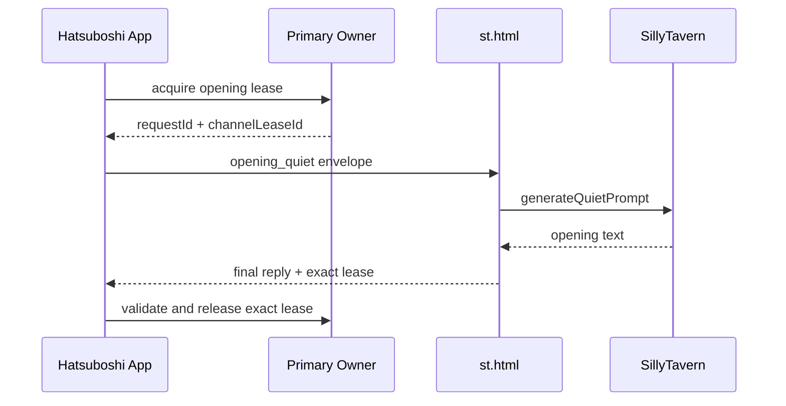
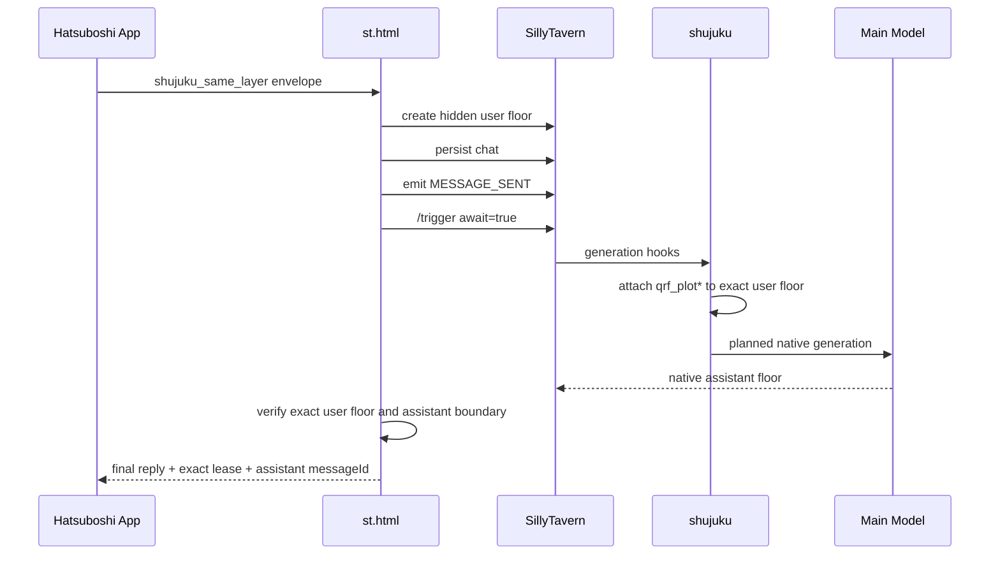

# Harness + shujuku Bridge Design

Date: 2026-07-11
Status: Proposed

## 1. Goal

Integrate the current Harness-enabled Hatsuboshi frontend with shujuku without restoring the pre-Harness request, save, and recovery risks.

The integration has two generation paths:

1. Opening narration uses SillyTavern quiet generation with the active character card, preset, and worldbook context, while deliberately bypassing shujuku planning and automatic table updates.
2. Post-opening narrative requests use a real hidden user floor, shujuku planning on that floor, and a native assistant floor.

This design does not change Prompt wording, deterministic settlement, time advancement, or narrative validation rules.

## 2. Authority Boundary

The Hatsuboshi frontend remains the only authority for:

- deterministic stats and resources;
- day, round, schedule, and time;
- ordinary action settlement;
- Harness turn state, Recovery, and abandonment;
- `saveScope`, `persistenceRevision`, and `hostSaveSequence`;
- accepted narrative text and chronicle eligibility.

shujuku remains the authority for:

- plot planning and `qrf_plot*` data;
- narrative memory and database tables maintained from chat floors;
- worldbook projection owned by shujuku;
- post-assistant automatic table updates.

shujuku must not overwrite frontend state. The frontend must not fabricate `qrf_plot`, write shujuku tables directly, or treat shujuku tables as a transaction log for deterministic settlement.

## 3. Explicit Non-Goals

- Do not import `world/hatsu-db-bridge.js` from the old adaptation.
- Do not create a second state mirror in chat metadata.
- Do not downgrade the current metadata envelope from version 2.
- Do not replace `hostSaveSequence` with a database revision.
- Do not introduce a queue service, event bus, database transaction coordinator, or new backend.
- Do not migrate every `legacy_main` entry as part of this integration.
- Do not redesign Prompt builders or settlement code.
- Do not make shujuku responsible for Recovery decisions.

## 4. Existing Assets To Reuse

From the current Harness frontend:

- `tryAcquirePrimaryModelChannel()` and exact lease release;
- `requestHostPromptSend()` and `requestHostRegeneration()`;
- `activeTurn.requestId` reply gate;
- ordinary action Recovery with frozen `generationPrompt`;
- `saveScope` isolation and metadata envelope v2;
- `hostSaveSequence` ordering;
- stale reply rejection before chronicle writes;
- current hidden-floor rollback helpers and reply compatibility checks.

From the old shujuku adaptation:

- opening quiet-generation concept;
- hidden host user floors for ordinary narrative turns;
- `MESSAGE_SENT` emission;
- `/trigger await=true` native generation;
- exact-floor `qrf_plot*` observation;
- planning-text rejection and visible-reply sanitization;
- stable loader-floor handling where still applicable.

## 5. Generation Protocol

### 5.1 Request Envelope

Every main-model dispatch sent to `st.html` must use a structured envelope:

```ts
interface HostGenerationEnvelope {
  requestId: string;
  channelLeaseId: string;
  saveScope: string;
  ownerKind: string;
  generationMode: "opening_quiet" | "shujuku_same_layer";
  prompt: string;
  turnId?: string;
}
```

Rules:

- `requestId + channelLeaseId` identifies one generation attempt.
- `requestId` alone is insufficient for host deduplication or release.
- `saveScope` is captured when dispatching and must still match before committing the reply.
- Prompt text classification may support legacy callers but cannot override an explicit `generationMode`.
- Debug output may record mode, owner kind, scope, Prompt length, and ID suffixes, but not Prompt content.

### 5.2 Attempt Key

The host bridge uses an attempt key derived from:

```txt
requestId + channelLeaseId + saveScope
```

This key replaces the old adaptation's requestId-only `activePromptRequestIds` guard. It allows regeneration to reuse a business requestId while obtaining a new lease, and prevents an old attempt from releasing or completing a new one.

## 6. Opening Quiet Path

### 6.1 Purpose

The affinity-zero opening must use the current SillyTavern preset stack without creating a real user floor or triggering shujuku.

### 6.2 Flow



### 6.3 Rules

- Opening obtains ownership before pending state, waiting UI, logs, or other generation-side effects.
- It does not create user or assistant chat floors.
- It does not emit `MESSAGE_SENT`.
- It does not call `/trigger`.
- It does not wait for `qrf_plot*`.
- It uses `generateQuietPrompt()` with world-info scanning enabled and reasoning removed from the visible result.
- A missing quiet-generation API is a terminal transport failure for that attempt, returned through `primaryAiError` with the exact lease.
- Opening regeneration reuses the cached `generationMode`, not Prompt-text inference.

## 7. shujuku Same-Layer Path

### 7.1 Purpose

Post-opening requests must behave like real SillyTavern chat turns so shujuku can plan, recall memory, update qrf data, and process the resulting assistant floor.

### 7.2 Host Attempt State

```ts
interface HostGenerationAttempt {
  requestId: string;
  channelLeaseId: string;
  saveScope: string;
  generationMode: "shujuku_same_layer";
  status:
    | "prepared"
    | "user_floor_committed"
    | "planning"
    | "generating"
    | "assistant_committed"
    | "replied"
    | "compensated"
    | "failed";
  userMessageId: number | null;
  assistantMessageId: number | null;
  startedAt: number;
}
```

This is host-memory state, not a second persistent Harness state machine.

### 7.3 Flow



### 7.4 Floor Identity

The hidden user floor is stamped with:

- requestId;
- channelLeaseId suffix or an opaque attempt token, never the full lease in visible UI;
- saveScope;
- `_acu_true_same_layer = true`;
- an exchange ID unique to the attempt;
- hidden status.

qrf evidence is accepted only from that exact user floor or a shujuku-confirmed canonical replacement carrying the same exchange identity. The bridge must not scan arbitrary older user floors for any qrf field.

### 7.5 Assistant Acceptance

The assistant floor must:

- appear after the canonical user floor;
- belong to the active saveScope and current attempt window;
- not be a hidden planning or recall floor;
- contain non-empty narrative text;
- pass the existing Prompt compatibility and response validation rules.

The bridge must not create a duplicate synthetic assistant floor when native generation already committed one.

## 8. Failure And Compensation

### 8.1 Before User-Floor Commit

Return `primaryAiError` with the exact requestId and lease. No chat mutation requires compensation.

### 8.2 After User-Floor Commit, Before Native Generation

Remove the exact hidden user floor if it is still the unmodified bridge floor. Persist the removal, mark the attempt compensated, and return `primaryAiError`.

### 8.3 After Planning Starts

Do not blindly delete a floor that contains shujuku data. Mark it as an aborted hidden bridge attempt and exclude it from future qrf matching and completion payloads. Return failure with the exact lease.

### 8.4 Assistant Exists But Reply Delivery Fails

Do not generate again automatically. Keep the assistant floor, return a diagnostic failure, and let the frontend Recovery or explicit regeneration decide the next action.

### 8.5 Timeout

Frontend timeout releases only the exact owner lease and applies existing business failure semantics. It cannot cancel the host model. A late host reply must retain its original lease and be rejected if the owner has changed.

## 9. Recovery And Regeneration

### 9.1 Ordinary Recovery

- Preserve the original turnId.
- Use a new requestId and new lease.
- Use the frozen `activeTurn.generationPrompt`.
- Use `shujuku_same_layer` mode.
- Do not repeat settlement, random rolls, time advancement, or logs.
- Any previous incomplete bridge floor must be excluded by attempt identity.

### 9.2 General Regeneration

- May preserve the existing business requestId to retain host regeneration identity.
- Must acquire a new lease.
- Host cache entries are attempt-aware and store generation mode, scope, and Prompt.
- Old-attempt events cannot complete or release the new attempt.
- Choice prompt and choice resolution remain outside this migration until their product semantics are separately approved.

## 10. Save And Chat-Switch Rules

- Existing metadata envelope v2 remains the only frontend save envelope.
- `hostSaveSequence` remains strictly increasing per saveScope.
- No `dbSyncState` or `dbReadState` mirror is added.
- On chat switch, the frontend releases an owner only by exact lease and rejects late replies from the old scope.
- Host attempts from the old scope are ignored for frontend commit even if the model later finishes.
- Local-save migration into an empty host chat is a separate product decision and is not changed by this bridge work.

## 11. Incremental Delivery

### Stage 0: Evidence And Fixtures

- Pin SillyTavern, TavernHelper, shujuku, preset, and frontend versions.
- Capture one opening and one ordinary action from the old adaptation.
- Add executable host-bridge fixtures rather than source-order assertions.
- No production behavior changes.

### Stage 1: Structured Dispatch And Opening Quiet

- Add `generationMode`, saveScope, ownerKind, and exact attempt identity to dispatch and cache records.
- Add formal opening ownership before generation-side effects.
- Implement quiet opening with exact lease reply and failure propagation.
- Do not change ordinary same-layer generation yet.

### Stage 2: Same-Layer Preparation

- Add host attempt records and exact hidden-floor stamps.
- Create and persist the hidden user floor.
- Emit `MESSAGE_SENT` and call `/trigger await=true`.
- Retain the current frontend owner and reply gates.

### Stage 3: qrf And Assistant Commit

- Confirm qrf only on the exact attempt floor.
- Locate and validate the native assistant floor.
- Sanitize visible text while retaining raw text for validation and chronicle extraction.
- Return one final committed reply with the exact lease.

### Stage 4: Compensation, Recovery, And Regeneration

- Cover failures at each host attempt status.
- Exclude aborted bridge floors from later attempts.
- Verify ordinary Recovery with a new requestId.
- Verify regeneration with a reused requestId and new lease.

### Stage 5: Real Host Acceptance

- Run the full manual matrix in SillyTavern with shujuku enabled.
- Do not claim compatibility from VM tests alone.
- Keep a feature flag or rollback switch until the matrix passes.

## 12. Test Strategy

### 12.1 Unit Tests

- generation mode resolution;
- attempt-key construction;
- exact floor matching;
- qrf evidence validation;
- assistant-floor filtering;
- planning-text sanitization;
- compensation decisions by attempt status.

### 12.2 Executable Host-Bridge Tests

- opening quiet creates no floor and emits no `MESSAGE_SENT`;
- opening reply echoes the exact lease;
- ordinary request commits the user floor before generation;
- qrf on another floor is ignored;
- native assistant floor is not duplicated;
- busy rejection happens before frontend state and UI writes;
- old lease cannot finish a new attempt with the same requestId;
- saveScope switch rejects an old reply;
- missing qrf, missing assistant, and host timeout use the expected compensation path;
- Recovery repeats narrative generation only.

### 12.3 Regression Tests

The existing Harness Phase 1, Recovery, ownership, metadata ordering, chronicle, phone, broadcast, VN, and Prompt compatibility suites must remain at their existing baseline or improve.

### 12.4 Real SillyTavern Matrix

At minimum:

1. Opening uses the active preset, character card, and worldbook.
2. Opening creates no user floor, qrf, or ACU review panel.
3. Confirming opening does not duplicate the opening narrative.
4. Ordinary lesson creates exactly one hidden user floor and one native assistant floor.
5. qrf fields are written to the current hidden user floor.
6. Planning and recall text do not appear in the frontend narrative.
7. A second ordinary action does not reuse the previous qrf or Prompt.
8. Phone and broadcast ownership block an ordinary request without side effects.
9. Refresh after settlement enters existing Recovery and does not settle again.
10. Recovery uses a new requestId and preserves turnId.
11. Regeneration with the same requestId uses a new lease.
12. Switching chat during generation prevents the old reply from committing.

## 13. Rollback

- Keep the current transactional bridge available behind a temporary compatibility flag during Stages 1-4.
- Rollback changes only the selected host generation adapter; it does not rewrite saved state.
- Do not persist the feature flag inside gameplay state.
- Hidden floors created by the new adapter remain hidden and identifiable by attempt metadata.
- Metadata envelope v2 and Harness state are never downgraded during rollback.

## 14. Acceptance Criteria

The bridge is ready only when:

- opening quiet and ordinary same-layer flows both pass executable tests;
- exact lease propagation is proven for success, failure, timeout, and stale reply;
- no new Harness regression is introduced;
- host save ordering remains v2 and strictly scoped;
- real SillyTavern tests confirm qrf placement and one-assistant-floor behavior;
- the BasicAuth-blocked manual-test gap is closed;
- the rollback switch has been exercised once.

