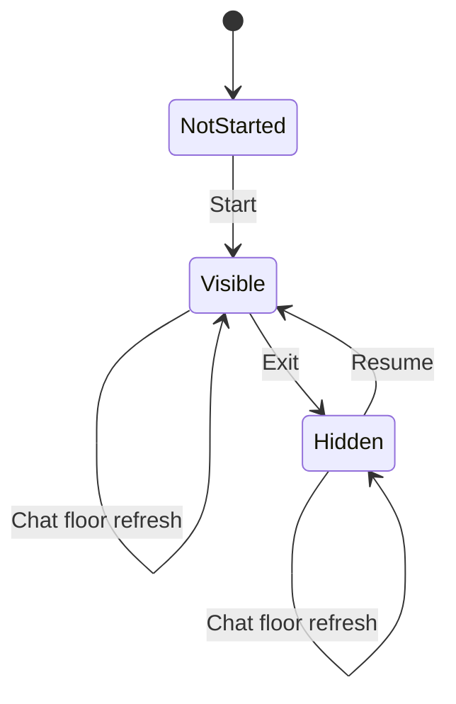

# Persistent SillyTavern Launcher Design

## Goal

Render a small game launcher inside each regex-transformed AI message while running the actual Hatsu Produce frontend in one persistent iframe attached to the SillyTavern top-level document.

This prevents shujuku chat-floor refreshes from destroying the game runtime. Closing the game hides the persistent container and preserves the current page state.

## Scope

This change adds a launcher page and a host-level overlay shell. It does not modify game settlement, Prompt construction, Harness ownership or recovery semantics, save ordering, or the shujuku request bridge.

## Components

### Launcher page

`launcher.html` is the page loaded by the user's regex replacement instead of `st.html`. It displays a compact entry card with:

- the product name;
- a short status label: not started, running in background, or currently open;
- a Start/Resume button.

Each rendered message may contain its own launcher card. All cards control the same host-level game instance.

### Host launcher controller

The first launcher instance installs a small controller on the accessible SillyTavern host window. Later launcher instances reuse it.

The controller owns fixed IDs for:

- one host overlay container;
- one game iframe;
- one Exit button.

It exposes only the operations needed by launcher cards: `open`, `hide`, and `getStatus`.

### Persistent game container

On the first Start action, the controller appends a fixed full-viewport container to the SillyTavern host document body and loads the canonical `st.html` URL in its iframe.

The container is outside the chat message tree. Rebuilding or refreshing chat floors therefore does not remove it.

The Exit button is part of the host overlay shell, above the game iframe. It hides the container without changing the iframe URL or removing the iframe node. Reopening shows the same container and retains in-memory frontend state.

## Lifecycle

No ordinary UI action destroys the persistent iframe. A full SillyTavern page reload still creates a new runtime and lets the existing Harness recovery rules decide whether an interrupted turn needs recovery.

## Host access and fallback

The launcher first uses the parent/top SillyTavern document when it is accessible. If no accessible host document exists, such as opening `launcher.html` directly, it shows an environment warning and does not create a fake local owner or alter the game state.

The game iframe source uses the canonical local path:

`http://127.0.0.1:8000/hatsu-produce-local/st.html`

A version query may be added for asset cache invalidation, but reopening must not rewrite the iframe source.

## Singleton and duplicate safety

- Fixed DOM IDs prevent duplicate containers and iframes.
- A controller stored on the host window prevents duplicate global listeners.
- Re-executing a message script reuses the existing controller.
- Starting from multiple message floors only reveals the same iframe.
- Launcher status is read from the host controller rather than persisted into game state.

## Error handling

- If the host document cannot be accessed, the launcher remains visible and reports that it must run inside SillyTavern.
- If the iframe fails to load, the overlay remains closable and the launcher reports a load failure.
- Hiding the overlay must work even while generation is pending.
- The Exit action does not cancel generation, release a model lease, abandon recovery, or write a save.

## Testing

Automated tests will verify:

- the launcher mounts the overlay under the host body, not the message iframe;
- repeated Start actions create exactly one overlay and one iframe;
- Exit hides rather than removes the iframe;
- Resume reuses the same iframe node and source;
- simulated chat-floor removal does not remove the host overlay;
- direct/non-host use does not mount an owner or mutate game state;
- no changes are required in `app.js` business functions.

Manual SillyTavern acceptance will verify:

1. Every transformed AI floor shows a compact launcher rather than the full game.
2. Starting opens the existing game full-screen.
3. Exit returns to chat while the game remains alive in the background.
4. Starting from another floor resumes the same screen.
5. A shujuku table refresh does not reload the game or show Harness Recovery.
6. Re-running the regex/script does not create duplicate full-screen frames.

## Non-goals

- No draggable or resizable window mode.
- No second persistent storage layer.
- No automatic AI retry or recovery behavior change.
- No changes to Prompt text, settlement, time, chronicle, save metadata, ownership, or shujuku bridge semantics.
- No removal of the backup branch or feature worktree before real-host acceptance.
