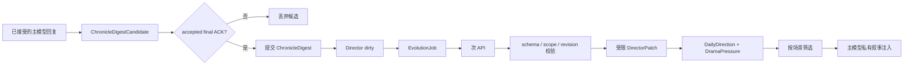
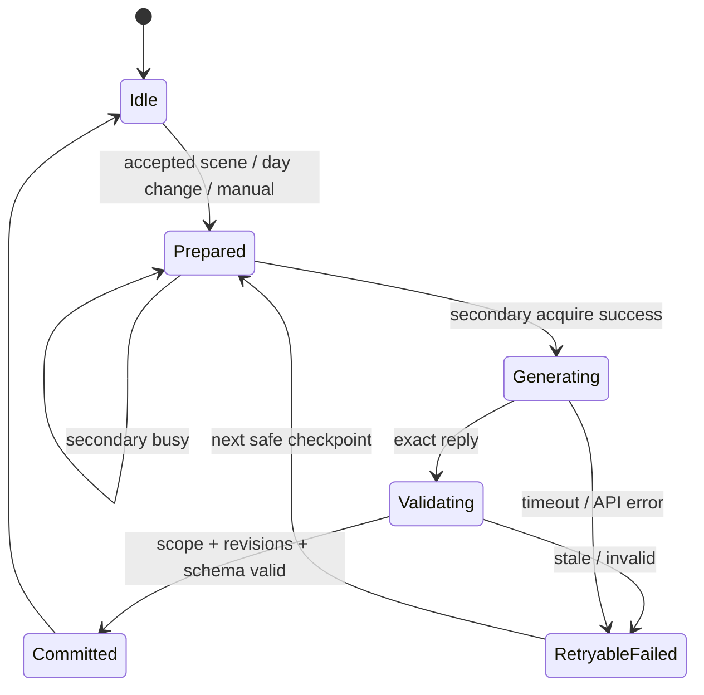

# 初星学园沙盒世界导演引擎设计

日期：2026-07-12

状态：已确认设计，待实施计划

## 1. 目标

将当前“玩家发起行动、主模型回应”的沙盒循环扩展为一个持续演进的群像叙事系统。首版只建立以下闭环：

1. 已接受的场景回复形成有界的结构化编年史索引。
2. 次 API 根据编年史和当前世界状态生成 `DailyDirection` 与 `DramaPressure`。
3. 本地代码校验并以受限 patch 提交结果。
4. 主模型只接收当前场景相关的导演方向和压力。

首版不实现 `CharacterIntent`、NPC 主动私信、来访、SNS 主动发帖或 NPC 对 NPC 正文。这些能力作为后续路线图保留。

## 2. 当前项目事实

原始规划文档中的部分前提已经变化。当前代码可直接确认：

- `world/` 已存在校园状态、角色出勤、日切、广播、SNS buzz、公开世界摘要和每日世界次 API 生成。
- `requestHostSecondaryPromptSend()` 已支持宿主与本地 OpenAI-compatible API，但当前只用单个 `pendingSecondaryRequestId` 管理 `world/daily/tier/test` 请求。
- `st.html` 将 primary 与 secondary 请求放入同一个 `queuePromptTask()`，因此二者在宿主层实际串行。
- Harness Phase 1、Recovery、Phase 1.5 和 Phase 1.6 已提供 primary owner、精确 lease、普通行动恢复、`saveScope` 隔离和 `hostSaveSequence` 顺序保护。
- shujuku same-layer bridge 已使用 `requestId + channelLeaseId + saveScope` 标识主模型尝试。
- 编年史当前从最终回复的 `<sum>` 提取摘要，经 `st.html` 写入角色世界书；它不是前端结构化事实库。
- `composeWorldSummary()` 只描述公开校园层，已用于地图、SNS、广播和每日世界生成。

因此本项目不 Fork HTYQ-LITE，也不新增独立 Director 插件。HTYQ-LITE 只在后续需要长期记忆压缩、快照或调试面板设计时作为参考。

## 3. 总体架构

世界导演引擎直接扩展当前 `world/` 子系统。`app.js` 继续负责调度、宿主通信和 UI；纯状态、schema、输入构建、输出校验、patch 应用和注入筛选放入独立模块。



### 3.1 权威边界

前端确定性代码继续唯一负责：

- 数值、资源、时间和随机结果；
- Harness、Recovery、request 接受性和 save ordering；
- Director schema、revision、去重、阶段转换和 patch 提交；
- 哪些 Director 内容可以注入当前场景。

次 API 只负责：

- 根据已存在事实提出下一阶段叙事方向；
- 识别、新建、更新、缓解、挂起、转化或消散压力；
- 给出解释性字段和叙事建议。

次 API 不得：

- 修改权威数值、关系值、任务、时间或 Harness；
- 返回任意 JSON Patch 路径；
- 删除 locked 数据；
- 把压力写成必须立即发生的固定剧情；
-生成完整正文或替玩家作出选择。

## 4. 双层编年史

### 4.1 世界书编年史

现有 `<sum>` 世界书继续负责用户可读记录、楼层关联和分支读档。本设计不修改其格式、编号或世界书归属。

### 4.2 Director 编年史索引

新增 `state.freeMode.world.director.chronicleDigests`，最多保存最近 32 条精简索引。它是 Director 输入缓存，不是新的正文存档，也不取代世界书。

```ts
interface ChronicleDigest {
  id: string;
  dayKey: string;
  timeKey: string;
  participants: string[];
  summary: string;
  actionType: string;
  sourceTurnId: string;
  sourceRequestId: string;
  sourceMessageId: number | null;
  committedAt: number;
}
```

约束：

- 不保存 Prompt 或正文。
- `summary` 复用已验证的 `<sum>`，设置明确长度上限。
- `participants`、`actionType`、day/time 从当前确定性上下文读取，不由模型猜测。
- 优先以 `sourceTurnId + sourceMessageId` 去重；缺失时回退 `sourceRequestId`。
- 每次真正新增 digest 时，`chronicleRevision` 递增一次并设置 `dirty = true`。

### 4.3 候选暂存与提交

当前 `requestChronicleUpdate()` 在 `applyAiReply()` 的 requestId 门禁后、路由解析前调用。Director digest 使用更严格的语义：

1. `applyAiReply()` 通过 current request/lease 门禁。
2. 从 reply candidates 提取合法 `<sum>`，形成内存 `ChronicleDigestCandidate`。
3. 现有正文、选项、任务、手机或广播路由继续执行。
4. 只有 `sendAiReplyAck(accepted=true, retry=false, isFinal=true)` 才提交候选。
5. stale、partial、retry、解析失败或 rejected final 丢弃候选。

提交成功后先释放 primary owner，再在安全检查点尝试启动 Director job。Director 失败不得改变现有正文提交结果。

## 5. Director 状态

```ts
interface WorldDirectorState {
  schemaVersion: 1;
  directorRevision: number;
  chronicleRevision: number;
  chronicleDigests: ChronicleDigest[];
  dailyDirection: DailyDirection | null;
  pressures: DramaPressure[];
  activeJob: EvolutionJob | null;
  dirty: boolean;
  lastAppliedJobId: string;
  receipts: DirectorReceipt[];
}
```

`directorRevision` 是 Director 业务状态版本。它不能复用：

- `persistenceRevision`：例行持久化观测计数；
- `hostSaveSequence`：同 `saveScope` 宿主保存顺序；
- `chronicleRevision`：Director 编年史输入版本。

### 5.1 DailyDirection

```ts
interface DailyDirection {
  dayKey: string;
  tone: string;
  tension: "decrease" | "maintain" | "increase_slightly";
  warmth: "decrease" | "maintain" | "increase_slightly";
  progressTarget: string;
  focusPressureIds: string[];
  avoid: string[];
  sourceRefs: string[];
  generatedByJobId: string;
  createdAt: number;
}
```

### 5.2 DramaPressure

```ts
type PressureStage =
  | "dormant"
  | "emerging"
  | "building"
  | "pressing"
  | "expressed"
  | "resolved";

type PressureStatus =
  | "active"
  | "suspended"
  | "transformed"
  | "dissipated";

interface DramaPressure {
  id: string;
  signature: string;
  type: "relationship" | "goal" | "identity" | "social" | "schedule";
  subjects: string[];
  sourceRefs: string[];
  sourceSummary: string;
  stage: PressureStage;
  intensity: number;
  direction: "negative" | "slightly_negative" | "mixed" | "slightly_positive" | "positive";
  visibility: "private" | "implicit" | "visible" | "public";
  dramaticNeed: string;
  escalationConditions: string[];
  reliefConditions: string[];
  status: PressureStatus;
  locked: boolean;
  updatedAtRevision: number;
}
```

Pressure ID 由本地根据标准化后的 `type + subjects + source signature` 派生。模型可提供匹配提示，但不能直接决定最终 ID。相同 signature 必须合并，不能重复创建。

### 5.3 Receipt

`DirectorReceipt` 最多保留 20 条，只记录标量和引用：jobId、trigger、base revisions、result、reject reason、pressure counts、applied revision 和时间。不记录 Prompt、API key、模型正文或完整 state。

## 6. Secondary Owner 与 EvolutionJob

### 6.1 当前问题

当前所有次 API 调用共享 `pendingSecondaryRequestId` 和 `pendingSecondaryMeta`。`world/daily/tier/test` 在 transport 前可能已经写入 loading/pending 状态；回复只校验 requestId，没有 `saveScope` 和 job identity。

### 6.2 最小 owner

正式化一个页面内存 secondary owner，不引入队列或抢占：

```ts
interface SecondaryChannelOwner {
  jobId: string;
  requestId: string;
  kind: "director" | "world" | "daily" | "tier" | "test";
  saveScope: string;
  acquiredAt: number;
}
```

规则：

- 同时最多一个 secondary owner。
- 所有已迁移入口在写 loading/pending/save/UI 前 acquire。
- 占用时立即拒绝发送；Director 保留 `dirty`，其他既有流程恢复各自 pending/idle 语义。
- release 必须精确匹配 `jobId + requestId + saveScope`。
- primary 与 secondary 是不同前端 owner，但宿主共享 `queuePromptTask()`；Director 只在 primary 释放后的安全节点启动。

### 6.3 EvolutionJob

```ts
interface EvolutionJob {
  jobId: string;
  requestId: string;
  saveScope: string;
  trigger: "scene_commit" | "day_change" | "manual";
  dayKey: string;
  baseDirectorRevision: number;
  baseChronicleRevision: number;
  status:
    | "prepared"
    | "generating"
    | "validating"
    | "committed"
    | "retryable_failed";
  attempts: number;
  preparedAt: number;
  startedAt: number;
  lastError: string;
}
```

Job 不持久化完整 Prompt。刷新时，`generating/validating` 统一归一化为 `retryable_failed`，清除旧 requestId，保留 `dirty = true`。下一安全节点基于当前状态创建新 job，不恢复旧网络请求。

### 6.4 生命周期



Director job 失败时保留上一版 Direction/Pressure，不回退现有公开世界静态池，也不阻止玩家继续行动。

## 7. Director 输入、输出与 patch

### 7.1 输入

`buildDirectorInput()` 构建精简快照，不复制完整 state：

- schemaVersion、saveScope、jobId；
- baseDirectorRevision、baseChronicleRevision；
- dayKey、时间阶段和当前地点；
- 最近 12 条 digests；
- active pressures，设置数量上限；
- 当前 DailyDirection；
- 已知角色的最小关系/阶段快照；
- 公开校园摘要；
- 最近场景类型和冷暖统计。

API key、Prompt 历史、全文正文、完整任务状态、Harness trace 和完整 state 不进入输入。

### 7.2 输出

次 API 输出 `DirectorOutput`：

```ts
interface DirectorOutput {
  schemaVersion: 1;
  jobId: string;
  baseDirectorRevision: number;
  baseChronicleRevision: number;
  dailyDirection: DailyDirectionProposal;
  pressureOperations: PressureOperation[];
}
```

允许的 `PressureOperation.action`：

- `upsert`
- `transition`
- `relieve`
- `suspend`
- `transform`
- `dissipate`

不接受任意 path/value patch。

### 7.3 校验顺序

`validateDirectorOutput()` 必须依次检查：

1. JSON 和 schemaVersion。
2. 当前 active job 的 jobId/requestId/saveScope。
3. baseDirectorRevision/baseChronicleRevision 与当前值一致。
4. 已知角色、已知 digest sourceRef 和合法枚举。
5. 字符串、数组、压力数量和文本长度上限。
6. intensity 范围 0-100。
7. 合法阶段转换和 locked 保护。
8. 本地 signature 去重。

任何一步失败都不得部分写入。

### 7.4 提交

`applyDirectorPatch()` 先在临时 Director 副本上完成全部操作并重新 normalize；成功后一次替换 `state.freeMode.world.director`，`directorRevision` 只递增一次并写 receipt。它不能访问或修改 Director 子树以外的状态。

`lastAppliedJobId` 防止同一 job 重复提交。若 job 期间新增 digest 导致 `chronicleRevision` 变化，旧结果整体拒绝并保留 dirty。

## 8. Prompt 公私隔离

### 8.1 公开世界层

现有 `composeWorldSummary()` 保持职责：校园公开阶段、角色公开活动、广播、SNS 热议和校园事件。它继续服务：

- 每日公开世界生成；
- SNS；
- 广播；
- 地图公开信息。

私密关系压力不得进入该函数，避免泄漏到广播、公开 SNS 或委托 Prompt。

### 8.2 私有导演层

新增 `world/director-injection.js`：

```ts
function composeDirectorNarrativeBlock(
  state: object,
  context: {
    participants: string[];
    locationId: string;
    scope: string;
    maxChars: number;
  }
): string;
```

筛选至少考虑：参与者、地点、Pressure status/stage、visibility、intensity、DailyDirection focusPressureIds 和字符预算。

输出必须说明：

- Direction 是基调，不是剧本。
- Pressure 是动机和压力，不要求本场爆发。
- 场景不合适时允许轻微表现、延期或保持潜伏。
- 不得据此修改确定性数值或替玩家作出选择。

首版只接入：

- 普通 `lesson/training/rest` 的 `buildPrompt()`；
- `buildFreeChatPrompt()`；
- `buildIdolInteractionPrompt()`。

地图、委托、手机、广播、gift、First Live、NSFW、choice continuation 和旁支事件后续逐项确认语义后接入。

## 9. 调度时机

安全检查点：

1. accepted final scene digest 提交且 primary lease 已释放；
2. `advanceFreeModeToNextDay()` 完成确定性日切后；
3. DEBUG 中用户手工请求重算。

Director 不自动在 primary 生成期间启动。secondary 忙时不建立复杂队列，只保留 dirty；下一个安全检查点再尝试。

## 10. 文件边界

建议新增：

- `world/director-state.js`：shape、normalize、digest、revision、pressure transition、patch apply。
- `world/director-api.js`：input builder、Prompt、parse、validate、operation normalization。
- `world/director-injection.js`：场景相关筛选和私有 Prompt block。
- `tests/world-director-state.test.mjs`
- `tests/world-director-api.test.mjs`
- `tests/world-director-injection.test.mjs`
- `tests/secondary-channel-owner.test.mjs`
- `tests/world-director-integration.test.mjs`

建议修改：

- `index.html`：按依赖顺序加载 Director 模块。
- `app.js`：状态归一化、reply candidate、ACK commit、secondary owner、job orchestration、safe checkpoints、DEBUG。
- `st.html`：secondary envelope 回显 jobId/saveScope，拒绝 malformed envelope。
- `world/world-gen-api.js`：迁移到正式 secondary owner，不合并私密 Director payload。
- `tests/tasks-sandbox.test.mjs`
- `tests/world-gen-api.test.mjs`
- `tests/chronicle-sum.test.mjs`
- `tests/primary-model-ownership.test.mjs`
- `tests/shujuku-harness-bridge.test.mjs`

不修改：

- 数值结算、随机规则和时间规则；
- ordinary Recovery 语义；
- shujuku primary same-layer 协议；
- 世界书 `<sum>` 内容格式；
- Prompt 中现有业务规则文本，除增加独立 Director block。

## 11. 分阶段路线

### Stage 0：基线与观测

- 固定当前全量和专项测试基线。
- 记录现有 secondary kind、requestId、scope、状态和拒绝原因，不记录 Prompt。
- 为 Director ownerKind/job kind 预留诊断显示。
- 不改变生成结果。

### Stage 1：Director 状态与 Digest

- 实现 Director state schema 与迁移。
- 实现候选暂存和 accepted final ACK 提交。
- 实现有界 digests、revision 和 receipts。
- 不调用次 API，不注入 Prompt。

### Stage 2：Secondary Owner 与宿主 envelope

- 实现次 API 单飞 owner。
- 迁移现有 `world/daily/tier/test` 到 acquire-before-side-effect。
- `st.html` 回显 `jobId/requestId/saveScope/kind`。
- 覆盖 timeout、刷新、切聊天和旧回复。

### Stage 3：DailyDirection + DramaPressure

- 实现 input builder、Director Prompt、parser、validator 和 patch apply。
- 场景结束、日切和手工按钮可启动非阻塞 job。
- 非法或 stale 结果不写状态。

### Stage 4：私有叙事注入

- 实现相关性筛选与预算。
- 接入普通行动、担当闲聊和偶像互动。
- 验证压力不会被主模型误读为固定剧情。

### Stage 5：调试与真实验收

- DEBUG 展示 revisions、active job、pressure sourceRefs 和最近 receipt。
- 执行真实 SillyTavern + shujuku + secondary API 验收。
- 保留 feature flag，完成一次禁用/恢复验证。

### 后续路线

1. `CharacterIntent`：只注入角色短期意图，不自动触发消息。
2. `InitiativeCandidate`：形成待处理主动事件候选。
3. SNS、私信、来访和 NPC 后台行为安全节点。
4. 曝光度平衡、重复事件检测、伏笔回收和节奏优化。

每个后续阶段单独设计，不在首版预埋完整队列或事件总线。

## 12. 测试策略

### 12.1 纯模块测试

- shape 迁移与旧存档兼容；
- digest 去重、裁剪和 revision；
- pressure signature 和阶段转换；
- input snapshot 不泄漏完整 state/Prompt/API key；
- output schema、枚举、sourceRef 和长度限制；
- patch 全有或全无；
- injection 参与者筛选和字符预算。

### 12.2 执行级集成测试

- stale/partial/retry 回复不提交 digest；
- accepted final ACK 只提交一次；
- secondary busy 在任何 loading/save/UI 写入前拒绝；
- 旧 job 无法释放或提交新 owner；
- 切 `saveScope` 后旧结果拒绝；
- job 期间 chronicleRevision 变化导致整体拒绝；
- refresh 后不恢复旧网络请求，只保留 dirty；
- Director 失败不阻止普通行动。

### 12.3 回归测试

必须覆盖现有：

- Harness Phase 1/Recovery/ownership；
- shujuku bridge；
- metadata v2/hostSaveSequence；
- chronicle；
- world/world-gen/tasks；
- phone/broadcast；
- VN 和 Prompt compatibility。

现有失败基线必须逐项记录，不得把既有失败归因于 Director，也不得把非全绿套件报告为全绿。

### 12.4 真实宿主验收

至少验证：

1. 普通场景 accepted final 后出现一个 digest。
2. 重 roll/旧回复不重复写 digest。
3. Director job 不阻塞下一次普通行动。
4. secondary world/daily/tier 与 Director 互相抢占时无前置副作用。
5. Direction/Pressure 提交后仅相关角色场景收到注入。
6. 广播、公开 SNS 和委托 Prompt 不包含私密 Pressure。
7. 切聊天和刷新不接受旧 Director 结果。
8. API 超时保留旧 Direction/Pressure 并允许后续重试。
9. 禁用 feature flag 后旧存档仍可继续游戏。

## 13. 明确不做

- 不引入 HTYQ-LITE 运行时代码。
- 不引入微服务、数据库、事件总线、复杂队列或事务框架。
- 不重写 `settleAction()` 或普通行动 Recovery。
- 不把 public world generation 与 private Director 合并为一个 Prompt 或一个 schema。
- 不把完整正文、Prompt、API key 或完整 state 写入 Director state/receipt。
- 不让 AI 决定权威数值、时间、随机、reply 接受性或任意 state path。
- 不在首版实现 CharacterIntent、Initiative、主动 SNS、私信或来访。
- 不一次性迁移所有 Prompt builder。

## 14. 首版完成标准

首版完成必须同时满足：

1. Digest 只在 accepted final ACK 后写入且可去重。
2. `DailyDirection + DramaPressure` 可从当前编年史生成、校验、提交和保存。
3. 相同压力不会重复创建。
4. 旧 scope、旧 job、旧 request 和旧 revision 结果均无法覆盖新状态。
5. 次 API 非法角色、非法阶段和未知 sourceRef 被拒绝。
6. 主模型只收到当前参与者相关的私有 Director block。
7. 公共世界 Prompt 不泄漏私密压力。
8. Director 失败、超时和刷新不阻断普通游戏。
9. 所有变更可通过 receipt 追踪到 sourceRefs 和 base revisions。
10. 真实 SillyTavern + shujuku 验收通过，且 feature flag 回滚有效。
