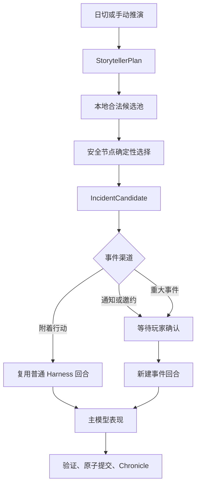
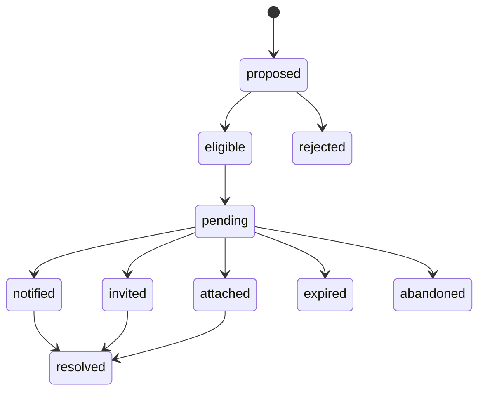

# 初星 Storyteller 事件导演引擎设计

日期：2026-07-13

状态：设计已确认，待编写 Phase S0-S1 实施计划

## 1. 目标

参考 RimWorld Storyteller，将当前只生成叙事方向的世界引擎扩展为受控的事件导演层。Storyteller 不生成完整正文，也不直接修改权威状态，而是依次控制：节奏、事件类别、强度、合法性和具体事件实例。

首版目标是让世界引擎能够提出多元、可执行、不会重复的事件候选，同时保留现有 Director、Harness、Recovery、存档和主模型职责边界。

## 2. 决策层次

### 2.1 节奏

本地根据最近事件强度、连续平静天数、Pressure 数量、重大事件冷却和当日历史计算基础预算。Director 可以提出方向，但不能绕过本地冷却和强度上限。

输出档位：`calm`、`normal`、`tense`、`crisis_allowed`，以及 minor/moderate/major 事件额度。

### 2.2 事件类别

类别包括：敌对、环境、资源、访客、任务、正面机会。类别是校园叙事语义，不等同于战斗；敌对可以表现为竞争、误会或公开压力，资源可以表现为委托、训练机会或时间窗口。

### 2.3 强度

强度分为 `minor`、`moderate`、`major`。强度影响日程占用、是否需要玩家确认和允许的戏剧变化范围，不直接决定数值结果。

### 2.4 合法性

合法性由本地确定性代码负责，检查 saveScope、dayKey、时段、地点、在场角色、签约状态、任务前置、Pressure 状态、冷却、事件额度和模型通道状态。计划生成时检查一次，真正落地前再次检查，以落地前结果为准。

### 2.5 具体实例

事件由本地候选目录的组合维度构成。Director 只能从本地提供的合法候选 ID 和组合槽位中选择，不能创造角色、地点、数值或任意事件类型。

组合维度为：

```text
IncidentArchetype × ActorPool × ContextModifier × LocationPool
× Channel × ResolutionMode
```

首版每次使用一个事件骨架和最多两个修饰器，保证组合多元但可控。

## 3. 运行架构



采用“日级计划 + 行动级本地选择”：日切或手动推演最多生成一份有效计划；安全节点从合法候选中确定性选择，不为每次行动调用次 API。

额外次 API 调用仅允许用于：计划缺失或过期、合法候选不足、玩家确认重大事件后的具体组合，以及 DEBUG 手动重算。

## 4. 核心数据结构

```ts
interface StorytellerPlan {
  planId: string;
  dayKey: string;
  saveScope: string;
  seed: string;
  pacing: "calm" | "normal" | "tense" | "crisis_allowed";
  categoryWeights: Record<IncidentCategory, number>;
  severityBudget: { minor: number; moderate: number; major: number };
  diversity: DiversityConstraints;
  eligibleCandidateIds: string[];
  generatedByJobId: string;
  status: "prepared" | "committed" | "retryable_failed" | "expired";
}

interface IncidentDefinition {
  id: string;
  category: IncidentCategory;
  archetypeId: string;
  actorPool: string[];
  locationPool: string[];
  modifierPool: string[];
  channels: IncidentChannel[];
  severityRange: Array<"minor" | "moderate" | "major">;
  prerequisites: string[];
  cooldownDays: number;
  allowPressureIds?: string[];
  requiresConfirmation: boolean;
}

interface IncidentCandidate {
  incidentId: string;
  planId: string;
  fingerprint: IncidentFingerprint;
  category: IncidentCategory;
  severity: "minor" | "moderate" | "major";
  archetypeId: string;
  actorIds: string[];
  targetIds: string[];
  locationId: string;
  modifierIds: string[];
  channel: "attach" | "sns" | "phone" | "invite" | "background";
  pressureIds: string[];
  resolutionMode: "player_choice" | "observe" | "defer" | "ignore";
  status:
    | "proposed" | "eligible" | "pending" | "attached" | "notified"
    | "invited" | "resolved" | "expired" | "abandoned";
  randomSeed: string;
  expiresAt: number | null;
  requiresConfirmation: boolean;
  sourceRefs: string[];
}
```

`StorytellerPlan` 每日最多一份；`IncidentDefinition` 是只读本地目录；`IncidentCandidate` 是实际事件身份，重试时保留 `incidentId`、组合字段和 `randomSeed`。

## 5. 多样性与重复控制

本地保存近期事件指纹，至少包含类别、骨架、角色、地点和修饰器。选择评分考虑：

```text
categoryWeight × pressureRelevance × eligibilityScore × noveltyBonus × contextFit
- repetitionPenalty - cooldownPenalty
```

计划额外包含：避免类别连续次数、避免骨架连续次数、优先未使用类别、同角色上限和同地点上限。随机仅用于合法候选中的可复现抽取，种子写入计划或候选，确保重试不换事件。

## 6. 生命周期与玩家语义



计划生成失败时保留上一份有效计划；没有旧计划时使用本地静态安全预算，不阻止普通游戏。候选的主模型失败、超时或验证失败时回到 `pending` 或 `retryable_failed`，不重新抽取实例。

忽略语义：minor 忽略后自然过期；moderate 第一次忽略只记录未回应，第二次才允许形成新的 Pressure 证据；major 必须明确选择处理、延后或放弃。普通关闭弹窗不改变状态，`abandoned` 只能由专用按钮和二次确认触发。

## 7. Harness 接入边界

- Storyteller 只写事件/Director 子树，不直接写数值、时间、资源、任务或普通日志。
- 附着型事件复用当前普通行动的 `turnId` 和 primary owner，不创建并发请求。
- 通知、邀约或重大事件经玩家确认后才创建新的事件回合。
- 事件请求沿用现有 acquire、reply gate、validation、atomic commit 和 recovery 规则。
- 通道被占用时只保留 `pending`，不清空输入、不改业务 UI、不消耗额度。
- 事件正文成功后才写 Chronicle、Pressure 变化和事件结果。
- `closeEventOverlay()` 不得自动标记 `abandoned`。

首版安全节点只包括：普通行动完成后、地图移动或时间推进完成后、打开 SNS 或世界引擎应用时。手机主动私信、强制重大事件、NPC 对 NPC 长正文、广播/委托事件化和多事件并发暂缓。

## 8. 审计与失败

```ts
interface IncidentAuditReceipt {
  incidentId: string;
  planId: string;
  event: "planned" | "eligible" | "rejected" | "attached" | "notified"
    | "invited" | "resolved" | "expired" | "abandoned" | "retryable_failed";
  reason: string;
  dayKey: string;
  saveScope: string;
  createdAt: number;
}
```

审计只保存无正文元数据，不保存 Prompt、回复正文、API Key 或完整 state，并按 `saveScope` 隔离。旧 scope 的计划或候选不能在新聊天落地。

## 9. 分阶段实施

### Phase S0：只读观测

- 记录日切、行动类别、地点、参与者、Pressure 和重复指纹。
- 不生成事件、不改变行为。
- 验证节奏统计、候选合法性输入和重复检测数据可靠。

### Phase S1：StorytellerPlan

- 新增 `world/storyteller/` 纯模块。
- 日切/手动推演生成节奏、类别权重、强度预算和多样性约束。
- 暂不调用主模型，不落地事件。
- 世界引擎 App 只显示计划状态。

### Phase S2：本地候选目录与合法性

- 建立组合式 `IncidentDefinition` 目录。
- 实现五层合法性检查、指纹、冷却和可复现抽取。
- 生成 `IncidentCandidate`，进入 `pending`。

### Phase S3：轻微/中等事件附着

- 只在普通行动完成后的安全节点附着。
- 复用普通 Harness 回合，不重复结算。

### Phase S4：通知与邀约

- 地图移动、时间推进、打开 SNS 或世界引擎应用时显示通知/邀约。
- 玩家确认后创建独立事件回合，支持延后、忽略和显式放弃。

### Phase S5：重大事件与组合扩展

- 加入重大事件确认、更多骨架与修饰器。
- 增加 Character Intent。
- 暂不实现强制打断、NPC 对 NPC 长正文或自动私信队列。

## 10. 首版完成标准

1. Storyteller 输出节奏、类别、强度和候选选择，而非剧情摘要复述。
2. 非法候选不会落地，落地前会再次校验。
3. 同一事件重试保持同一个 `incidentId`。
4. 同一天不会自动覆盖有效计划。
5. 轻微/中等事件可以安全附着到普通行动。
6. 重大事件必须经过玩家确认。
7. 事件失败不阻塞普通游戏。
8. 现有 Director、Harness、Recovery、手机、广播和委托行为无回归。

## 11. 明确不做

- 不引入队列、事件总线、微服务、数据库或复杂事务框架。
- 不让 AI 修改权威数值、时间、随机、任务、资源或任意 state path。
- 不把 Storyteller 计划与普通正文 Prompt 合并成一个 schema。
- 不按每次行动调用次 API。
- 不自动重发旧请求，不用普通关闭代替显式放弃。
