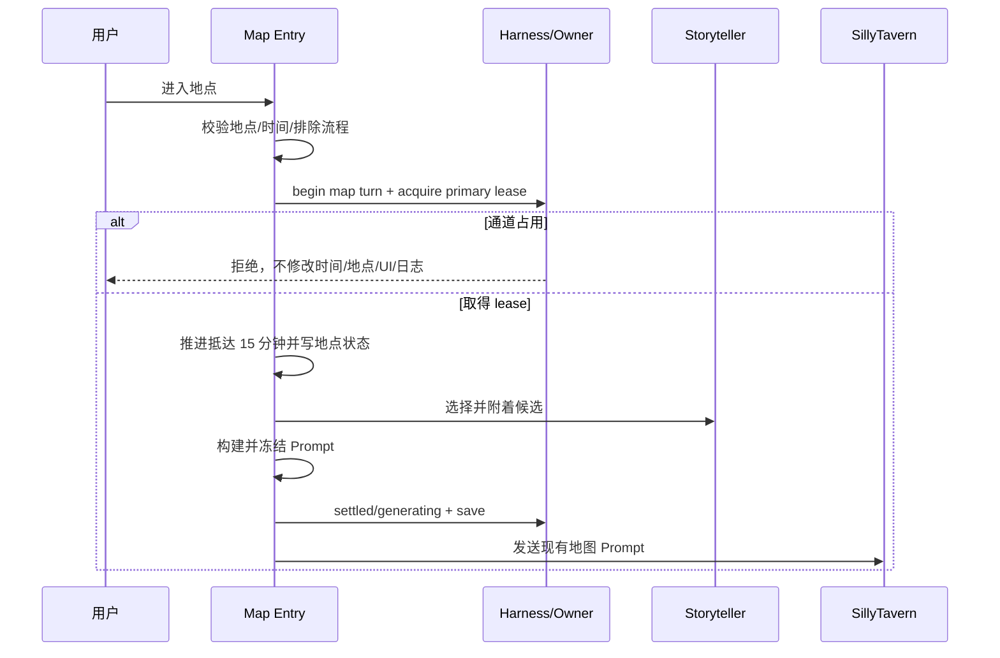

# Storyteller 地图探索与移动覆盖设计

日期：2026-07-13

状态：设计范围已确认，等待实施计划

## 1. 目标

将 Storyteller S2-S3 扩展到沙盒地图的普通移动与探索，同时保持现有确定性时间推进、地图选项、主模型 ownership、Harness Recovery 和候选一致性。

本阶段覆盖：

- 进入校园地图地点后的首次抵达场景与选项生成；
- 地点内选择普通选项或提交普通自定义行动后，生成下一轮场景与选项；
- 抵达时间和每轮探索时间作为同一个地图 Harness 回合的确定性结算；
- 轻微/中等 Storyteller 候选附着到该地图回合的既有 Prompt，不增加模型请求。

本阶段不覆盖：

- 离开地点的简短描写；
- 委托现场及委托结算；
- 沙盒物色、签约和物色收尾；
- 购物中心、商店街等专用校外设施内部流程；
- major 事件、SNS、手机、广播、赠礼和普通 choice continuation 的全面迁移。

## 2. 当前实现事实

### 2.1 首次抵达

`beginMapLocationExploreSession()` 当前顺序为：

```text
校验地点
→ advanceFreeModeTime(15)
→ 写 activeLocationId
→ 写 pendingActionContext
→ 清空选项状态
→ createRequestId
→ build map Prompt
→ saveState/render
→ requestHostPromptSend
```

因此主模型通道被其他流程占用时，`legacy_main` 即使最终拒绝发送，抵达时间、地点、UI 和 pending 状态已经改变。

### 2.2 地点内探索

`handleMapLocationChoiceSelection()` 和 `handleMapLocationCustomChoice()` 当前先推进时间、写普通日志并保存，然后调用 `requestNextMapLocationOptions()` 发送下一轮场景与选项请求。同样存在请求被拒绝但确定性副作用已发生的风险。

### 2.3 回复与刷新

地图回复沿用 choice payload 解析。有效回复必须包含完整场景与四个选项，但地图流程目前没有独立 Harness turn，也没有冻结 Prompt 的刷新恢复记录。页面刷新后不恢复旧网络请求，也无法明确重发该次已结算地图步骤的叙事。

## 3. 方案比较

### 方案 A：只向地图 Prompt 注入候选

优点是修改最少。缺点是保留“先扣时间、后发现通道占用”的现有风险；候选没有稳定 turn 身份，刷新或 stale reply 时无法可靠提交。该方案不采用。

### 方案 B：专用地图 Harness 回合

为每次首次抵达或普通探索步骤创建 `map_explore` Harness turn。正式 primary lease 在任何时间、地点、日志和 UI 写入前取得；结算后选择候选、冻结 Prompt、保存并发送。Recovery 使用同一 `turnId` 和候选，只更换 `requestId`。该方案边界清晰，复用现有 Harness 语义，推荐并采用。

### 方案 C：把所有 choice 流程统一成通用 NarrativeTransaction

长期结构最统一，但会同时触碰外出、交流、亲密、羁绊、地图、委托和公寓聊天，超过本阶段范围。现阶段不采用。

## 4. 数据结构

复用 `state.harness.activeTurn`，但新增独立 kind，不伪装成普通育成行动：

```ts
interface MapExploreHarnessTurn {
  turnId: string;
  kind: "map_explore";
  status:
    | "prepared"
    | "settled"
    | "generating"
    | "recovery_required"
    | "completed"
    | "abandoned";
  stepKind: "arrival" | "explore_choice" | "custom_choice";
  action: "map_location";
  locationId: string;
  locationName: string;
  selectedAction: string;
  settledMinutes: number;
  requestId: string;
  requestIds: string[];
  saveScope: string;
  storageKey: string;
  sessionEpoch: string;
  generationPrompt: string;
  generationPromptLength: number;
  generationPromptStatus: "captured" | "missing" | "too_large";
  storytellerCandidateRef: StorytellerCandidateRef | null;
  snapshot: {
    dayKey: string;
    clockMinutes: number;
    locationId: string;
    pendingAction: string;
  };
  createdAt: number;
  updatedAt: number;
}
```

`selectedAction` 只保存有限长度的选项文本或自定义行动摘要。Harness trace 不记录完整选项、Prompt 或正文；trace 只记录长度、stepKind、locationId、分钟数和拒绝原因。

Storyteller 继续使用当前 `pendingCandidate` 和 `storytellerCandidateRef`。候选必须额外满足：

- `sourceTurnId === mapTurn.turnId`；
- `saveScope/dayKey/planId` 与当前上下文一致；
- `channel === "attach"`；
- `severity` 只能是 `minor` 或 `moderate`；
- 地点和角色实例在结算后的地图状态下仍合法。

## 5. 运行流程

### 5.1 首次抵达



候选选择发生在抵达时间和地点状态写入后、Prompt 构建前。若没有当前 Storyteller Plan 或没有合法候选，地图流程照常继续。

### 5.2 地点内普通探索

用户选择普通选项或提交自定义行动时：

1. 在写入选择、时间、日志和 UI 前创建新的 map turn 并取得 primary lease；
2. 取得 lease 后推进选项声明的分钟数或默认分钟数；
3. 写入选择行和地图日志；
4. 若到达日终，则完成 `completed_without_narrative`，释放 lease，不生成下一轮候选或 Prompt；
5. 否则选择候选并构建下一轮地图 Prompt；
6. 冻结 Prompt、保存 map turn，再发送一次现有主模型请求。

不得在 `handleMapLocationChoiceSelection()` 完成结算后再由 `requestNextMapLocationOptions()` 临时 acquire。所有 ownership 必须在调用前置结算之前完成。

### 5.3 有效回复

地图 choice payload 只有在以下条件全部成立时才完成 map turn：

- `requestId === activeTurn.requestId`；
- primary lease 精确匹配；
- reply 为 final；
- 场景正文有效；
- 四个选项完整；
- 当前 `pendingActionContext.action === "map_location"`；
- active turn kind 为 `map_explore`。

随后先将 turn 标为 `completed`，再调用 ACK。Storyteller candidate 只有在 turn 已完成时才能进入 `resolved`。不完整 choice payload 不得以 accepted-final 方式完成候选。

### 5.4 Recovery

旧 session 中 `settled` 或 `generating` 的 `map_explore` turn 在刷新后进入 `recovery_required`。不恢复旧网络请求，不回滚已经推进的时间、地点和日志。

恢复规则与普通行动一致：

- 重新生成使用冻结的 `generationPrompt`；
- 保留原 `turnId` 和 `storytellerCandidateRef`；
- 每次生成使用新 `requestId` 和新 lease；
- 不再次推进时间、写日志、处理任务或选择候选；
- 生成失败仍回到 `recovery_required`；
- 普通关闭恢复弹窗不放弃；
- 显式放弃加二次确认后，turn 变为 `abandoned`，候选变为 `expired`；
- 未解决的地图 recovery turn 阻止新的普通行动和新的地图探索步骤。

恢复 UI 可以复用现有 Harness Recovery overlay，但标题和说明需根据 `kind` 显示“地图探索叙事恢复”，不得显示为上课/训练/休息。

## 6. Prompt 注入

扩展 `composeStorytellerIncidentPromptAddendum()` 的地图上下文，不修改现有地图 Prompt 文案主体。附加块仍只包含：

- 类别、强度、事件骨架；
- 当前地点、担当与合法在场角色；
- 最多两个现场修饰器；
- 事件必须嵌入本次抵达或探索步骤；
- 不得修改时间、关系数值、任务、资源、选项耗时或前端结算。

地图 Prompt 仍负责生成场景和四个选项。Storyteller 不决定选项时间标签、任务结果、关系变化或可进入地点。

## 7. 排除与分流规则

以下情况不创建 map Storyteller turn，也不选择候选：

- `isSandboxScoutActive()` 为真，包括物色和签约链；
- 抵达地点存在委托并进入 side quest 分支；
- `actionContext.sideQuestResolving`；
- `actionContext.isReturn` 或 `handleMapLocationReturn()`；
- 专用校外设施内部的 `outing_scene_dialogue`；
- 页面只打开地点介绍 overlay，尚未确认进入；
- 地图布局编辑模式；
- 当日已到结束时间；
- 当前 Storyteller Plan 不存在或 scope/day 不匹配时，只跳过候选，不阻止地图行动。

未迁移分支继续保留现有行为和 `legacy_main` 兜底。本阶段不借机修改其产品语义。

## 8. 需要修改的函数

预计修改：

- `beginMapLocationExploreSession()`：前置 owner、map turn、抵达结算、候选和冻结 Prompt；
- `requestNextMapLocationOptions()`：改为接收已取得的 map turn/lease，不自行产生副作用前请求；
- `handleMapLocationChoiceSelection()`：前置 owner 后才推进时间与日志；
- `handleMapLocationCustomChoice()`：同上；
- choice payload 成功/失败分支：完成或恢复 map turn；
- Harness recovery disposition、retry、abandon 和 overlay 文案：支持 `map_explore`；
- `settleStorytellerCandidateForReply()`：接受严格完成的 `map_explore` turn；
- 地图 Prompt builder：只增加可选 Storyteller addendum 参数；
- 世界引擎手机视图：显示候选来源是普通行动或地图步骤，不新增控制按钮。

不修改：

- 地图选项耗时解析规则；
- `advanceFreeModeTime()`；
- 委托数值和任务结算；
- 地图关系更新协议；
- 普通行动的数值、Prompt 和 Recovery 语义。

## 9. 测试策略

必须增加执行级测试，而不只检查源码顺序：

1. 通道被占用时，首次抵达不推进 15 分钟、不写地点/pending/UI/日志；
2. 通道被占用时，普通选项和自定义行动不推进时间、不清空选项、不写日志；
3. 取得 lease 后，抵达或选择只结算一次并发送一次请求；
4. 候选在结算后、Prompt 冻结前选择；
5. 无合法候选时地图行为与旧实现一致；
6. 首次抵达和下一轮探索使用不同 `turnId/requestId`；
7. valid final choice payload 才完成 turn 和候选；
8. stale、partial、retry、不完整四选项不得完成候选；
9. 刷新恢复保留时间、日志、地点、turnId、候选和 Prompt，只更换 requestId；
10. 普通关闭 recovery overlay 不放弃；
11. 显式放弃后允许新的地图步骤和普通行动；
12. 委托、物色、离开和专用校外设施不进入新流程；
13. 普通 `lesson/training/rest` 的现有 31 项 Storyteller 测试保持通过；
14. primary owner 旧 lease 不能释放新 map owner；
15. 全量测试不得增加既有 6 个失败。

## 10. 完成标准

地图覆盖完成需同时满足：

1. 首次抵达和每轮普通探索可附着轻微/中等事件；
2. 不增加模型请求；
3. ownership 在任何地图业务副作用之前取得；
4. 失败和刷新不重复推进时间、日志或任务；
5. candidate 与 map turn、scope、day、plan 严格绑定；
6. 只有当前有效完整回复能提交候选；
7. 排除分支行为不变；
8. 普通行动 S3 和既有 Recovery 无回归。
