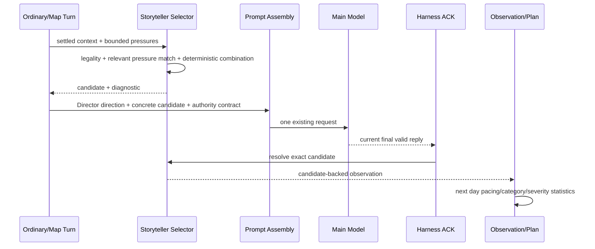

# Storyteller S3.5 Feedback And Selection Quality Design

Date: 2026-07-13

Status: approved for implementation planning

## 1. Goal

Strengthen the existing S0-S3 and map-coverage loop without adding a model request, a new narrative output tag, or a new event channel. S3.5 makes the current attached incidents feed accurate facts back into the next daily plan, makes Pressure relevance specific instead of global, increases deterministic combination diversity, and gives Director and Storyteller an explicit Prompt hierarchy.

This phase keeps the current product semantics for settlement, map time, Recovery, primary ownership, Chronicle, phone, broadcast, commission, gift, SNS and choice continuation.

## 2. Current Problems

### 2.1 Observation distortion

`recordAcceptedFinalStorytellerObservation()` currently records every accepted-final reply as `category: "task"` and `severity: "minor"`. Shared ACK paths can also record replies from flows that Storyteller does not control. As a result, the next `StorytellerPlan` does not reflect the actual resolved candidate history.

### 2.2 Pressure is only a global bonus

The incident context currently passes a flat list of active Pressure IDs. Any nonempty list adds the same score bonus, and the selected candidate stores all those IDs. Actor, target, visibility, stage, type and theme are not used to decide relevance.

### 2.3 Combination slots are static

The first sorted present idol is always selected and the first two definition modifiers are always used. The catalog has multiple archetypes, but individual instances can still feel repetitive.

### 2.4 Prompt authority is implicit

Ordinary narrative prompts contain deterministic settlement rules, Director guidance and the attached Storyteller incident, but their relative authority is not stated as a single contract. The Director block can appear after the Storyteller block and dilute the concrete incident.

### 2.5 Diagnostics show outcome, not reasoning

The phone view shows the selected candidate but does not explain the bounded reasons that made it eligible or why alternatives were rejected.

## 3. Scope

Included:

- accurate candidate-backed observations for completed `produce_action` and `map_explore` turns;
- ambient observations for eligible ordinary/map turns that completed without a Storyteller candidate;
- exclusion of phone, broadcast and other unsupported ACK paths from Storyteller pacing statistics;
- bounded Pressure normalization and relevance matching;
- deterministic actor and modifier selection from legal pools;
- explicit Director/Storyteller Prompt precedence;
- bounded, read-only selection diagnostics;
- migration of old observation and candidate state without restoring requests.

Excluded:

- new output tags or semantic AI judging;
- SNS, phone, invite or background incident channels;
- `major` incidents and player confirmation;
- independent event turns;
- Character Intent;
- commission, broadcast, gift or choice-continuation migration;
- changes to deterministic values, time, random tables, tasks, resources or relationship settlement;
- additional primary or secondary model calls.

## 4. Observation Contract

### 4.1 Accepted-final gate

`sendAiReplyAck()` continues to call `settleStorytellerCandidateForReply()` first. Observation recording receives both the current request identity and the settlement result.

An observation is eligible only when all of the following hold:

- `accepted === true`;
- `isFinal === true`;
- `retry === false`;
- the active Harness turn is `completed` or `completed_without_narrative` as appropriate;
- `turn.requestId === requestId` for a generated narrative;
- the turn kind is `produce_action` or `map_explore`;
- the turn belongs to the active save scope.

Phone, broadcast, free chat, manual prompt, regeneration, commission, gift, outing facility and other unsupported flows do not create Storyteller observations.

### 4.2 Candidate-backed observation

When `candidateSettlement.resolved === true`, the observation copies bounded metadata from the resolved candidate:

```ts
interface StorytellerObservation {
  schemaVersion: 2;
  sourceKind: "resolved_candidate" | "ambient_turn";
  saveScope: string;
  requestId: string;
  turnId: string;
  dayKey: string;
  timeMinutes: number | null;
  actionId: string;
  locationId: string;
  participantIds: string[];
  category: IncidentCategory | "";
  severity: IncidentSeverity | "";
  archetypeId: string;
  fingerprint: string;
  pressureCount: number;
}
```

`category`, `severity`, `archetypeId`, participants, location, fingerprint and `pressureCount` come from the candidate. Prompt text, narrative text, full state and lease data are never stored.

### 4.3 Ambient observation

An eligible ordinary/map turn with no resolved candidate records `sourceKind: "ambient_turn"`, empty category/severity/archetype fields, and bounded action/location/participant metadata. Ambient records contribute a day to calm-day observation but do not increment incident category or severity counters.

### 4.4 Deduplication and migration

Observations remain deduplicated by nonempty request ID. Version 1 observations normalize to version 2 with `sourceKind: "ambient_turn"` unless they contain a valid category and severity, in which case they normalize to `resolved_candidate`. Existing bounded history limits remain unchanged.

## 5. Pressure Relevance

### 5.1 Bounded pressure input

`buildStorytellerIncidentContext()` passes at most eight normalized active pressures. Each entry contains only:

```ts
interface StorytellerPressureFact {
  pressureId: string;
  type: "relationship" | "goal" | "identity" | "social" | "schedule";
  theme: string;
  actorId: string;
  targetIds: string[];
  stage: "latent" | "emerging" | "active" | "expressed";
  intensity: number;
  visibility: "private" | "implicit" | "visible" | "public";
}
```

Resolved, inactive, malformed or wrong-scope pressures are excluded.

### 5.2 Relevance rules

A pressure may affect a candidate only when actor relevance and visibility allow it:

- candidate actors/targets intersect pressure actor/targets; or
- the pressure is public and the candidate occurs in a public campus location.

Private pressures require an actor intersection. Public visibility alone never makes an unrelated private relationship relevant.

Type/theme compatibility is a local map:

- relationship/social themes favor `hostile`, `visitor` and `opportunity`;
- goal/schedule themes favor `task`, `resource` and `environment`;
- identity themes favor `opportunity`, `visitor` and `hostile`;
- `other` gives no category bonus without an actor match.

The relevance score is bounded. Intensity can adjust the bonus but cannot change legality, exceed the plan severity budget or bypass cooldowns.

### 5.3 Candidate storage

The candidate stores only the IDs of pressures that passed relevance checks, capped at six. An unrelated active pressure is not copied into the candidate and gives no score bonus.

## 6. Deterministic Combination Diversity

Selection remains reproducible. A stable combination seed is derived from:

```text
plan.seed | sourceTurnId | definition.id | action | locationId
```

The seed is used to:

- choose among legal present actors instead of always taking the first sorted actor;
- choose zero to two legal modifiers within the definition limit;
- keep actor and modifier ordering stable after selection;
- preserve the exact same combination during Recovery;
- permit a different legal combination on a different turn.

The selected combination is finalized before fingerprinting. Cooldown, recent fingerprint and daily actor/location limits therefore apply to the concrete instance rather than only the definition.

No runtime `Math.random()` participates in Storyteller selection.

## 7. Prompt Authority

For ordinary actions, the final conceptual order is:

```text
deterministic action and settlement facts
Director daily direction and relevant pressure context
Storyteller concrete incident for this turn
final authority and output contract
```

For map actions, the existing map prompt remains intact and receives the same bounded authority footer.

The authority contract states:

- Director provides long-range direction and unresolved world pressure;
- Storyteller provides the locally legal concrete complication for this turn;
- when both are present, the concrete Storyteller incident must be expressed without contradicting deterministic state;
- neither block may modify values, time, tasks, resources, option time tags or relationship settlement;
- the normal output contract remains the final instruction.

S3.5 may reorder existing generated blocks and add a short static authority statement. It does not rewrite narrative prose requirements or introduce a new output schema.

## 8. Diagnostics

The pending/recent candidate stores an optional bounded selection diagnostic:

```ts
interface StorytellerSelectionDiagnostic {
  selectedScore: number;
  categoryWeight: number;
  actionFit: number;
  noveltyBonus: number;
  pressureBonus: number;
  relevantPressureCount: number;
  evaluatedCount: number;
  eligibleCount: number;
  rejectionCounts: Record<string, number>;
}
```

Only allowlisted rejection reasons are retained. Counts and scores are bounded integers. The phone view may show:

- selected because of category/action/novelty/Pressure;
- number of related pressures;
- a compact rejection summary;
- the last committed observation category and severity.

It must not show Prompt text, narrative text, full request IDs, lease IDs, full Pressure contents or full state.

Diagnostics are observational and cannot influence selection after the candidate has been created.

## 9. Data Flow



Recovery reuses the frozen Prompt and candidate. It does not recompute Pressure relevance, actor selection, modifiers, diagnostic scores or observation data before a valid final commit.

## 10. Failure Semantics

- Missing or malformed Pressure data reduces relevance to zero and does not block gameplay.
- No eligible candidate leaves the ordinary/map request unchanged and may retain a bounded rejection summary.
- A stale, partial, retry or invalid reply records no resolved-candidate observation.
- An abandoned candidate expires and does not count as a resolved incident.
- Observation failure does not roll back an already accepted narrative; it records a bounded diagnostic reason and remains retryable only through future observation repair, not narrative regeneration.
- Scope/day mismatches remain no-ops.

## 11. Testing

Required tests include:

1. resolved `visitor/moderate` candidates produce `visitor/moderate` observations;
2. ambient ordinary/map turns produce no category or severity count;
3. phone, broadcast and unsupported ACKs produce no Storyteller observation;
4. stale, partial, retry and rejected replies do not record candidate observations;
5. version 1 observations normalize safely;
6. unrelated private pressures give zero bonus and are not stored;
7. matching actor/target pressures influence only compatible categories;
8. public pressures require a public context when actor relevance is absent;
9. the same seed/turn produces the same actors and modifiers;
10. different turns can produce different legal combinations;
11. Recovery preserves candidate, diagnostic and frozen Prompt;
12. Prompt ordering places the final authority/output contract after Director and Storyteller blocks;
13. phone diagnostics remain bounded, escaped and read-only;
14. the focused Storyteller, Director, Harness, ownership and map suites pass;
15. the full suite adds no failures beyond the existing six-test baseline.

## 12. Completion Criteria

S3.5 is complete when the next daily plan is driven by actual resolved candidate categories and severities, unsupported replies no longer pollute pacing, only relevant pressures influence a candidate, concrete actor/modifier combinations are deterministic but varied across turns, Director and Storyteller authority is explicit, diagnostics explain selection without exposing private data, and all existing settlement and Recovery behavior remains unchanged.

