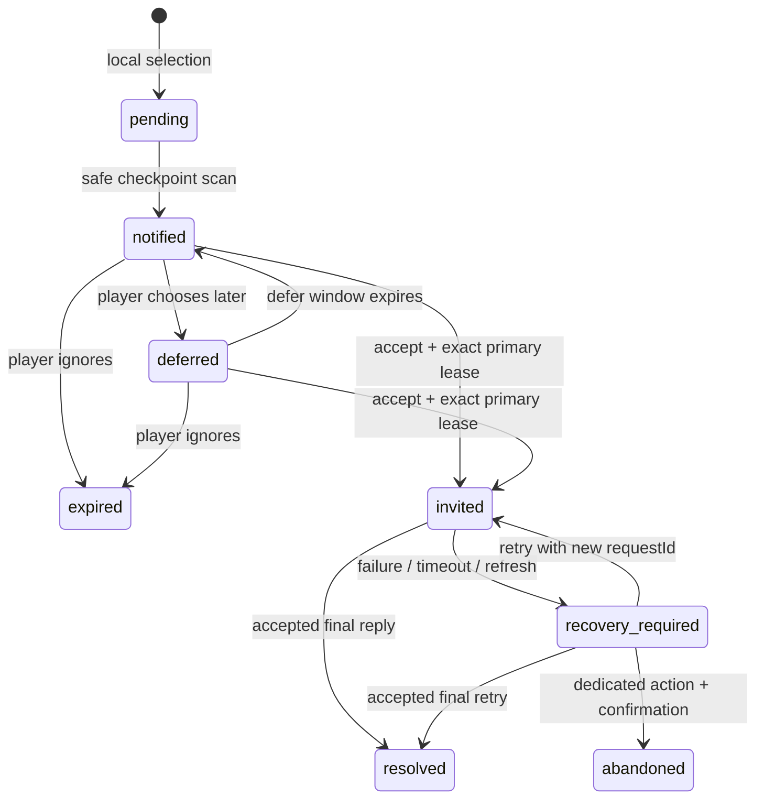

# Storyteller S4-S5 Notification And Major Incident Design

## 1. Objective

Extend the completed Storyteller S0-S3.5 loop in two strictly ordered steps:

1. S4 adds a non-blocking single-candidate event inbox and an independent `storyteller_event` Harness turn for accepted invitations.
2. S5 reuses the same inbox and event-turn path for confirmed major incidents and expands the deterministic incident catalog.

Character Intent is explicitly deferred. This design does not add forced interruptions, automatic private-message queues, NPC-to-NPC long-form scenes, commission event migration, broadcast event migration, or additional secondary-model calls.

## 2. Existing Baseline

The current implementation already provides:

- daily deterministic `StorytellerPlan` generation;
- local minor/moderate incident selection;
- relevant Pressure scoring;
- deterministic actor and modifier combinations;
- ordinary-action and campus-map attachment;
- primary-model ownership and exact lease release;
- frozen Prompt Recovery;
- accepted-final candidate settlement and Observation V2;
- read-only Storyteller diagnostics in the world-engine phone app.

S4 and S5 must preserve ordinary settlement, time advancement, resources, tasks, Prompt output tags, Director behavior, ownership semantics, save ordering, Chronicle gates and existing Recovery semantics.

## 3. Approved Rollout

S4 must be implemented and accepted before S5 production code begins. S5 may share the S4 design and tests, but it cannot bypass the S4 acceptance gate.

### S4 Scope

- One non-blocking pending notification per `saveScope`.
- Local scans at approved safe checkpoints.
- A read-only inbox inside the world-engine phone app.
- Phone-home and SNS app badges only; Storyteller event contents are not inserted into SNS posts.
- Accept, defer and ignore actions.
- An independent `storyteller_event` Harness turn after acceptance.
- Existing ownership, reply validation, Chronicle and Recovery behavior.
- No automatic time cost or deterministic gameplay settlement.

### S5 Scope

- Major incident eligibility and confirmation.
- Approximately six conservative major incident definitions spanning the campus incident categories.
- Additional legal actor, location and modifier combinations for existing severities.
- The same inbox, event turn, ownership, validation and Recovery path as S4.

### Deferred Scope

- Character Intent.
- Forced or automatic interruptions.
- Multiple simultaneous inbox candidates.
- Automatic model dispatch from a scan.
- Automatic private messages or background narrative queues.
- NPC-to-NPC long-form narrative.
- Gift, commission, broadcast, First Live and choice-continuation migration.
- AI-authored state patches, time costs, rewards, penalties or task completion.

## 4. Architectural Choice

Use a single-candidate inbox plus an independent event turn.

The existing `state.freeMode.world.storyteller.pendingCandidate` remains the only current candidate slot. A notification scan may place one legal `invite` candidate into `notified`; it does not create a queue and does not occupy the primary model channel. Only explicit acceptance may acquire a primary lease and create a `storyteller_event` Harness turn.

This avoids queue ordering, concurrent recovery turns, multi-event budget arbitration and ordinary-action blocking while preserving a path for future expansion.

## 5. S4 State Machine



Candidate status and Harness turn status remain separate. `invited` describes candidate lifecycle ownership by an event turn. `generating` and `recovery_required` are Harness turn statuses.

Ordinary inbox closing does not transition the candidate. `expired` is only produced by the explicit ignore/decline action or deterministic expiry. `abandoned` is only produced after an accepted event has entered the independent event-turn lifecycle and the player confirms abandonment.

## 6. Candidate Data

The normalized candidate status set becomes:

```ts
type IncidentStatus =
  | "pending"
  | "attached"
  | "notified"
  | "deferred"
  | "invited"
  | "resolved"
  | "expired"
  | "abandoned";
```

Notification metadata is bounded and contains no Prompt or narrative:

```ts
interface IncidentNotificationMeta {
  notifiedAtWorldMinute: number | null;
  deferredUntilWorldMinute: number | null;
  expiresAtWorldMinute: number | null;
  notificationReason: string;
}
```

World minute is derived deterministically from the current game day ordinal and clock minutes. Deferring does not advance game time. The initial defer window is 60 game minutes. A deferred candidate remains manually visible in the world-engine inbox while its phone badges remain hidden until the defer window expires.

A candidate belongs to one exact `saveScope`, `dayKey`, `planId` and `sourceTurnId`. A scope or plan mismatch cannot be repaired by rewriting ownership fields; the candidate must expire and a future scan may select a new candidate.

## 7. Safe Checkpoint Scanning

Approved S4 scan triggers are:

- completed campus-map movement or exploration settlement;
- completed deterministic time advancement;
- opening the SNS app;
- opening the world-engine app.

The scan is local and synchronous. It may read the current plan, current location, present actors, Director Pressure facts, recent candidates, fingerprints, notification state and current model-channel state. It may only write a bounded Storyteller candidate/receipt when selection succeeds.

The scan must not:

- acquire a model owner;
- send a model request;
- advance time;
- modify stats, resources, tasks, relationships or ordinary logs;
- clear input or replace business UI state;
- replace an unresolved `pending`, `notified`, `deferred`, `invited`, `attached` or recovery-owned candidate;
- create more than one notification in the same scope.

S4 notification definitions use the `invite` channel. SNS is a discovery checkpoint and badge surface, not a separate narrative channel in this phase.

## 8. Inbox UI

The world-engine phone app gains an `events` tab. The bounded view model may expose only:

- candidate status label;
- category and severity labels;
- archetype label;
- location label;
- involved character display names;
- modifier display labels;
- defer/expiry summary;
- whether confirmation is required.

It must not expose full incident, turn, request, lease, scope or plan identifiers; Prompt text; generated narrative; Pressure contents; API configuration; or full state.

S4 actions are:

- `Accept`: attempts formal ownership and event-turn creation.
- `Later`: marks the candidate `deferred` and hides app badges for 60 game minutes.
- `Ignore`: marks the candidate `expired` and writes a bounded receipt.

The world-engine and SNS phone icons show a badge when a non-deferred `notified` candidate exists. Opening SNS may scan and refresh the badge, but does not render the candidate as an SNS post. Ordinary closing has no lifecycle effect.

## 9. Independent Storyteller Event Turn

```ts
interface StorytellerEventTurn {
  kind: "storyteller_event";
  turnId: string;
  incidentId: string;
  status:
    | "prepared"
    | "generating"
    | "completed"
    | "recovery_required"
    | "abandoned";
  requestId: string;
  requestIds: string[];
  saveScope: string;
  storageKey: string;
  sessionEpoch: string;
  generationPrompt: string;
  generationPromptLength: number;
  generationPromptStatus: string;
  channelLeaseId: string;
  createdAt: number;
  updatedAt: number;
}
```

Acceptance order is mandatory:

1. Read and normalize the exact inbox candidate.
2. Revalidate scope, day, plan, location, actors, status, expiry and confirmation rules.
3. Check that no conflicting primary owner or unresolved Harness recovery exists.
4. Create a request identity without mutating business state.
5. Acquire the formal primary lease.
6. Create the `storyteller_event` turn and transition the candidate to `invited`.
7. Build and freeze the Prompt.
8. Persist the prepared/generating state.
9. Send through the existing host bridge.

If acquisition fails, candidate, Harness state, input, business UI and logs remain unchanged except for a bounded reject diagnostic/toast. A local non-host fallback must retain the existing manual-copy behavior and must not create a primary owner.

## 10. Prompt And Validation

The independent event Prompt order is:

```text
bounded deterministic world facts
Director long-range direction
Storyteller independent incident skeleton
narrative authority contract
existing narrative output contract
```

No new model output tags are introduced. The Prompt explicitly states that the event has no automatic time, stat, resource, reward, penalty or task settlement. AI output cannot modify authoritative state.

The existing narrative marker and completeness validation is reused. Accepted-final processing requires exact current `requestId`, exact lease, active `saveScope`, current session ownership and a complete narrative. `requestIds` remains audit-only.

On accepted final reply:

1. Mark the exact Harness event turn completed.
2. Transition the exact candidate from `invited` to `resolved`.
3. Record the resolved candidate as Observation V2.
4. Request Chronicle write only after validation.
5. Save bounded Storyteller state.
6. Release the exact lease independently of ACK delivery success.

Stale, partial, retry, old-scope or wrong-lease replies cannot resolve the candidate, create an observation or write Chronicle.

## 11. Recovery And Refresh

An unaccepted `notified` or `deferred` candidate is ordinary persisted state and is restored by exact `saveScope`. It has no network attempt to recover.

A refreshed `storyteller_event` turn in `prepared` or `generating` becomes `recovery_required` under the existing session-epoch rules. The old request is never restored or resent.

Recovery must:

- preserve the original `turnId` and `incidentId`;
- generate a new `requestId` and acquire a new exact lease;
- use the frozen `generationPrompt` only;
- refuse missing, oversized or unowned Prompts;
- return to `recovery_required` after retryable failure;
- never repeat notification selection or any deterministic settlement;
- require a dedicated button and confirmation for `abandoned`.

An unresolved accepted event recovery blocks a new ordinary action and another independent Storyteller event. A merely notified/deferred inbox candidate does not block ordinary play.

## 12. S5 Major Incidents

Major candidates require all of the following:

- current plan pacing is `crisis_allowed`;
- `severityBudget.major` has capacity;
- definition severity includes `major`;
- definition has `requiresConfirmation: true`;
- scope, day, plan, location, actor, prerequisite, Pressure, cooldown, fingerprint and diversity checks pass;
- no unresolved inbox candidate or Storyteller event recovery exists.

Major incidents never attach to ordinary actions and never interrupt automatically. They enter the same inbox.

Accepting a major incident first opens a second confirmation containing bounded character, location and no-authoritative-state-change information. After confirmation, the complete legality check runs again before ownership acquisition.

Major inbox actions are:

- `Accept and handle`;
- `Decide later`;
- `Decline`: confirmation required, transitions to `expired`;
- recovery-only `Abandon narrative`: confirmation required, transitions to `abandoned`.

## 13. S5 Catalog Expansion

Add approximately six conservative major definitions across the campus categories:

- hostile: a public rivalry or reputation confrontation;
- environment: a major venue or campus-condition disruption;
- resource: a critical shared venue/equipment conflict;
- visitor: an evaluator, authority or significant observer arrival;
- task: a consequential official deadline or responsibility collision;
- opportunity: a high-visibility showcase or breakthrough opportunity.

Definitions remain local, immutable and allowlisted. They describe narrative skeletons rather than fixed prose or deterministic outcomes.

Existing minor/moderate definitions may gain additional legal actor pools, location pools and modifiers. Every concrete incident still uses one archetype and at most two modifiers. Selection remains deterministic for the same plan, turn, definition, action and location. Pressure remains a bounded score input and cannot bypass legality, cooldown, severity budget or confirmation.

## 14. Audit And Persistence

Existing Storyteller receipts are extended with bounded events:

```ts
type IncidentAuditEvent =
  | "notified"
  | "deferred"
  | "ignored"
  | "accepted"
  | "resolved"
  | "expired"
  | "abandoned"
  | "rejected"
  | "retryable_failed";
```

Receipts store only suffix-safe or internal bounded identities, reason, day, scope ownership reference and timestamp. They never store Prompt, response text, API keys, lease IDs, Pressure contents or full state.

Old saves without notification metadata normalize to `null` metadata. Existing `pending`, `attached`, `resolved` and `expired` candidates remain readable. Old Harness turns remain unchanged.

## 15. Module Boundaries

- `world/storyteller/incidents.js`: channel/status schema, notification/major definitions, selection and revalidation inputs.
- `world/storyteller/notifications.js`: pure notification metadata normalization, scan eligibility and lifecycle transitions.
- `world/storyteller/injection.js`: bounded independent-event Prompt addendum and authority text.
- `world/storyteller/phone-view.js`: bounded inbox and badge view models.
- `app.js`: safe checkpoint orchestration, ownership, event Harness turn, Recovery, ACK, persistence and UI commands.
- `index.html`: world-engine events tab and confirmation controls.
- `style.css`: phone-sized inbox, badge and confirmation styling.
- `index.html` and `st.html`: load the notification module before `app.js`.

No event queue, event bus, database, microservice or separate transaction framework is introduced.

## 16. Testing And Acceptance

S4 acceptance requires:

1. scans are local, scoped and side-effect bounded;
2. one unresolved notification prevents duplicate selection;
3. notification/defer does not acquire ownership or block ordinary play;
4. accept acquires before candidate/Harness/UI/log mutation;
5. occupied ownership leaves state unchanged;
6. independent Prompt is frozen once and contains no state authority delegation;
7. exact accepted-final reply resolves once and only then records Observation/Chronicle;
8. stale request, stale lease and stale scope cannot commit;
9. refresh produces Recovery without automatic resend;
10. retry preserves turn/incident/Prompt and rotates request/lease;
11. ignore produces `expired`, while ordinary close produces no transition;
12. only confirmed recovery abandonment produces `abandoned`;
13. inbox and badges expose no private data;
14. existing ordinary/map Storyteller, Harness, ownership, phone and Director tests have no new failures.

S5 acceptance additionally requires:

1. major selection is impossible outside `crisis_allowed` or without major budget;
2. every major definition requires confirmation;
3. confirmation is followed by a full legality recheck before ownership;
4. decline is explicit and confirmed;
5. major candidates never attach to ordinary/map turns;
6. retries preserve deterministic combinations;
7. expanded combinations remain bounded and diverse;
8. Character Intent and excluded channels remain absent.

The full suite may retain only the six known baseline failures already documented by the project. Real SillyTavern acceptance must verify badges, inbox actions, exact owner lifecycle, refresh recovery and major confirmation against the host bridge.

## 17. Stop Conditions

Stop implementation and request a new design decision if the work would require:

- automatic time or numeric settlement for an event;
- a new model output schema or tag;
- more than one pending inbox candidate;
- a new secondary-model request for each scan;
- migration of phone chat, broadcast, commission, gift, First Live or choice continuation;
- Character Intent;
- forced interruption or automatic resend;
- changing ordinary-action or map settlement semantics;
- allowing AI output to modify authoritative state.
